

   
 

 
 
<strong>Universidad Peruana de Ciencias Aplicadas</strong>

 

  <strong>Ingeniería de Software</strong> 
  <strong>Curso: </strong>Aplicaciones para Dispositivos Móviles 
  <strong>Código del curso:</strong> 1ACC0238 
  <strong>Profesor:</strong> Eduardo Martín Reyes Rodríguez

 
 <h2 align="center">INFORME DE TRABAJO FINAL</h2>
 
 <h3 align="center">Startup: VERSS</h3>
 
<strong>Producto: LookUp</strong>

 
<strong>NRC: 14650</strong>

 
<strong>Ciclo: 2025-20</strong>

 
 <h3 align="center">Team Members:</h3>
 
 

 
 | **Member**                           | **Code**     |
 |--------------------------------------|--------------|
 |Santiago Iván Cárdenas Concha    |  U202311207  |
 |Luis Piero Rodríguez Rodríguez   |  U202311334  |
 |Luis Gustavo Román Pajuelo       |  U202123373  |
 |Elvia Marcela Rodríguez Villa    |  U20231C784  |
 |Santiago Manuel Suárez Romero    |  U202311532  |
 
 
 

 
 
<strong>Setiembre, 2025</strong>

 
**REGISTRO DE VERSIONES DEL INFORME**

| Versión  | Fecha  | Autores | Descripción de Modificación      |
| :---: | :---: | ----- | ----- |
| 1 (TB1) | 18/09/2025 | Santiago Iván Cárdenas Concha, Luis Piero Rodríguez Rodríguez, Luis Gustavo Román Pajuelo, Elvia Marcela Rodríguez Villa, Santiago Manuel Suárez Romero | Desarrollo de capitulos 1 y 2 |
| 2 (TP1) |  |  |   |
| 3 (TB2) |  |  |   |
| 4 (TF1) |  |  |   |

**CONTENT** 

[Capítulo I: Presentación](#capítulo-i-presentación)  
[1.1 Startup Profile](#11-startup-profile)  
[1.1.1 Descripción de la startup](#111-descripción-de-la-startup)  
[1.1.2 Perfiles de integrantes de grupo](#112-perfiles-de-integrantes-de-grupo)  
[1.2 Solution Profile](#12-solution-profile)  
[1.2.1 Antecedentes y problemática](#121-antecedentes-y-problemática)  
[5 “W” s](#5-“w”-s)  
[What](#what)  
[When](#when)  
[Where](#where)  
[Who](#who)  
[Why](#why)  
[2 “H” s](#2-“h”-s)  
[How](#how)  
[How much](#how-much)  
[1.2.2 Lean UX Process](#122-lean-ux-process)  
[1.2.2.1 Lean UX Problem Statements](#1221-lean-ux-problem-statements)  
[1.2.2.2 Lean UX Assumptions](#1222-lean-ux-assumptions)  
[1.2.2.2.1 Resultados del usuario](#12221-resultados-del-usuario)  
[1.2.2.2.2 Features](#12222-features)  
[1.2.2.2.3 Business Outcomes](#12223-business-outcomes)  
[1.2.2.2.4 User Benefits](#12224-user-benefits)  
[1.2.2.2.5 ¿Quién es el usuario?](#12225-¿quién-es-el-usuario)  
[1.2.2.2.6 ¿Dónde encaja nuestro producto en su trabajo o vida?](#12226-¿dónde-encaja-nuestro-producto-en-su-trabajo-o-vida)  
[1.2.2.2.7 ¿Qué problemas tiene nuestro producto y cómo se pueden resolver?](#12227-¿qué-problemas-tiene-nuestro-producto-y-cómo-se-pueden-resolver)  
[1.2.2.2.8 ¿Cuándo y cómo es usado nuestro producto?](#12228-¿cuándo-y-cómo-es-usado-nuestro-producto)  
[1.2.2.2.9 ¿Qué características son importantes?](#12229-¿qué-características-son-importantes)  
[1.2.2.2.10 ¿Cómo debe verse nuestro producto y cómo debe comportarse?](#122210-¿cómo-debe-verse-nuestro-producto-y-cómo-debe-comportarse)  
[1.2.2.3 Lean UX Hypothesis Statements](#1223-lean-ux-hypothesis-statements)  
[1.2.2.4 Lean UX Canvas](#1224-lean-ux-canvas)  
[1.3 Segmentos objetivo](#13-segmentos-objetivo)  

[Capítulo II: Requirements Development and Software Solution Design](#capítulo-ii-requirements-development-and-software-solution-design)  
[2.1 Competidores](#21-competidores)  
[2.1.1 Análisis competitivo](#211-análisis-competitivo)  
[2.1.2 Estrategias y tácticas frente a competidores](#212-estrategias-y-tácticas-frente-a-competidores)  
[2.2 Entrevistas](#22-entrevistas)  
[2.2.1 Diseño de entrevistas](#221-diseño-de-entrevistas)  
[2.2.2 Registro de entrevistas](#222-registro-de-entrevistas)  
[2.2.3 Análisis de entrevistas](#223-análisis-de-entrevistas)  
[2.3 Needfinding](#23-needfinding)  
[2.3.1 User Personas](#231-user-personas)  
[2.3.2 User Task Matrix](#232-user-task-matrix)  
[2.3.3 User Journey Mapping](#233-user-journey-mapping)  
[2.3.4 Empathy Mapping](#234-empathy-mapping)  
[2.3.5 As-Is Scenario Mapping](#235-as-is-scenario-mapping)  
[2.3.6 Ubiquitous Language](#236-ubiquitous-language)  
[2.4 Requirements specification](#24-requirements-specification)  
[2.4.1 To-Be Scenario Mapping](#241-to-be-scenario-mapping)  
[2.4.2 User Stories](#242-user-stories)  
[2.4.3 Impact Mapping](#243-impact-mapping)  
[2.4.4 Product Backlog](#244-product-backlog)  
[2.5 Strategic-Level Domain-Driven Design](#25-strategic-level-domain-driven-design)  
[2.5.1 EventStorming](#251-eventstorming)  
[2.5.1.1 Candidate Context Discover](#2511-candidate-context-discover)  
[2.5.1.2 Domain Message Flows Modeling](#2512-domain-message-flows-modeling)  
[2.5.1.3 Bounded Context Canvases](#2513-bounded-context-canvases)  
[2.5.2 Context Mapping](#252-context-mapping)  
[2.5.3 Software Architecture](#253-software-architecture)  
[2.5.3.1 Software Architecture Context Level Diagrams](#2531-software-architecture-context-level-diagrams)  
[2.5.3.2 Software Architecture Container Level Diagrams](#2532-software-architecture-container-level-diagrams)  
[2.5.3.3 Software Architecture Deployment Diagrams](#2533-software-architecture-deployment-diagrams)  
[2.6 Tactical-Level Domain-Driven Design](#26-tactical-level-domain-driven-design)  
[2.6.1 Bounded Context: Gestión de Postulación](#261-bounded-context-gestión-de-postulación)  
[2.6.1.1 Domain Layer](#2611-domain-layer)  
[2.6.1.2 Interface Layer](#2612-interface-layer)  
[2.6.1.3 Application Layer](#2613-application-layer)  
[2.6.1.4 Infrastructure Layer](#2614-infrastructure-layer)  
[2.6.1.5 Bounded Context Software Architecture Component Level Diagrams](#2615-bounded-context-software-architecture-component-level-diagrams)  
[2.6.1.6 Bounded Context Software Architecture Code Level Diagrams](#2616-bounded-context-software-architecture-code-level-diagrams)  
[2.6.1.6.1 Bounded Context Domain Layer Class Diagrams](#26161-bounded-context-domain-layer-class-diagrams)  
[2.6.1.6.2 Bounded Context Database Design Diagram](#26162-bounded-context-database-design-diagram)  
[2.6.2 Bounded Context: Gestión de Contacto de Postulación](#262-bounded-context-gestión-de-contacto-de-postulación)  
[2.6.2.1 Domain Layer](#2621-domain-layer)  
[2.6.2.2 Interface Layer](#2622-interface-layer)  
[2.6.2.3 Application Layer](#2623-application-layer)  
[2.6.2.4 Infrastructure Layer](#2624-infrastructure-layer)  
[2.6.2.5 Bounded Context Software Architecture Component Level Diagrams](#2625-bounded-context-software-architecture-component-level-diagrams)  
[2.6.2.6 Bounded Context Software Architecture Code Level Diagrams](#2626-bounded-context-software-architecture-code-level-diagrams)  
[2.6.2.6.1 Bounded Context Domain Layer Class Diagrams](#26261-bounded-context-domain-layer-class-diagrams)  
[2.6.2.6.2 Bounded Context Database Design Diagram](#26262-bounded-context-database-design-diagram)  
[2.6.3 Bounded Context: Gestión de Métricas](#263-bounded-context-gestión-de-métricas)  
[2.6.3.1 Domain Layer](#2631-domain-layer)  
[2.6.3.2 Interface Layer](#2632-interface-layer)  
[2.6.3.3 Application Layer](#2633-application-layer)  
[2.6.3.4 Infrastructure Layer](#2634-infrastructure-layer)  
[2.6.3.5 Bounded Context Software Architecture Component Level Diagrams](#2635-bounded-context-software-architecture-component-level-diagrams)  
[2.6.3.6 Bounded Context Software Architecture Code Level Diagrams](#2636-bounded-context-software-architecture-code-level-diagrams)  
[2.6.3.6.1 Bounded Context Domain Layer Class Diagrams](#26361-bounded-context-domain-layer-class-diagrams)  
[2.6.3.6.2 Bounded Context Database Design Diagram](#26362-bounded-context-database-design-diagram)  
[2.6.4 Bounded Context: Gestión del Perfil](#264-bounded-context-gestión-del-perfil)  
[2.6.4.1 Domain Layer](#2641-domain-layer)  
[2.6.4.2 Interface Layer](#2642-interface-layer)  
[2.6.4.3 Application Layer](#2643-application-layer)  
[2.6.4.4 Infrastructure Layer](#2644-infrastructure-layer)  
[2.6.4.5 Bounded Context Software Architecture Component Level Diagrams](#2645-bounded-context-software-architecture-component-level-diagrams)  
[2.6.4.6 Bounded Context Software Architecture Code Level Diagrams](#2646-bounded-context-software-architecture-code-level-diagrams)  
[2.6.4.6.1 Bounded Context Domain Layer Class Diagrams](#26461-bounded-context-domain-layer-class-diagrams)  
[2.6.4.6.2 Bounded Context Database Design Diagram](#26462-bounded-context-database-design-diagram)  

[CONCLUSIONES Y RECOMENDACIONES](#conclusiones-y-recomendaciones)  
[BIBLIOGRAFÍA](#bibliografía)  

# **STUDENT OUTCOME**

| Criterio Específico | Acciones realizadas | Conclusiones |
| ----- | ----- | ----- |
| Diseñar soluciones en ingeniería de software (productos, procesos y/o servicios) que satisfagan necesidades específicas considerando el impacto en salud pública, seguridad, bienestar, así como factores globales, culturales, sociales, ambientales y económicos | Cárdenas Concha, Santiago Iván Suárez Romero, Santiago Suárez Rodríguez Rodríguez, Luis Piero Roman Pajuelo, Luis Gustavo Rodríguez Villa, Elvia Marcela  Avance TB1 | Avance: En conclusión,  es esencial comprender exhaustivamente las necesidades de nuestros usuarios para definir estrategias precisas en el diseño de LookUp. Este análisis e identificación nos ha permitido implementar ideas innovadoras. Durante la presentación, la respuesta positiva de los usuarios confirma que la combinación de planificación y diseño contribuye significativamente. |

# Capítulo I: Presentación {#capítulo-i:-presentación}

## 1.1. 	Startup Profile {#1.1.-startup-profile}

### **1.1.1. Descripción de la startup** {#1.1.1.-descripción-de-la-startup}

VERSS es una startup fundada por estudiantes apasionados por la tecnología, la innovación y el desarrollo profesional, convencidos de que la búsqueda de empleo no solo es un proceso de postulación, sino un camino de aprendizaje, autoconocimiento y crecimiento.

Nuestro equipo multidisciplinario integra conocimientos en desarrollo de software, análisis de datos, diseño de experiencia de usuario y gestión empresarial, con el propósito de construir soluciones digitales que permitan a estudiantes y profesionales monitorear, organizar y optimizar su trayectoria en el mercado laboral.

Inspirados en la necesidad de hacer de la búsqueda de empleo una experiencia más clara, estructurada y menos frustrante, en VERSS diseñamos herramientas que combinan tecnología, datos y empatía, ayudando a cada persona a visualizar su camino, identificar oportunidades de mejora y mantener la motivación en cada etapa del proceso.

En VERSS, creemos que cada postulación cuenta, que cada experiencia suma, y que el éxito profesional se construye paso a paso cuando se cuenta con las herramientas adecuadas para entender y aprender del trayecto.

Misión

Desarrollar soluciones digitales accesibles e innovadoras que permitan a estudiantes y profesionales gestionar, medir y potenciar su proceso de búsqueda de empleo y prácticas, facilitando la organización, el análisis de feedback y el crecimiento personal y profesional.

Visión

Ser la startup referente en Latinoamérica en el desarrollo de soluciones tecnológicas que transformen la manera en que las personas enfrentan la búsqueda de empleo, ofreciendo herramientas centradas en el usuario que promuevan la transparencia, el aprendizaje continuo y el bienestar profesional.

### **1.1.2. Perfiles de integrantes de grupo**

|  | Cárdenas Concha, Santiago Iván U202311207 | Ingeniería de Software |
| :---- | ----- | :---: |
|  | Mi nombre es Santiago Cárdenas tengo 19 años y soy estudiante de la carrera de ingeniería de software. Soy responsable, amigable, trato de caer bien a la gente que me rodea, y siempre trato de sorprender a las personas. |  |

|  | Rodríguez Rodríguez, Luis Piero U202311334 | Ingeniería de Software |
| :---: | :---: | :---: |
|  | Mi nombre es Luis Rodríguez, tengo 19 años y estoy en el sexto ciclo de la carrera de ingeniería de software en la UPC. Me considero una persona sociable y empática, en mis ratos libres me gusta escuchar música y salir a pasear. |  |

|  | Román Pajuelo, Luis Gustavo U202123373 | Ingeniería de Software |
| :---- | ----- | :---: |
|  | Mi nombre es Luis Gustavo Román, soy estudiante de Ingeniería de Software de la UPC. Me caracterizo por ser una persona persistente en cumplir sus objetivos. |  |

|  | Rodríguez Villa, Elvia Marcela U20231C784 | Ingeniería de Software |
| :---- | ----- | :---: |
|  | Soy estudiante de Ingeniería de Software en Perú, con formación sólida en el desarrollo de proyectos centrados en datos, inteligencia artificial y aprendizaje automático. Mi enfoque combina excelencia académica con la aplicación práctica de nuevas tecnologías en data y desarrollo. |  |

|  | Suárez Romero, Santiago Manuel U202311532 | Ingeniería de Software |
| :---: | :---: | :---: |
|  | Soy de la carrera de ingeniería de software. Mis cualidades son ser creativo, trabajar en grupo, me adapto a diferentes entornos. Además, siempre trato de apoyar con los conocimientos que he aprendido a lo largo de mi vida y siempre trato de aprender algo nuevo. |  |

## 1.2. Solution Profile {#1.2.-solution-profile}

LookUp es una aplicación móvil que acompaña a estudiantes y profesionales en su búsqueda de empleo, ofreciendo un espacio centralizado donde organizar y dar seguimiento a cada postulación realizada.

La aplicación permite registrar todas las aplicaciones enviadas, asociar documentos relevantes como CV o cartas de presentación, y actualizar el estado de cada proceso (pendiente, en revisión, contactado, oferta o rechazo). Además, centraliza el feedback recibido, facilitando que el usuario tenga en un solo lugar la información clave para su aprendizaje y mejora mm.

Los usuarios pueden consultar métricas como el número de aplicaciones realizadas, entrevistas obtenidas, rechazos acumulados y ofertas alcanzadas.

La aplicación está dirigida a estudiantes, egresados y profesionales en transición, quienes muchas veces enfrentan el desafío de organizar su proceso y dar sentido a cada paso.

### **1.2.1. Antecedentes y problemática** {#1.2.1.-antecedentes-y-problemática}

Con el fin de entender con claridad las necesidades de los usuarios, resulta esencial examinar los antecedentes y las problemáticas mediante la técnica de las 5W's & 2H's. Según Alvarez (2020), citado por Lean Construction México, esta herramienta es crucial para definir y estructurar un plan de acción o estrategia. La información presentada a continuación ha sido obtenida aplicando dicha metodología.

Las dos preguntas "H" de la técnica “5W+2H” se refieren a "¿Cómo?" y "¿Cuánto?". La pregunta "¿Cómo?" se enfoca en la manera en que se realizan las acciones, lo cual es crucial para entender y explicar una situación. En el contexto de LookUp, esta pregunta se utilizará para examinar cómo lograremos que los estudiantes, egresados y profesionales en transición adopten la aplicación como su principal herramienta de organización y seguimiento de postulaciones. Esto incluye estrategias de difusión en universidades, alianzas con bolsas de trabajo, tutoriales prácticos dentro de la app y la integración de una interfaz intuitiva que facilite el registro de aplicaciones, la carga de documentos y la actualización de estados en pocos pasos.

Por otro lado, la pregunta "¿Cuánto?" se centra en cuantificar el problema en cuestión y, a menudo, en evaluar su magnitud. En este caso, los datos recopilados nos permitirán obtener una comprensión más profunda de la situación actual en cuanto al desorden y la falta de seguimiento en los procesos de búsqueda de empleo. Esto implica considerar cuántas postulaciones suelen realizar los usuarios en un periodo determinado, el porcentaje de procesos en los que no reciben respuesta, el tiempo invertido en organizar la información de forma manual, así como el impacto positivo que puede tener centralizar todo el proceso en una sola aplicación como LookUp.

| 5 “W” s |  |  |
| :---- | :---- | :---- |
| **What** ¿Qué? | ¿Cuál es el problema? | LookUp surge como respuesta a una problemática clara en el proceso de búsqueda de empleo: la carencia de herramientas móviles que permitan a los candidatos registrar, organizar y dar seguimiento de manera estructurada a sus postulaciones. Actualmente, muchos estudiantes, egresados y profesionales en transición dependen de hojas de cálculo, correos electrónicos dispersos o simples notas, lo que genera desorden, falta de control y, en consecuencia, la pérdida de oportunidades laborales. Este problema se acentúa al considerar que la mayoría de postulaciones laborales ya se realizan desde dispositivos móviles. Por ejemplo, en sectores como la economía gig, cerca del 86 % de las aplicaciones se efectúan desde smartphones (Eckhardt, 2024). Esta tendencia confirma que los entornos móviles son el espacio principal donde los usuarios gestionan sus oportunidades, lo que demanda soluciones diseñadas nativamente para este tipo de dispositivos. Asimismo, la experiencia del postulante suele verse afectada por procesos engorrosos: al menos un 60 % de los candidatos abandona una solicitud en línea cuando el trámite es largo o supera los 20 minutos (Brothwell, 2023). Este dato revela que la experiencia de usuario debe ser directa, intuitiva y rápida. Frente a ello, LookUp se plantea como una aplicación que centraliza en un solo lugar todas las postulaciones, documentos y estados, ofreciendo una experiencia organizada, clara y eficiente. |
|  | ¿Cuál es la relación con la persona en cuestión? | Para estudiantes, egresados o profesionales en transición que buscan organizar de manera eficiente su proceso de postulación laboral, LookUp se presenta como una aplicación móvil diseñada para centralizar y simplificar este camino. La plataforma permite registrar todas las postulaciones enviadas, asociar documentos relevantes como currículums o cartas de presentación y actualizar el estado de cada proceso (pendiente, en revisión, contactado, oferta o rechazo). De esta manera, el usuario accede de forma rápida y ordenada a la información clave de su búsqueda, evitando la dispersión en correos o anotaciones manuales. Con una interfaz intuitiva y práctica, LookUp responde a las necesidades actuales de quienes enfrentan el desafío de postular a múltiples oportunidades, ofreciendo una experiencia enfocada en la organización, la claridad y el control de cada avance en su trayectoria laboral. |
|   **When** ¿Cuándo? | ¿Cuándo ocurre el problema? | El problema se presenta cuando un estudiante, egresado o profesional en transición necesita llevar un control ordenado de sus postulaciones laborales y no cuenta con una herramienta adecuada que le permita centralizar y dar seguimiento a esta información. Los métodos tradicionales (como hojas de cálculo, anotaciones en papel o correos dispersos) resultan poco prácticos, difíciles de mantener actualizados y propensos a generar confusión. Esta falta de organización con frecuencia ocasiona pérdida de oportunidades y dificulta tener una visión clara del proceso. Además, realizar este seguimiento de manera manual suele ser lento, tedioso e ineficiente, lo que limita la capacidad del usuario para analizar su progreso y tomar decisiones informadas. Frente a ello, LookUp ofrece una solución ágil, intuitiva y centralizada: una aplicación móvil que facilita el registro de cada postulación, la actualización de su estado y la consulta de métricas clave sobre el avance en la búsqueda de empleo. |
|  | ¿Cuándo utiliza el cliente el producto? | El usuario recurrirá a LookUp cuando necesite acceder de forma rápida y organizada a la información vinculada con sus postulaciones laborales. La aplicación le permitirá registrar nuevas aplicaciones, adjuntar documentos importantes como currículums o cartas de presentación, y actualizar el estado de cada proceso (pendiente, en revisión, contactado, oferta o rechazo). De este modo, tendrá a su disposición un historial claro de todas sus postulaciones y acceso instantáneo a métricas clave sobre su desempeño. Con esta centralización, el usuario obtiene una visión estructurada y práctica de su avance, lo que facilita una gestión más eficiente y estratégica de su búsqueda de empleo, evitando la dispersión y el desorden de métodos tradicionales. |
| **Where** ¿Dónde? | ¿Dónde está el cliente cuando usa el producto? | Al ser una aplicación móvil, LookUp ofrece a los usuarios la posibilidad de acceder a la plataforma en cualquier momento y desde cualquier lugar. Su diseño está pensado para funcionar directamente en dispositivos móviles con conexión a internet, lo que facilita que estudiantes, egresados y profesionales en transición puedan registrar postulaciones, adjuntar documentos, actualizar estados y revisar métricas de su proceso sin limitaciones geográficas. De esta forma, el usuario puede integrar el uso de la aplicación en su rutina diaria (ya sea mientras se traslada, asiste a clases, trabaja o incluso antes y después de una entrevista), asegurando un acompañamiento constante y accesible a lo largo de toda su búsqueda de empleo. |
|  | ¿A dónde se dirige? | Con el uso de LookUp, el usuario logra encaminar su búsqueda de empleo hacia un proceso más organizado, claro y eficiente. La aplicación reduce el tiempo que normalmente se pierde en métodos manuales o dispersos, permitiendo un seguimiento más ágil y preciso de cada postulación. Asimismo, facilita la gestión personal del proceso laboral al centralizar toda la información en un solo lugar. De esta manera, el usuario puede visualizar con mayor claridad su avance, identificar tendencias en sus resultados y tomar decisiones más informadas para futuras aplicaciones. Con ello, LookUp impulsa prácticas de búsqueda más ordenadas y efectivas, contribuyendo a que los estudiantes, egresados y profesionales en transición incrementen sus oportunidades y avancen con mayor seguridad hacia sus metas profesionales. |
|  | ¿Dónde surge el problema? | La problemática se presenta en el contexto de estudiantes, egresados y profesionales en transición que buscan empleo en el Perú y en otros países de la región. Estos usuarios enfrentan procesos de postulación fragmentados, donde la información se dispersa entre correos electrónicos, hojas de cálculo, portales laborales y notas personales. Esta dispersión, unida a la ausencia de herramientas digitales especializadas, provoca desorganización, pérdida de oportunidades y dificultades para tener una visión clara del propio avance. En consecuencia, la falta de un sistema práctico y accesible limita la capacidad de los candidatos para gestionar de manera eficiente sus postulaciones y aprovechar cada experiencia como parte de su aprendizaje en la búsqueda de empleo. LookUp surge precisamente como respuesta a esta necesidad, ofreciendo un espacio centralizado y fácil de usar que organiza el proceso y facilita la toma de decisiones. |
| **Who** ¿Quién? | ¿Quiénes están involucrados? | Los principales involucrados en LookUp son, en primer lugar, los estudiantes, egresados y profesionales en transición laboral, quienes requieren una herramienta práctica y accesible para organizar y dar seguimiento a sus postulaciones. Asimismo, las instituciones educativas y las bolsas de trabajo pueden recomendar su uso como un recurso que fortalezca los procesos de empleabilidad de sus egresados, facilitando una búsqueda más estructurada y efectiva. De manera indirecta, también se benefician las empresas reclutadoras, ya que los candidatos que emplean LookUp suelen presentarse a los procesos de selección con mayor preparación y claridad, lo que contribuye a postulaciones más completas, ordenadas y profesionales. |
|  | ¿A quiénes les sucede el problema? | El problema impacta directamente en estudiantes, egresados y profesionales en transición laboral, quienes enfrentan dificultades para llevar un control claro y ordenado de sus postulaciones debido a la ausencia de herramientas digitales especializadas. Muchos de ellos dependen de métodos manuales o dispersos, como hojas de cálculo o correos electrónicos, lo que ocasiona pérdida de tiempo, desorganización y errores en el seguimiento de cada proceso. De manera indirecta, también se ven afectados los orientadores de empleabilidad, las instituciones educativas y las bolsas de trabajo, ya que carecen de una forma estructurada de acompañar a sus usuarios en la organización de sus postulaciones. Esta situación limita la capacidad de los candidatos para gestionar su búsqueda de manera estratégica y disminuye sus oportunidades de inserción laboral exitosa. |
|  | ¿Quién lo utilizará? | LookUp será utilizado por distintos perfiles de usuarios, cada uno con necesidades específicas en su proceso de búsqueda laboral. Por un lado, los estudiantes y recién egresados emplearán la aplicación como una herramienta práctica y sencilla para registrar sus postulaciones, adjuntar documentos como currículums o cartas de presentación y dar seguimiento al estado de cada proceso. Para ellos, la facilidad de uso y la organización visual serán aspectos clave, ya que requieren un sistema que se adapte a la inmediatez y dinámica de su día a día. Por otro lado, los profesionales en transición laboral utilizarán LookUp para tener una visión más completa y estratégica de sus postulaciones. Este grupo valorará especialmente la posibilidad de centralizar toda la información en un solo lugar, acceder rápidamente a métricas que reflejen su avance y mantener un control estructurado que les permita identificar oportunidades de mejora, optimizar su tiempo y tomar decisiones más informadas durante el proceso de búsqueda de empleo. |
| **Why** ¿Por qué? | ¿Cuál es la causa del problema? | ​La dificultad que enfrentan estudiantes, egresados y profesionales en transición para organizar y dar seguimiento eficiente a sus postulaciones laborales se origina principalmente en tres causas estructurales: Una parte significativa de la población ocupada forma parte del sector informal. Según el Instituto Nacional de Estadística e Informática (INEI), la tasa de empleo informal alcanzó el 70.5 % en el primer trimestre de 2023\. Esta alta informalidad limita el acceso de muchos candidatos a plataformas digitales profesionales estandarizadas para gestionar sus postulaciones. Muchos postulantes desisten de completar una solicitud si esta es demasiado extensa o compleja. El 57 % de los candidatos abandona la aplicación en curso por estos motivos (bambooHR, 2025). Otros estudios reportan cifras similares, como el 60 % que abandona debido a requisitos rígidos o procesos tediosos (Ubio, 2024\) . Existe una creciente frustración por la poca claridad y transparencia en la experiencia de postulación. El mismo informe de bambooHR señala que muchos candidatos renuncian porque sienten que sus solicitudes no son vistas por un reclutador real. |

| 2 “H” s |  |  |
| :---- | :---- | :---- |
| **How** ¿Cómo? | ¿En qué condiciones nuestros clientes usan el producto? | Los clientes utilizan LookUp en condiciones diversas, pero principalmente dentro de su rutina diaria de búsqueda de empleo. Al ser una aplicación móvil, acceden a ella desde sus smartphones en cualquier momento y lugar, ya sea en casa, en la universidad, en el trabajo o mientras se trasladan. Estas condiciones permiten que los usuarios registren nuevas postulaciones apenas las encuentran, actualicen el estado de procesos en curso o adjunten documentos importantes de manera inmediata. Además, dado que la aplicación está disponible en todo momento, puede ser utilizada en situaciones clave como después de enviar un CV, al salir de una entrevista o al recibir una respuesta de un empleador, garantizando así un acompañamiento constante y accesible durante todo el proceso de búsqueda laboral. |
|  | ¿Cómo nos conocieron los compradores? | Los clientes conocen LookUp principalmente a través de estrategias de marketing digital enfocadas en los espacios que frecuentan estudiantes, egresados y profesionales en transición. La aplicación puede ser difundida en redes sociales como LinkedIn, Instagram y Facebook, mediante la publicación de contenido relacionado con empleabilidad, organización en la búsqueda de trabajo y consejos prácticos para postulantes. Además, LookUp puede ser descubierto a través de campañas publicitarias en portales de empleo y bolsas laborales, así como mediante recomendaciones directas de universidades, institutos y centros de empleabilidad, que promuevan la herramienta como apoyo a sus alumnos y egresados. Finalmente, la aplicación también puede darse a conocer en ferias laborales, talleres de empleabilidad y conferencias profesionales, donde los usuarios buscan recursos que fortalezcan sus oportunidades de inserción laboral. |
|  | ¿Cómo prefieren los lectores acceder a nuestro contenido? | Los usuarios de LookUp prefieren acceder a la aplicación de forma rápida, sencilla e intuitiva, directamente desde sus dispositivos móviles. Esto les permite registrar postulaciones, adjuntar documentos, actualizar estados y consultar métricas clave en cualquier momento y lugar, sin necesidad de depender de métodos manuales o dispersos. Además, valoran que el acceso sea flexible y dinámico, alineado con sus hábitos digitales cotidianos. De esta manera, LookUp se integra naturalmente en su día a día (ya sea mientras estudian, trabajan o se trasladan), convirtiéndose en una herramienta práctica, accesible y sin complicaciones para gestionar su búsqueda de empleo de manera eficiente. |
|  | ¿Qué llevó a la persona a llegar a esta situación? | La necesidad de utilizar LookUp surge de una serie de factores que, acumulados en la experiencia de los estudiantes, egresados y profesionales en transición, han generado dificultades en la gestión de sus postulaciones laborales. En muchos casos, los candidatos han llevado un control disperso y poco estructurado mediante hojas de cálculo, correos electrónicos o notas personales, lo que complica la organización y el seguimiento de cada proceso. La falta de una herramienta especializada impide centralizar la información, tener un panorama claro de los avances y aprender de cada experiencia, lo que termina por generar desorden, pérdida de tiempo y oportunidades desaprovechadas. Con el tiempo, esta situación se traduce en frustración, falta de motivación y en la percepción de que el esfuerzo invertido en postular no rinde frutos claros. En este contexto, la adopción de una aplicación como LookUp se vuelve esencial, ya que centraliza las postulaciones, facilita la actualización de estados y el acceso a métricas clave, permitiendo a los usuarios gestionar su búsqueda laboral de manera más eficiente, ordenada y estratégica. |
| **How much** ¿Cuánto? | Estadísticas que sustentan la problemática | Según el estudio "Reclutamiento y postulación digital 2024" de Bumeran, el 84 % de los talentos peruanos considera que las plataformas digitales brindan más posibilidades de conseguir empleo, mientras que el 91 % de los postulantes elige portales web de empleo sobre otros métodos. Esto resalta la creciente apuesta por lo digital y la necesidad de herramientas especializadas como LookUp para gestionar postulaciones efectivamente (Bumeran, 2024). El proceso digital presenta sus desafíos: el 69 % de los candidatos prefiere que el proceso de selección sea totalmente digital, lo que implica que cualquier herramienta debe ser rápida y sencilla para no desincentivar su uso (Bumeran, 2024\)  Además, un informe de la Encuesta Permanente de Empleo Nacional (INEI) señala que entre los jóvenes de 14 a 24 años, la tasa de desempleo aumentó del 10,9 % al 11,5 % entre 2023 y 2024\. Este incremento pone en evidencia los retos que enfrentan los postulantes más jóvenes para insertarse laboralmente y la urgencia de brindarles herramientas que les permitan organizar y potenciar sus procesos de búsqueda (Comexperu, 2025\)  |

### **1.2.2. Lean UX Process** {#1.2.2.-lean-ux-process}

El enfoque de Lean UX se basa en la colaboración y en la creación de productos que respondan a altos estándares de calidad. En lugar de centrarse en alcanzar un diseño perfecto desde las primeras etapas, esta metodología pone el acento en el aprendizaje continuo, la optimización progresiva de la experiencia del usuario y la adaptación a las necesidades reales del cliente. Gracias a ello, se obtienen resultados más efectivos, ya que promueve una comprensión integral de la visión del negocio y, al mismo tiempo, brinda la flexibilidad necesaria para incorporar nuevas ideas y generar entregables más prácticos y eficientes (Lean UX y Lean Startup: potencia experiencia y diseño de producto, 2023).

#### **1.2.2.1. Lean UX Problem Statements** {#1.2.2.1.-lean-ux-problem-statements}

LookUp es una aplicación móvil que acompaña a estudiantes, egresados y profesionales en transición en su búsqueda de empleo, ofreciendo un espacio centralizado para organizar, dar seguimiento y aprender de cada postulación realizada. Más que un simple registro de procesos, busca convertirse en una guía que ordene el camino hacia la empleabilidad, proporcionando claridad, motivación y retroalimentación en un proceso que suele ser incierto y desgastante.

Se ha identificado que la búsqueda de empleo enfrenta múltiples desafíos. Muchas personas gestionan sus aplicaciones en planillas dispersas, documentos sueltos o incluso recordatorios personales, lo que genera desorganización, pérdida de información y dificultad para tener una visión integral de su progreso. La ausencia de métricas claras y la falta de retroalimentación centralizada hacen que los candidatos experimenten frustración, desmotivación y menor capacidad de aprendizaje durante el proceso.

#### **1.2.2.2. Lean UX Assumptions** {#1.2.2.2.-lean-ux-assumptions}

##### **1.2.2.2.1. Resultados del usuario** {#1.2.2.2.1.-resultados-del-usuario}

Los usuarios de LookUp esperan una solución que les permita organizar, dar seguimiento y aprender de sus postulaciones laborales de manera rápida, clara y accesible. Buscan una aplicación móvil intuitiva que enfoque toda la información relevante (postulaciones, estados, documentos y feedback) en un solo lugar. También desean contar con métricas que reflejen su avance (entrevistas, rechazos, ofertas) para poder analizar y mejorar su desempeño en el proceso de búsqueda de empleo.

El resultado esperado es reducir la desorganización, ahorrar tiempo, aumentar la motivación y lograr un proceso de postulación más estructurado y eficiente.

##### **1.2.2.2.2. Features** {#1.2.2.2.2.-features}

* Registro de postulaciones con detalles (empresa, puesto, fecha, portal de aplicación).

* Carga y gestión de documentos relevantes (CV, cartas de presentación, certificados).

* Actualización del estado de cada postulación (pendiente, en revisión, contactado, oferta o rechazo).

* Historial centralizado de todas las postulaciones.

* Métricas y estadísticas sobre el proceso de búsqueda (número de aplicaciones, entrevistas, rechazos, ofertas).

* Notificaciones para recordatorios y actualizaciones de estado.

* Interfaz móvil intuitiva, optimizada para uso frecuente y rápido.

* Opciones de feedback centralizado para aprender de los procesos previos.

##### **1.2.2.2.3. Business Outcomes** {#1.2.2.2.3.-business-outcomes}

* Optimización de la búsqueda de empleo: LookUp busca mejorar la forma en que estudiantes, egresados y profesionales en transición gestionan y dan seguimiento a sus postulaciones. Al centralizar información y métricas, se facilita una búsqueda más organizada y estratégica.

* Generación de ingresos: LookUp generará ingresos mediante las empresas que usen la aplicación para ofrecer puestos.

* Diferenciación en el mercado: La propuesta de LookUp se centra en ofrecer una herramienta especializada que combina organización, seguimiento y aprendizaje del proceso de búsqueda, diferenciándose de simples bolsas de empleo o gestores genéricos.

* Toma de decisiones basada en datos: Los usuarios podrán analizar su progresos, lo que les permitirá identificar patrones, ajustar sus estrategias y tomar decisiones más informadas para mejorar sus resultados en la búsqueda laboral.

  ##### **1.2.2.2.4. User Benefits** {#1.2.2.2.4.-user-benefits}

* Acceso rápido y centralizado a todas sus postulaciones y documentos.

* Ahorro de tiempo al evitar métodos manuales y dispersos como hojas de cálculo o correos.

* Claridad en el proceso de búsqueda mediante métricas.

* Mayor motivación y confianza al contar con feedback organizado y avances visibles.

* Gestión ordenada de estados y etapas de cada postulación.

* Incremento en las oportunidades de conseguir empleo al tener un proceso más estructurado.

* Reducción de errores y olvidos gracias a recordatorios y notificaciones.

* Flexibilidad y portabilidad al usar la aplicación en cualquier momento y lugar desde el smartphone.

  ##### **1.2.2.2.5. ¿Quién es el usuario?** {#1.2.2.2.5.-¿quién-es-el-usuario?}

El usuario de LookUp es un estudiante, egresado o profesional en transición que busca empleo y necesita una herramienta práctica para organizar y seguir sus postulaciones. Este perfil valora la rapidez, la facilidad de uso y la posibilidad de aprender de cada experiencia. Son personas que enfrentan procesos múltiples de postulación y requieren centralizar la información para no perder oportunidades, también puede servir para personas desempleadas.

##### **1.2.2.2.6. ¿Dónde encaja nuestro producto en su trabajo o vida?** {#1.2.2.2.6.-¿dónde-encaja-nuestro-producto-en-su-trabajo-o-vida?}

LookUp encaja en la rutina diaria del usuario como un asistente digital accesible desde el smartphone. Acompaña al postulante en cada paso: después de enviar un CV, al recibir una respuesta de un empleador, tras una entrevista o al analizar los resultados de sus postulaciones. Se convierte en un recurso clave dentro de la vida profesional y académica del usuario, ayudándole a mantener claridad y control en un proceso que suele ser incierto y demandante.

##### **1.2.2.2.7. ¿Qué problemas tiene nuestro producto y cómo se pueden resolver?** {#1.2.2.2.7.-¿qué-problemas-tiene-nuestro-producto-y-cómo-se-pueden-resolver?}

Un desafío que podría enfrentar LookUp sería la aceptación del público, debido a que muchos usuarios están acostumbrados a usar métodos tradicionales, como, apuntar notas, correos u hojas de excel. Esto se puede resolver utilizando una interfaz intuitiva y opciones que permitan explorar el valor de la aplicación sin problemas. Otro problema podría ser la competencia con otras aplicaciones de gestión de postulaciones. LookUp se diferenciará al resto gracias a su enfoque en la experiencia completa del postulante.

##### **1.2.2.2.8. ¿Cuándo y cómo es usado nuestro producto?** {#1.2.2.2.8.-¿cuándo-y-cómo-es-usado-nuestro-producto?}

LookUp podrá ser usado diariamente, en momentos después de haber postulado a un empleo serían clave, porque la aplicación será de gran ayuda para recibir la respuesta de alguna empresa tras una entrevista o para revisar los puestos existentes para postular. La aplicación será fácil de usar debido a que la mayoría suele usar un smartphone.

##### **1.2.2.2.9. ¿Qué características son importantes?** {#1.2.2.2.9.-¿qué-características-son-importantes?}

* **Interfaz móvil clara, moderna e intuitiva:** Diseñada para funcionar perfectamente en smartphones y tablets, con un diseño limpio y responsivo que garantiza una experiencia de uso cómoda en cualquier dispositivo.

* **Registro fácil y rápido de postulaciones:** Permite ingresar las aplicaciones con unos pocos clics, evitando procesos tediosos. El usuario puede crear una nueva postulación en segundos, completando solo los campos esenciales y guardando la información para futuras referencias.

* **Asociación de documentos relevantes a cada aplicación:** Cada postulación puede tener adjuntos como CV, cartas de presentación, certificados u otros documentos. Esto evita confusiones y garantiza que toda la información relacionada esté centralizada en un solo lugar.

* **Historial completo de postulaciones y feedback:** Se guarda un registro detallado de todas las postulaciones realizadas, junto con comentarios, evaluaciones y resultados obtenidos en cada etapa. Esto permite hacer un seguimiento ordenado y tener una visión clara del desempeño.

##### **1.2.2.2.10. ¿Cómo debe verse nuestro producto y cómo debe comportarse?** {#1.2.2.2.10.-¿cómo-debe-verse-nuestro-producto-y-cómo-debe-comportarse?}

* **Visualmente:** La aplicación debe contar con un diseño moderno que refleje organización y confianza. Los colores deben ser consistentes y transmitir calma. Las tipografías deben ser legibles y equilibradas, evitando saturación visual. Cada sección debe estar bien delimitada para que el usuario identifique rápidamente dónde registrar, consultar o actualizar información.

* **Comportamiento:** El sistema debe responder en cuestión de segundos a cada interacción, evitando demoras innecesarias. La estabilidad es clave: la aplicación no debe fallar durante el registro de postulaciones ni en la carga de documentos. Esto genera confianza en los usuarios, quienes podrán utilizar la plataforma de manera continua sin interrupciones.

* **Seguridad:** La aplicación debe implementar cifrado en la transmisión y almacenamiento de datos, junto con autenticación segura para proteger el acceso. Los documentos cargados (CV, certificados, métricas personales) deben mantenerse en servidores confiables con respaldo automático. Además, se deben aplicar roles y permisos para controlar quién accede a cada información.

* **Intuitiva:** El diseño debe ser simple y autoexplicativo, de modo que incluso usuarios sin experiencia en aplicaciones de gestión puedan comprender su funcionamiento. Botones con nombres claros, iconos representativos y flujos de navegación lógicos facilitarán que cualquier persona aprenda a usar la plataforma en pocos minutos, sin necesidad de un manual complejo.

#### **1.2.2.3. Lean UX Hypothesis Statements** {#1.2.2.3.-lean-ux-hypothesis-statements}

1. Creemos que, al ofrecer filtros avanzados y un buscador inteligente, los usuarios encontrarán oportunidades laborales más relevantes y acordes a su perfil.  
   Sabremos que esto es cierto cuando el 70% de los usuarios apliquen a una oferta laboral dentro de la primera semana de uso y al menos el 50% guarden empleos en su lista de favoritos.

2. Creemos que, al permitir a los usuarios crear perfiles profesionales detallados con experiencia, habilidades y certificaciones, aumentaremos la visibilidad de los candidatos frente a los reclutadores.  
   Sabremos que esto es cierto cuando el 80% de los usuarios completen al menos el 70% de su perfil durante el primer mes y el 40% reciba contacto de empresas en ese periodo.

3. Creemos que, al enviar notificaciones y alertas personalizadas sobre nuevas vacantes, mejoraremos la conexión entre usuarios y oportunidades laborales en tiempo real.  
   Sabremos que esto es cierto cuando el 60% de los usuarios active alertas de empleo y el 40% postule directamente desde una notificación en el primer trimestre.

4. Creemos que, al implementar un sistema de postulación rápida con un solo tap y CV cargado, reduciremos la fricción en el proceso de aplicar a trabajos.  
   Sabremos que esto es cierto cuando el 70% de las postulaciones se realicen mediante el sistema rápido y los usuarios reporten un 30% de disminución en el tiempo invertido en aplicar.

5. Creemos que, al ofrecer una aplicación intuitiva, accesible y optimizada para móviles, aumentaremos la adopción y el uso constante de LookUp en la rutina de búsqueda laboral.  
   Sabremos que esto es cierto cuando el 75% de los usuarios utilicen la app al menos 3 veces por semana durante el primer mes y el 50% exprese mayor satisfacción en comparación con otras plataformas similares.

#### **1.2.2.4. Lean UX Canvas** {#1.2.2.4.-lean-ux-canvas}

  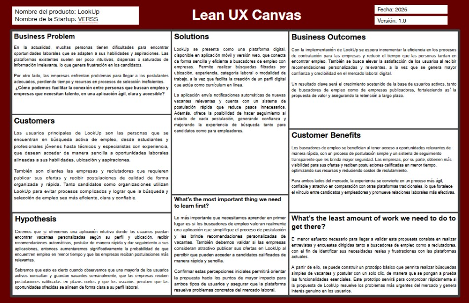

Link del Lean UX Canvas: [https://docs.google.com/presentation/d/1ZuQGHHF-bz5lqgT6a14uyj3nKRctpDh4E8dbKhN6guM/edit?usp=sharing](https://docs.google.com/presentation/d/1ZuQGHHF-bz5lqgT6a14uyj3nKRctpDh4E8dbKhN6guM/edit?usp=sharing)

## 1.3. Segmentos objetivo {#1.3.-segmentos-objetivo}

Con el objetivo de llegar a usuarios de manera eficiente y asegurar que LookUp responda a sus verdaderas necesidades, hemos identificado los siguientes dos segmentos principales:

**Segmento objetivo \#1: Estudiantes y recién egresados en búsqueda de prácticas**

Jóvenes que están iniciando su trayectoria profesional y enfrentan por primera vez el reto de postular a convocatorias de prácticas preprofesionales o profesionales. Buscan una herramienta sencilla y confiable para organizar sus postulaciones, hacer seguimiento a las respuestas que reciben y mantener la motivación en un proceso que suele ser confuso y desgastante.

**Aspectos demográficos:**

* Sexo: Masculino y femenino

* Rango de edad: 18 a 25 años

* Nivel socioeconómico: Clases B y C (media y media-alta)

**Aspectos geográficos:**

* Nacionalidad: Perú (con posibilidad de expansión a otros países de Latinoamérica)

* Zona geográfica: Principalmente urbana (ciudades con universidades e institutos)

**Aspectos psicográficos:**

* Intereses: Crecimiento profesional, empleabilidad, primeras experiencias laborales, organización personal.

* Estilo de vida: Jóvenes activos, multitarea, usuarios frecuentes de apps móviles para estudiar, trabajar y socializar.

* Actitudes: Valoran la simplicidad, la accesibilidad gratuita y la posibilidad de ver avances de manera clara. Tienen baja tolerancia a procesos burocráticos y esperan inmediatez en la información.

**Segmento objetivo \#2: Profesionales en transición laboral**

Personas que ya cuentan con experiencia previa, pero están en proceso de cambiar de empleo, buscar nuevas oportunidades o reinsertarse en el mercado laboral. Necesitan organizar y visualizar sus postulaciones para evitar perder oportunidades y dar un seguimiento estructurado a su proceso.

**Aspectos demográficos:**

* Sexo: Masculino y femenino

* Rango de edad: 25 a 40 años

* Nivel socioeconómico: Clases B y C (media y media-alta)

**Aspectos geográficos:**

* Nacionalidad: Perú (con proyección a expansión regional)

* Zona geográfica: Urbana (zonas con mayor oferta laboral)

**Aspectos psicográficos:**

* Intereses: Desarrollo de carrera, crecimiento económico, estabilidad laboral, planificación profesional.

* Estilo de vida: Profesionales activos, acostumbrados a la multitarea, que necesitan mantener el orden en un proceso que puede extenderse por semanas o meses.

* Actitudes: Valoran la organización, la claridad en la información y el control sobre su avance. Buscan herramientas que les brinden motivación y acompañamiento sin costos adicionales.

**Segmento objetivo \#3: Personas sin estudios completos que buscan empleo**

Personas que están en búsqueda de empleo mientras aún estudian, se capacitan o no han culminado sus estudios superiores. Buscan oportunidades para ganar experiencia laboral, generar ingresos y avanzar en su desarrollo profesional. Su reto principal es organizar sus postulaciones mientras compaginan sus estudios u otras actividades.

Aspectos demográficos:

* **Sexo:** Masculino y femenino

* **Rango de edad:** 18 a 27 años

* **Nivel socioeconómico:** Clases B, C y D (media, media-baja y en algunos casos baja)

Aspectos geográficos:

* **Nacionalidad:** Perú (con potencial expansión regional)

* **Zona geográfica:** Urbana y semiurbana (zonas con demanda de empleos para estudiantes o sin título)

Aspectos psicográficos:

* **Intereses:** Conseguir su primer empleo, independencia económica, desarrollo personal, adquirir experiencia práctica.

* **Estilo de vida:** Jóvenes multitarea, que deben equilibrar estudio, trabajo y vida personal; suelen usar mucho el celular y buscan soluciones rápidas.

* **Actitudes:** Valoran la simplicidad, la accesibilidad y la inmediatez. Prefieren herramientas fáciles de usar que les ayuden a no perder oportunidades y a visualizar sus avances, incluso en procesos de corto plazo.

# Capítulo II: Requirements Development and Software Solution Design {#capítulo-ii:-requirements-development-and-software-solution-design}

## 2.1. Competidores {#2.1.-competidores}

En el ámbito de la gestión del desempeño laboral y recursos humanos, existen varias plataformas que ofrecen servicios similares a LookUp. A continuación, se presentan los principales competidores directos reconocidos:

* **Linkedln:** Red profesional global que incluye funciones de búsqueda de empleo: filtros, perfiles profesionales, alertas y seguimiento de postulaciones. Muy valorada por su enfoque profesional y networking.  
* **Computrabajo:** Portal ampliamente usado en Perú que permite a los usuarios buscar y filtrar ofertas por ubicación, salario y tipo de contrato, y realizar postulaciones directamente desde la plataforma. Ofrece también una app móvil para facilitar el acceso desde cualquier lugar. Ideal para búsquedas rápidas y múltiples, aunque algunos usuarios reportan falta de seguimiento o portales con vacantes caducadas.  
* **Universia:** Enfocado en estudiantes y recién egresados, ideal para buscar prácticas o primeros empleos. Pertenece a una red de universidades y ofrece vacantes dirigidas a este grupo específico.

### **2.1.1. Análisis competitivo** {#2.1.1.-análisis-competitivo}

| Competitive Analysis Landscape |  |  |  |  |  |
| ----- | :---- | ----- | ----- | ----- | ----- |
| ¿Por qué realizar este análisis? |  | Llevar a cabo este análisis resulta fundamental, ya que nos brinda una comprensión profunda del panorama competitivo al que se enfrenta LookUp. Nos permite identificar tanto los riesgos como las posibilidades de crecimiento dentro del mercado, y reconocer en qué aspectos podemos diferenciarnos de otras propuestas similares. Asimismo, facilita el reconocimiento de nuestras ventajas y limitaciones frente a la competencia, lo que contribuye a una toma de decisiones estratégicas más informada y enfocada. |  |  |  |
| Nombre |  | LookUp | LinkedIn | Universia | Computrabajo |
| Logo |  |  |  |  |  |
| Perfil | Overview | Aplicación móvil y web para organizar, dar seguimiento y medir postulaciones laborales, con enfoque en estudiantes, recién egresados y profesionales en transición laboral. | Red social profesional global que integra búsqueda de empleo, networking y marca personal. | Plataforma dirigida a estudiantes y recién egresados que conecta universidades con empresas para prácticas y primeros empleos. | Portal de empleo masivo en Perú con amplia base de vacantes en múltiples sectores. |
|  | Ventaja competitiva ¿Qué valor ofrece a los clientes? | Gestión integral de postulaciones con historial y documentos centralizados en una interfaz intuitiva. | Networking profesional, visibilidad de marca personal y gran alcance de empresas a nivel global. | Especialización en el segmento joven (universitarios), con oportunidades adaptadas a sus primeras experiencias. | Alto volumen de ofertas laborales locales y facilidad de postulación directa desde la web o app. |
| Plan de marketing | Mercado objetivo | Estudiantes, recién egresados y profesionales en transición laboral en Perú. | Profesionales y empresas de todos los niveles y sectores a nivel global. | Universitarios y recién egresados, especialmente en búsqueda de prácticas preprofesionales. | Postulantes en general, desde puestos operativos hasta mandos medios, en el mercado peruano. |
|  | Estrategias de marketing | Estrategia digital en redes sociales y testimonios de usuarios; app gratuita para generar adopción rápida. | Marketing de contenido, presencia activa en redes profesionales, integraciones con reclutadores y empresas. | Alianzas con universidades, difusión en campus, convenios con empresas que buscan practicantes.   | Publicidad digital masiva, SEO, anuncios en medios y presencia en ferias de empleo. |
| Plan de producto | Productos y servicios | Registro rápido de postulaciones, asociación de documentos, métricas, notificaciones, historial y seguridad en la nube. | Perfiles profesionales, búsqueda de empleo, networking, alertas personalizadas, cursos y certificaciones.  | Se ofrece una plataforma web y app móvil con módulos para gestión de empleados, incorporación, ausencias, evaluaciones, reportes y firma electrónica.  | Software en la nube para gestión de recursos humanos con módulos especializados. |
|  | Precios y costos | Acceso gratuito con funciones básicas y planes premium con métricas avanzadas y personalización. | Acceso gratuito con opción premium (LinkedIn Premium) que amplía visibilidad y funciones avanzadas. | Generalmente gratuito para estudiantes; costos pueden ser asumidos por universidades y empresas aliadas. | Gratuito para postulantes; modelo de negocio basado en cobro a empresas por publicar ofertas. |
|  | Canales de distribución (Web y/o Móvil) | Aplicación móvil (Android/iOS) y plataforma web responsiva. | Web y aplicación móvil en todas las plataformas. | Web y convenios institucionales, accesible desde móviles mediante navegador. | Web y aplicación móvil disponible en Android/iOS. |
| Análisis FODA (SWOT) | Fortalezas | Interfaz intuitiva, enfoque en organización personal, métricas y seguridad de datos. | Gran base de usuarios global, reconocimiento de marca, networking profesional. | Enfoque en universitarios, respaldo institucional, especialización en prácticas. | Volumen masivo de ofertas locales, fuerte posicionamiento en Perú. |
|  | Oportunidades | Crecimiento en digitalización de procesos laborales en jóvenes, alianzas con universidades y empresas. | Integrar más IA y analítica predictiva, expandir herramientas de capacitación. | Ampliar alcance regional y alianzas con más universidades. | Expandir servicios premium y mejorar experiencia de usuario. |
|  | Debilidades | Menor reconocimiento inicial, requiere captación de usuarios para generar red. | Menos enfocado en seguimiento personalizado de postulaciones. | Segmento muy limitado (solo jóvenes y prácticas). | Percepción negativa por falta de respuesta de empleadores y vacantes no actualizadas. |
|  | Amenazas | Competencia con portales masivos y redes profesionales consolidadas. | Aparición de nuevas redes de nicho y apps de empleabilidad más ágiles. | Baja adopción si los estudiantes prefieren otras plataformas globales. | Pérdida de confianza de usuarios por calidad irregular de ofertas. |

### **2.1.2. Estrategias y tácticas frente a competidores** {#2.1.2.-estrategias-y-tácticas-frente-a-competidores}

Innovación Continua en la Experiencia del Usuario

* Fortaleza Utilizada: Interfaz limpia, intuitiva y moderna.

* Oportunidad Aprovechada: Profesionales y reclutadores demandan plataformas fáciles de usar y rápidas.

* Estrategia: Priorizar mejoras constantes en usabilidad y accesibilidad para diferenciarse de plataformas más complejas.

* Táctica: Realizar actualizaciones mensuales con pequeños cambios en diseño y experiencia.

  Modelo de Negocio Asequible y Cercano

* Fortaleza Utilizada: Enfoque directo en el mercado peruano y latinoamericano, con conocimiento de sus necesidades.

* Oportunidad Aprovechada: Empresas buscan alternativas locales frente a plataformas internacionales con precios elevados.

* Estrategia: Ofrecer planes de bajo costo y flexibles, adaptados a startups, pymes y empresas medianas.

* Táctica: Diseñar un plan con funcionalidades básicas gratuitas y planes premium con módulos avanzados.

  Pruebas Piloto y Testimonios

* Fortaleza Utilizada: Adaptación a la realidad peruana/latinoamericana.

* Estrategia: Posicionar la marca a través de casos de éxito locales que inspiren confianza.

* Táctica: Publicar en la web y redes sociales testimonios de empresas peruanas y jóvenes talentos que hayan conseguido empleo mediante LookUp.

## 2.2. Entrevistas {#2.2.-entrevistas}

Luego de realizar un análisis de los usuarios, se decidió formar dos segmentos para realizar las entrevistas.

### **2.2.1. Diseño de entrevistas** {#2.2.1.-diseño-de-entrevistas}

| Estudiantes y recién egresados en búsqueda de prácticas |  |
| :---: | ----- |
| **Pregunta 1** | ¿Cómo sueles realizar prácticas o empleos? |
| **Pregunta 2** | ¿Qué tan difícil es para ti hacer seguimiento de las respuestas que recibes después de postularte? |
| **Pregunta 3** | ¿Qué aspectos del proceso de postulación te parecen más frustrantes o confusos? |
| **Pregunta 4** | ¿Qué tan útil te parecería una aplicación que te ayude a organizar todas tus postulaciones, almacenar documentos importantes y hacer un seguimiento claro de cada proceso? |
| **Pregunta 5** | ¿Qué funcionalidades específicas te gustaría que tuviera una herramienta como Luca/Look up? |
| **Pregunta 6** | ¿Qué tan valiosa te parece la idea de contar con estadísticas sobre tu desempeño en las postulaciones, como número de entrevistas, rechazos, ofertas recibidas, y cómo crees que podría ayudarte en tu proceso de búsqueda? |

| Profesionales en transición laboral |  |
| :---: | :---: |
| **Pregunta 1** | Cuando decides postular a varios empleos al mismo tiempo, ¿cómo sueles organizar el registro de cada aplicación (documentos enviados, fechas, respuestas, etc.)? |
| **Pregunta 2** | ¿Qué tan seguido revisas el estado de tus postulaciones y qué tan fácil o difícil te resulta darles seguimiento a todas? |
| **Pregunta 3** | ¿Cuál es el mayor reto que enfrentas en tu búsqueda de empleo cuando ya tienes experiencia previa (ejemplo: manejar el volumen de procesos abiertos, actualizar documentos, no perder comunicación con las empresas)? |
| **Pregunta 4** | ¿Qué tipo de información te resulta más valiosa para evaluar tu avance en la transición laboral (ejemplo: cantidad de entrevistas, feedback recibido, número de rechazos, empresas interesadas)? |
| **Pregunta 5** | ¿Qué tanto valor le darías a tener un panel visual que te muestre de manera clara cómo avanzas en tu proceso de cambio de empleo? |
| **Pregunta 6** | ¿Usarías una aplicación como LookUp si te permite centralizar en un solo lugar todas tus postulaciones, documentos y feedback, y ayudarte a organizar tu búsqueda de manera más práctica? |

| Personas sin estudios completos que buscan empleo |  |
| :---: | :---: |
| **Pregunta 1** | Actualmente, ¿cómo organizas las postulaciones a los trabajos a los que aplicas? |
| **Pregunta 2** | ¿Qué tan difícil es para ti mantener un seguimiento claro de tus postulaciones cuando al mismo tiempo estudias o haces cursos? |
| **Pregunta 3** | ¿Qué parte te resulta más complicada al buscar empleo sin contar todavía con un título (preparar tu CV, falta de experiencia, no saber dar seguimiento, perder fechas importantes, etc.)? |
| **Pregunta 4** | ¿Qué información te gustaría ver organizada de manera visual y clara en la aplicación para no perder el control de tus procesos? |
| **Pregunta 5** | ¿Te motivaría ver estadísticas como la cantidad de postulaciones enviadas, entrevistas conseguidas o rechazos acumulados para medir tus avances? |
| **Pregunta 6** | ¿Usarías una aplicación como LookUp si te permite centralizar tus postulaciones, guardar tu CV y documentos, y tener todo en un solo lugar con una interfaz fácil de usar? |

### **2.2.2. Registro de entrevistas** {#2.2.2.-registro-de-entrevistas}

**Segmento objetivo \#1: Estudiantes y recién egresados en búsqueda de prácticas**

  

Nombre: Matthew Roca

**Ocupación:** Estudiante de Comunicación 

**Edad:19**

**Distrito:** Breña

**Link: [Entrevistas 1.mp4](https://upcedupe-my.sharepoint.com/:v:/g/personal/u202311207_upc_edu_pe/EabtHFnODKJMrkQ6OJN7vcYBD75CKvRzkmKxlxL3zclFCw?e=D8flLn&nav=eyJyZWZlcnJhbEluZm8iOnsicmVmZXJyYWxBcHAiOiJTdHJlYW1XZWJBcHAiLCJyZWZlcnJhbFZpZXciOiJTaGFyZURpYWxvZy1MaW5rIiwicmVmZXJyYWxBcHBQbGF0Zm9ybSI6IldlYiIsInJlZmVycmFsTW9kZSI6InZpZXcifX0%3D)**

Resumen: En la entrevista, Santiago Suárez presenta a Matthew Roca, estudiante de la carrera de comunicación, y le explica que LookUp es una aplicación movil para facilitar y mejorar la interactividad del proceso de postulación a un trabajo tanto para las empresas como para los usuarios en búsqueda de trabajo. La plataforma permite ver estadísticas importantes, recibir feedback y  realizar postulacion de manera rápida, sencilla e interactiva.

Durante la conversación,  se le preguntó a Matthew sobre su experiencia tratando de postular para  algún empleo, ya sea de manera física a través de una aplicación. Matthew menciono ya haber utilizado paginas como Linkedin o computrabajo, además de comentar acerca de funcionalidades que desearía que tuviera relacionadas al seguimiento del proceso de postulación y estadísticas.

Matthew opina que LookUp sería muy útil, ya que mejoraría el proceso de búsqueda y postulación a diferentes trabajos de empresas, ahorrando tiempo, almacenando información clave con estadísticas y recibiendo feedback de lo que puede mejorar para así asegurarse poder  tener más oportunidad de encontrar trabajo.

  

Nombre: Paula Luyo  
**Ocupación:** Estudiante de Derecho  
**Edad:** 20  
**Distrito:** Cercado de Lima, Lima   
Link: [Entrevistas 1.mp4](https://upcedupe-my.sharepoint.com/:v:/g/personal/u202311207_upc_edu_pe/EabtHFnODKJMrkQ6OJN7vcYBD75CKvRzkmKxlxL3zclFCw?e=D8flLn&nav=eyJyZWZlcnJhbEluZm8iOnsicmVmZXJyYWxBcHAiOiJTdHJlYW1XZWJBcHAiLCJyZWZlcnJhbFZpZXciOiJTaGFyZURpYWxvZy1MaW5rIiwicmVmZXJyYWxBcHBQbGF0Zm9ybSI6IldlYiIsInJlZmVycmFsTW9kZSI6InZpZXcifX0%3D)

Resumen: En la entrevista, Santiago Suárez conversa con Paula Luyo, estudiante de Derecho de 20 años residente en el Cercado de Lima. Paula comenta que normalmente accede a prácticas profesionales a través de recomendaciones de familiares y amigos, sin recurrir a aplicaciones digitales. Explica que cuando postula a una empresa debe revisar constantemente si hay novedades sobre su solicitud, ya que muchas veces no recibe respuesta, lo que genera incertidumbre y tiempo perdido.

Paula considera que una aplicación como LookUp sería de gran ayuda, ya que le permitiría tener sus CVs listos para enviar en cualquier momento y acceder a recomendaciones de empresas que se ajusten a sus intereses. Además, destaca que le gustaría que la aplicación ofrezca notificaciones frecuentes sobre el estado de sus postulaciones, con etapas claras como “recibido”, “en proceso”, “visto” o “rechazado”, lo cual le daría mayor seguridad y transparencia en el seguimiento de cada oportunidad laboral.

  

Nombre: Maylhy Gutierrez   
**Ocupación:** Estudiante de Ingeniería Industrial  
**Edad:** 20  
**Distrito:** San Isidro  
Link: [Entrevistas 1.mp4](https://upcedupe-my.sharepoint.com/:v:/g/personal/u202311207_upc_edu_pe/EabtHFnODKJMrkQ6OJN7vcYBD75CKvRzkmKxlxL3zclFCw?e=D8flLn&nav=eyJyZWZlcnJhbEluZm8iOnsicmVmZXJyYWxBcHAiOiJTdHJlYW1XZWJBcHAiLCJyZWZlcnJhbFZpZXciOiJTaGFyZURpYWxvZy1MaW5rIiwicmVmZXJyYWxBcHBQbGF0Zm9ybSI6IldlYiIsInJlZmVycmFsTW9kZSI6InZpZXcifX0%3D)  
Resumen: En la entrevista, Santiago Suárez presenta a Maylhy Gutiérrez, estudiante de Ingeniería Industrial de 20 años que vive en San Isidro. Ella comenta que suele postular a empleos a través de aplicaciones como LinkedIn o Universia, aunque señala que el principal problema es el seguimiento de sus postulaciones, ya que las respuestas tardan demasiado en llegar y no siempre hay actualizaciones claras, lo que le resulta muy frustrante.

Maylhy considera que una aplicación como LookUp sería muy útil porque le permitiría tener sus CVs listos para enviar en cualquier momento y subirlos de forma rápida. Lo que más valora es la posibilidad de contar con un sistema de mejor seguimiento del estado de las postulaciones, ya que esto le ahorraría tiempo y reduciría la incertidumbre durante el proceso de búsqueda laboral.

**Segmento objetivo \#2: Profesionales en transición laboral**

  

**Nombre:** Ernesto Rodas

**Ocupación:** Colaborador en una Empresa Familiar

**Edad:** 22

**Distrito:** Jesus María, Lima 

**Link: [Entrevistas 1.mp4](https://upcedupe-my.sharepoint.com/:v:/g/personal/u202311207_upc_edu_pe/EabtHFnODKJMrkQ6OJN7vcYBb-AhUcwBKBU7MnR3rJkFIQ?e=OpG35V&nav=eyJyZWZlcnJhbEluZm8iOnsicmVmZXJyYWxBcHAiOiJTdHJlYW1XZWJBcHAiLCJyZWZlcnJhbFZpZXciOiJTaGFyZURpYWxvZy1MaW5rIiwicmVmZXJyYWxBcHBQbGF0Zm9ybSI6IldlYiIsInJlZmVycmFsTW9kZSI6InZpZXcifX0%3D)**

En la entrevista, Santiago Cárdenas conversa con Ernesto Rodas, egresado de Marketing en la Universidad de Lima. Actualmente trabaja en una empresa pequeña del rubro administrativo, pero busca nuevas oportunidades laborales porque no se siente del todo satisfecho con su puesto actual. Vive en Jesús María, Lima.

Ernesto cuenta que, al egresar, postula enviando su currículum a muchas empresas y usando contactos familiares. Usó plataformas como Computrabajo y LinkedIn, pero encontraba difícil organizar sus postulaciones y hacer seguimiento a las respuestas.

Entre sus principales retos menciona el manejo de documentos y la poca retroalimentación de las empresas. Aunque la digitalización ayuda, todavía percibe mucha dispersión de información y procesos poco claros.

Finalmente, señala que una herramienta como LookUp le sería muy útil para centralizar postulaciones y feedback, dándole mayor organización y confianza en su transición laboral.

  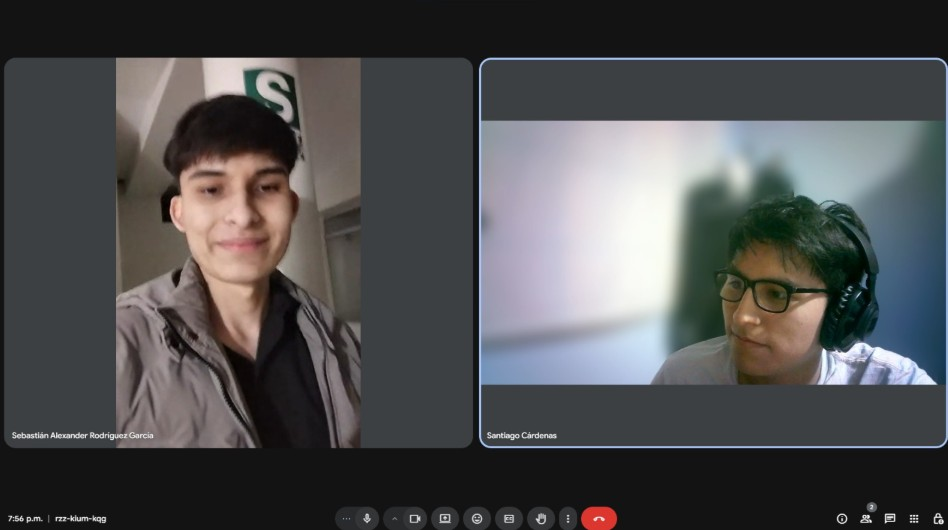

**Nombre:** Sebastian Rodriguez

**Ocupación:** Colaborador de Tottus

**Edad:** 21

**Distrito:** La Molina, Lima 

**Link:** [Entrevistas 1.mp4](https://upcedupe-my.sharepoint.com/:v:/g/personal/u202311207_upc_edu_pe/EabtHFnODKJMrkQ6OJN7vcYBb-AhUcwBKBU7MnR3rJkFIQ?e=OpG35V&nav=eyJyZWZlcnJhbEluZm8iOnsicmVmZXJyYWxBcHAiOiJTdHJlYW1XZWJBcHAiLCJyZWZlcnJhbFZpZXciOiJTaGFyZURpYWxvZy1MaW5rIiwicmVmZXJyYWxBcHBQbGF0Zm9ybSI6IldlYiIsInJlZmVycmFsTW9kZSI6InZpZXcifX0%3D)

En la entrevista, Sebastián Rodríguez, de 25 años, administrador de empresas con experiencia en marketing y actualmente en Totus, comenta que busca un nuevo empleo porque siente estar mejor capacitado para asumir mayores retos. Vive en el distrito de San Martín de Porres.

Para organizar sus postulaciones utiliza un Excel, donde registra fechas, contactos y tiempos de respuesta de cada empresa. Revisa sus aplicaciones entre 2 a 4 veces por semana, aunque reconoce que la falta de respuesta de algunas compañías le hace perder tiempo y dificulta el seguimiento.

El mayor reto que enfrenta es manejar el volumen de procesos abiertos, mantener actualizados los documentos y no perder comunicación con las empresas. Valora mucho saber si revisaron su CV y recibir feedback, especialmente cuando se trata de rechazos, ya que le permitiría mejorar en futuras postulaciones.

Sebastián considera muy valioso contar con un panel visual que muestre su progreso y le dé claridad en su transición laboral. Afirma que sí usaría una aplicación como LookUp, ya que le ahorraría tiempo, le daría organización y reduciría el estrés en su búsqueda de empleo.

  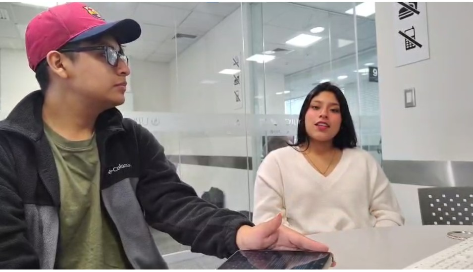

**Nombre:** Valieri Colan

**Ocupación:** Trabajadora en una Empresa

**Edad:** 24

**Distrito:** Jesus María, Lima 

**Link: [Entrevistas 1.mp4](https://upcedupe-my.sharepoint.com/:v:/g/personal/u202311207_upc_edu_pe/EabtHFnODKJMrkQ6OJN7vcYBb-AhUcwBKBU7MnR3rJkFIQ?e=OpG35V&nav=eyJyZWZlcnJhbEluZm8iOnsicmVmZXJyYWxBcHAiOiJTdHJlYW1XZWJBcHAiLCJyZWZlcnJhbFZpZXciOiJTaGFyZURpYWxvZy1MaW5rIiwicmVmZXJyYWxBcHBQbGF0Zm9ybSI6IldlYiIsInJlZmVycmFsTW9kZSI6InZpZXcifX0%3D)**

Valier Colan, de 23 años, estudió Administración en un instituto y actualmente convalida cursos en Administración y Negocios en la UPC, donde va en sexto ciclo. Además, trabaja a tiempo completo, pero busca una mejor oportunidad laboral que se alinee con sus estudios y le permita aplicar lo aprendido en su carrera.

Para organizar sus postulaciones utiliza Excel o notas digitales, donde registra las empresas, fechas de postulación y envío de CV. Revisa sus aplicaciones de 2 a 3 veces por semana, aunque comenta que el seguimiento se complica por la poca claridad en las respuestas de las empresas, lo que le genera desorganización.

El mayor reto que enfrenta es mantener la comunicación con las empresas, ya que muchas veces las respuestas se demoran o se pierde el vínculo, dificultando dar continuidad a sus procesos. Valora especialmente poder medir el número de entrevistas conseguidas y recibir feedback sobre su perfil.

Finalmente, considera que un panel visual sería muy útil para evaluar en qué etapa del proceso está y tomar mejores decisiones sobre sus postulaciones. Afirma que sí usaría una aplicación como LookUp, pues le parece interesante y práctica para ordenar documentos, entrevistas y su progreso en la búsqueda laboral.

**Segmento objetivo \#3: Personas sin estudios completos que buscan empleo**

  

**Nombre:** Abel Rojas

**Ocupación:** Colaborador en una Empresa Familiar

**Edad:** 18

**Distrito:** San Martin de Porres, Lima 

**Link: [Entrevistas 1.mp4](https://upcedupe-my.sharepoint.com/:v:/g/personal/u202311207_upc_edu_pe/EabtHFnODKJMrkQ6OJN7vcYBb-AhUcwBKBU7MnR3rJkFIQ?e=OpG35V&nav=eyJyZWZlcnJhbEluZm8iOnsicmVmZXJyYWxBcHAiOiJTdHJlYW1XZWJBcHAiLCJyZWZlcnJhbFZpZXciOiJTaGFyZURpYWxvZy1MaW5rIiwicmVmZXJyYWxBcHBQbGF0Zm9ybSI6IldlYiIsInJlZmVycmFsTW9kZSI6InZpZXcifX0%3D)**

Abel Rojas, estudiante de Desarrollo de Sistemas en el tercer ciclo y residente de San Martín de Porres, comentó que actualmente no tiene un método definido para organizar sus postulaciones. Principalmente revisa los correos que recibe de las empresas, lo cual le dificulta llevar un control claro de sus procesos.

Explicó que compaginar estudios con la búsqueda de empleo le resulta complejo, ya que no siempre tiene tiempo para revisar cada postulación. Su mayor reto es la falta de experiencia y la correcta preparación del CV, lo que siente que le resta oportunidades frente a otros postulantes.

Abel señaló que le gustaría poder visualizar de forma organizada las empresas a las que postuló y el tiempo transcurrido desde cada aplicación. También considera valioso contar con estadísticas sobre postulaciones, entrevistas y rechazos, ya que eso le ayudaría a medir su avance.

Finalmente, indicó que sí usaría una aplicación como LookUp, ya que centralizaría su información, le daría orden y le permitiría mejorar su rendimiento en la búsqueda laboral.

  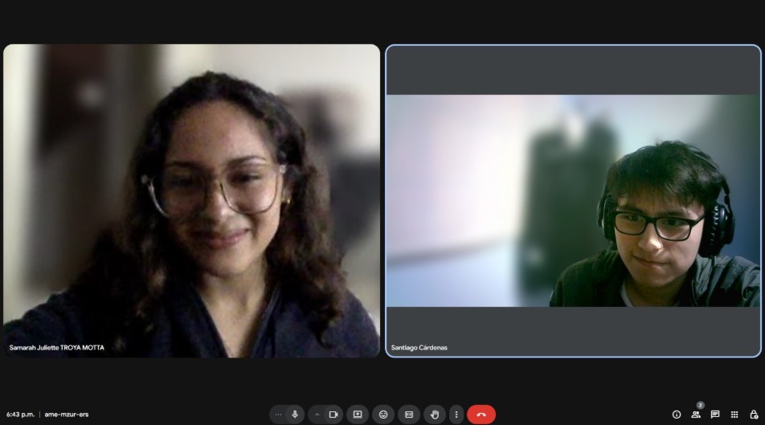

**Nombre:** Samarah Troya

**Ocupación:** Estudiante de Psicología

**Edad:** 19

**Distrito:** Pueblo Libre, Lima 

**Link: [Entrevistas 1.mp4](https://upcedupe-my.sharepoint.com/:v:/g/personal/u202311207_upc_edu_pe/EabtHFnODKJMrkQ6OJN7vcYBb-AhUcwBKBU7MnR3rJkFIQ?e=OpG35V&nav=eyJyZWZlcnJhbEluZm8iOnsicmVmZXJyYWxBcHAiOiJTdHJlYW1XZWJBcHAiLCJyZWZlcnJhbFZpZXciOiJTaGFyZURpYWxvZy1MaW5rIiwicmVmZXJyYWxBcHBQbGF0Zm9ybSI6IldlYiIsInJlZmVycmFsTW9kZSI6InZpZXcifX0%3D)**

Samara Troya, de 19 años, estudia Psicología en el cuarto ciclo y vive en Pueblo Libre. Señaló que busca empleos de medio tiempo cercanos a su hogar, pero no lleva una organización formal para sus postulaciones, ya que las realiza según su disponibilidad y necesidades.

Comentó que usa plataformas como Google Jobs, LinkedIn, Computrabajo e Indeed, aunque a veces olvida dar seguimiento a sus aplicaciones, lo que le ha hecho perder oportunidades laborales. Su mayor dificultad es manejar los filtros de búsqueda, coordinar entrevistas con sus clases y recordar fechas importantes.

Samara destacó que sería útil contar con un calendario integrado que organice postulaciones y entrevistas, además de un sistema que muestre gráficamente el estado de los CV y las características que buscan las empresas. También valoraría recibir feedback claro para mejorar su perfil.

Concluyó afirmando que sí usaría LookUp, ya que le permitiría centralizar postulaciones, documentos y feedback en un solo lugar. Considera que una herramienta de este tipo facilitaría su búsqueda laboral y reduciría el riesgo de perder oportunidades por desorganización.

  

**Nombre:** Fabrizio Huamaní

**Ocupación:** Estudiante de Psicología

**Edad:** 21

**Distrito:** Cercado de Lima, Lima 

**Link: [Entrevistas 1.mp4](https://upcedupe-my.sharepoint.com/:v:/g/personal/u202311207_upc_edu_pe/EabtHFnODKJMrkQ6OJN7vcYBb-AhUcwBKBU7MnR3rJkFIQ?e=OpG35V&nav=eyJyZWZlcnJhbEluZm8iOnsicmVmZXJyYWxBcHAiOiJTdHJlYW1XZWJBcHAiLCJyZWZlcnJhbFZpZXciOiJTaGFyZURpYWxvZy1MaW5rIiwicmVmZXJyYWxBcHBQbGF0Zm9ybSI6IldlYiIsInJlZmVycmFsTW9kZSI6InZpZXcifX0%3D)**

Fabrizio Gomani, estudiante de Psicología en sexto ciclo y con 21 años, vive en Lima. Explicó que organiza sus postulaciones en una hoja de Excel donde anota las ofertas, fechas, empresas y estado de las solicitudes, pero reconoció que mantenerlo actualizado resulta difícil debido a la carga de estudios y otros compromisos.

Comentó que lo más complicado es dar seguimiento a las postulaciones, ya que suele priorizar tareas y exámenes, lo que ocasiona que pierda fechas o no recuerde en qué lugares aplicó. Además, considera que la falta de experiencia laboral y la dificultad para preparar un CV atractivo son grandes limitantes, pues no siempre sabe cómo mostrar sus proyectos universitarios de forma convincente.

Sobre la información que quisiera ver en una aplicación, mencionó que sería muy útil tener todo organizado de manera visual y centralizada, incluyendo fechas de postulaciones, entrevistas y estados de los procesos. También resaltó la importancia de contar con estadísticas claras sobre postulaciones enviadas, entrevistas conseguidas y rechazos acumulados, ya que eso le permitiría medir sus avances y mantenerse motivado.

Finalmente, afirmó que sí usaría una aplicación como LookUp, siempre que sea intuitiva y práctica, porque le ayudaría a ahorrar tiempo y evitar distracciones al tener todo en un solo lugar. Destacó que centralizar postulaciones, CV y documentos con feedback sobre su progreso sería de gran apoyo en su etapa de búsqueda laboral.

### **2.2.3. Análisis de entrevistas** {#2.2.3.-análisis-de-entrevistas}

**Segmento objetivo \#1: Estudiantes y recién egresados en búsqueda de prácticas**

**Hallazgos:**

* **Canales de búsqueda principales:** Utiliza plataformas digitales como Computrabajo y LinkedIn para encontrar oportunidades de prácticas, lo que refleja confianza en herramientas tecnológicas para la búsqueda de empleo.

* **Dificultad en el seguimiento:** Encuentra complicado revisar constantemente el estado de sus postulaciones, ya que no recibe notificaciones frecuentes y debe ingresar manualmente a las plataformas.

* **Frustraciones clave:** La falta de retroalimentación y respuesta por parte de las empresas genera incertidumbre y desmotivación durante el proceso.

* **Interés en una solución centralizada:** Ve gran valor en una aplicación que organice postulaciones, almacene documentos y brinde notificaciones sobre el estado de los procesos.

* **Valor de estadísticas:** Considera que las métricas de desempeño (postulaciones, entrevistas, rechazos, éxitos) le permitirían identificar fortalezas y áreas de mejora en su búsqueda laboral.

**Conclusiones:**  
Los estudiantes en búsqueda inicial de prácticas valoran fuertemente la organización centralizada y la retroalimentación en tiempo real. Su principal frustración es la falta de visibilidad sobre sus procesos, lo que abre la oportunidad para que LookUp se posicione como una herramienta clave para centralizar postulaciones, enviar recordatorios de fechas límite y ofrecer estadísticas de progreso que aumenten la confianza y el aprendizaje en el proceso de búsqueda laboral.

**Segmento objetivo \#2: Profesionales en transición laboral**

**Hallazgos:**

* **Contexto laboral más definido:** Busca específicamente prácticas en bufetes de abogados, lo que muestra una necesidad de ofertas filtradas y relevantes según perfil y especialidad.

* **Canales mixtos:** Combina postulaciones por recomendaciones personales con plataformas digitales (LinkedIn, Indeed), aunque en ambos casos debe revisar constantemente correos o aplicaciones para enterarse de avances.

* **Frustración principal:** La incertidumbre y demora en recibir respuestas es lo más desmotivador del proceso de postulación.

* **Valor en centralización y accesibilidad:** Considera que una app que organice postulaciones y permita enviar documentos (CV, cartas de presentación) desde la misma plataforma sería una gran ventaja.

**Conclusiones:**  
Para estudiantes avanzados que buscan prácticas en sectores específicos, como Derecho, la relevancia de la oferta y la rapidez de las notificaciones son factores críticos. Existe un fuerte interés en una herramienta que combine centralización documental con recomendaciones personalizadas y alertas en tiempo real. LookUp puede diferenciarse en este segmento si integra filtros de afinidad (por carrera o sector) junto con una gestión clara de notificaciones.

**Segmento objetivo \#3: Personas sin estudios completos que buscan empleo**

**Hallazgos:**

* **Método actual de organización:** Utiliza hojas de Excel para registrar sus postulaciones (empresa, fecha, estado), pero reconoce que mantenerlas actualizadas es difícil por la carga académica y compromisos personales.

* **Problema central:** La falta de tiempo genera desorden y pérdida de control sobre entrevistas, fechas de postulación y procesos en curso.

* **Frustraciones adicionales:** Además de la organización, enfrenta dificultades por falta de experiencia laboral y poca claridad para elaborar CVs competitivos, lo que reduce su confianza al postular.

* **Necesidades de información organizada:** Considera clave tener en una aplicación toda la información centralizada, con un enfoque visual y claro que le ayude a no perder el control.

* **Valor en estadísticas:** Ver métricas de postulaciones, entrevistas y rechazos le parece motivador, ya que le permitiría evaluar su progreso, aunque reconoce que los rechazos acumulados también podrían desmotivarlo.

* **Alta disposición de uso:** Afirma que sí usaría una aplicación como LookUp siempre que sea fácil de usar, centralice documentos y procesos, y permita ahorrar tiempo.

**Conclusiones:**  
Los estudiantes con mayor carga académica priorizan la eficiencia en la organización y la facilidad de uso. LookUp tiene gran potencial en este segmento si ofrece una interfaz visual, intuitiva y práctica, que reduzca la dependencia de herramientas externas como Excel y permita ahorrar tiempo en la gestión de postulaciones. Además, el feedback estadístico puede convertirse en un motivador clave si se presenta de manera positiva y orientada al aprendizaje, más que al simple conteo de rechazos.

## 2.3. Needfinding {#2.3.-needfinding}

Las necesidades identificadas en los segmentos objetivo para la aplicación LookUp son las siguientes:

**Segmento objetivo \#1: Estudiantes y recién egresados en búsqueda de prácticas**

* Centralización de postulaciones: Herramienta que concentra en un solo lugar todas las aplicaciones enviadas, evitando depender de hojas de cálculo, correos dispersos o notas personales.

* Seguimiento claro y actualizado: Posibilidad de registrar y modificar el estado de cada postulación (pendiente, en revisión, contactado, oferta o rechazo) para mantener control sobre el avance en tiempo real.

* Gestión de documentos relevantes: Opción para adjuntar y consultar fácilmente CVs, cartas de presentación u otros archivos necesarios en cada aplicación.

* Métricas de progreso personal: Acceso a estadísticas simples como número de aplicaciones enviadas, entrevistas obtenidas, ofertas alcanzadas o rechazos acumulados, que motiven al usuario y le permitan identificar su avance.

* Acceso rápido y móvil: Disponibilidad desde el smartphone para que el usuario pueda actualizar y consultar información mientras estudia, trabaja o se desplaza.

**Segmento objetivo \#2: Profesionales en transición laboral**

* Organización estructurada del proceso: Plataforma que permita ordenar las distintas postulaciones de manera clara, reduciendo el riesgo de perder oportunidades por falta de seguimiento.

* Visión global del avance laboral: Información consolidada que muestre cuántas aplicaciones se han realizado, cuáles están activas y qué resultados han tenido, permitiendo tomar decisiones estratégicas.

* Identificación de patrones y oportunidades: Posibilidad de detectar tendencias en el historial de postulaciones (ej. áreas con mayor respuesta positiva o tipos de puestos más alcanzables).

* Soporte para la toma de decisiones: Datos objetivos que faciliten priorizar entre ofertas, organizar entrevistas o planificar próximos pasos en la búsqueda de empleo.

* Flexibilidad y acompañamiento accesible: Una solución intuitiva y sin costos adicionales que se adapte a rutinas largas, multitarea y procesos de transición que suelen extenderse por semanas o meses.

**Segmento objetivo \#3: Personas sin estudios completos que buscan empleo**

* Centralización de oportunidades de empleo: Una herramienta que concentre todas las postulaciones enviadas en un solo lugar, evitando depender de capturas, notas personales o conversaciones dispersas.

* Seguimiento claro y actualizado: Posibilidad de visualizar y registrar fácilmente el estado de cada postulación (pendiente, en revisión, contactado, oferta o rechazo), evitando perder de vista oportunidades importantes.

* Acceso móvil prioritario: Disponibilidad total desde el celular para actualizar y consultar información rápidamente mientras estudian, trabajan o realizan actividades personales.

* Simplicidad en el uso: Una interfaz intuitiva y directa que reduzca la curva de aprendizaje, ya que priorizan herramientas fáciles de usar y con instrucciones claras.

* Métricas básicas de progreso: Indicadores simples como número de postulaciones, entrevistas y ofertas, que permitan medir avances sin necesidad de estadísticas complejas.

* Gestión de documentos esencial: Posibilidad de subir y mantener actualizados documentos básicos (CV, certificados simples, constancias), sin requerir procesos complicados.

* Motivación mediante logros inmediatos: Reconocimiento con logros sencillos (primera postulación, primera entrevista) para mantener la motivación en procesos que suelen ser cortos o inmediatos.

### **2.3.1. User Personas** {#2.3.1.-user-personas}

Se presentarán los user persona por cada segmento objetivo. Estos son arquetipos de los usuarios ideales para cada uno de los 2 segmentos:

**Segmento objetivo \#1: Estudiantes y recién egresados en búsqueda de prácticas**

  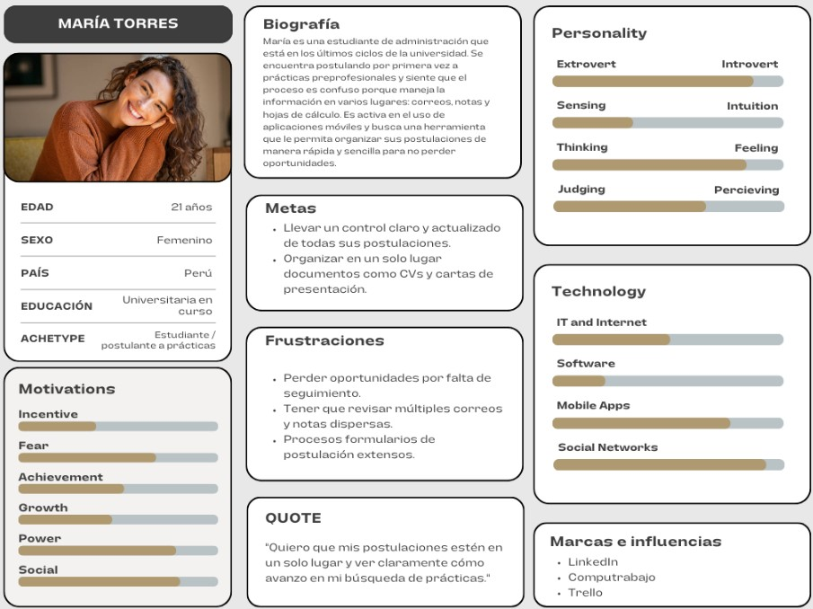

**Segmento objetivo \#2: Profesionales en transición laboral**

  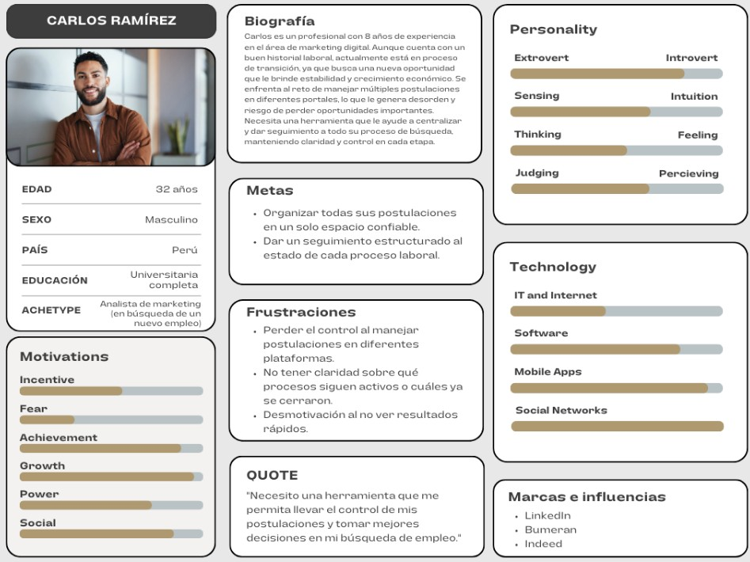

**Segmento objetivo \#3: Personas sin estudios completos que buscan empleo**

  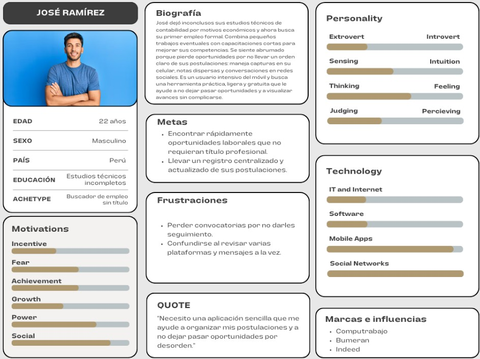

### **2.3.2. User Task Matrix** {#2.3.2.-user-task-matrix}

**Segmento objetivo \#1: Estudiantes y recién egresados en búsqueda de prácticas:**

| Actividades | María Torres |  |
| ----- | :---: | :---: |
|  | **Frecuencia** | **Importancia** |
| Registrar nuevas postulaciones a prácticas | Con frecuencia | Alta |
| Adjuntar documentos relevantes (CV, carta de presentación) | Con frecuencia | Alta |
| Actualizar el estado de cada proceso (pendiente, en revisión, oferta, rechazo) | Con frecuencia | Alta |
| Revisar métricas (número de postulaciones, entrevistas, rechazos) | A veces | Media |
| Recordar fechas de entrevistas o plazos de postulación | Con frecuencia | Alta |
| Consultar historial de postulaciones anteriores | A veces | Media |
| Organizar información dispersa en un solo lugar | Con frecuencia | Alta |

**Segmento objetivo \#2: Profesionales en transición laboral:**

| Actividades | Carlos Ramírez |  |
| ----- | :---: | :---: |
|  | **Frecuencia** | **Importancia** |
| Registrar postulaciones a nuevos empleos | Con frecuencia | Alta |
| Adjuntar documentos relevantes (CV, carta de presentación) | Con frecuencia | Alta |
| Actualizar el estado de cada proceso (pendiente, en revisión, oferta, rechazo) | Con frecuencia | Alta |
| Revisar métricas (número de postulaciones, entrevistas, rechazos) | A veces | Media |
| Comparar y priorizar oportunidades laborales según resultados | A veces | Alta |
| Consultar historial completo de postulaciones anteriores | Con frecuencia | Media |
| Organizar información dispersa en un solo lugar | Con frecuencia | Alta |

**Segmento objetivo \#3: Personas sin estudios completos que buscan empleo:**

| Actividades | José Ramírez |  |
| ----- | :---: | :---: |
|  | **Frecuencia** | **Importancia** |
| Registrar postulaciones a empleos sin requerir título profesional | Con frecuencia | Alta |
| Subir documentos básicos (CV sencillo, certificados de cursos, etc.) | A veces | Alta |
| Actualizar el estado de las postulaciones (pendiente, en revisión, oferta, rechazo) | Con frecuencia | Alta |
| Revisar métricas simples (cantidad de postulaciones enviadas, entrevistas, ofertas) | A veces | Media |
| Consultar historial de empleos a los que se ha postulado | A veces | Media |

### **2.3.3. User Journey Mapping** {#2.3.3.-user-journey-mapping}

**Segmento objetivo \#1: Estudiantes y recién egresados en búsqueda de prácticas (María Torres):**

| Etapa | Customer actions | Mood Tester | Oportunidades |
| :---: | :---: | :---: | :---: |
| **Descubrimiento y Registro** | María conoce LookUp a través de una recomendación de su universidad o en redes sociales. Descarga la app y se registra para empezar a organizar sus postulaciones. | Alivio | \- Ofrecer registro simple con correo o LinkedIn. \- Mostrar de inmediato beneficios de centralizar postulaciones. |
| **Exploración de la Aplicación** | Explora la app y aprende a registrar su primera postulación. Adjunta su CV y carta de presentación. Revisa cómo cambiar estados y explorar métricas. | Intriga | \- Brindar tutorial u onboarding interactivo.  \- Explicar con ejemplos cómo actualizar estados y adjuntar documentos. |
| **Interacción y Participación** | Usa la app regularmente para registrar nuevas postulaciones, actualizar estados y revisar sus métricas de avance. Empieza a notar el orden en su proceso. | Felicidad | \- Incorporar recordatorios de entrevistas o plazos.  \- Mostrar progreso visual con gráficos motivadores. |
| **Evaluación y Retroalimentación** | Evalúa cómo LookUp ha simplificado su proceso, ya que tiene todo centralizado y puede ver con claridad cuántas aplicaciones ha enviado y en qué etapa está cada una. | Satisfacción | \- Permitir exportar un historial de postulaciones. \- Mostrar estadísticas personalizadas que refuercen su avance. |

**Segmento objetivo \#2: Profesionales en transición laboral (Carlos Ramírez):**

| Etapa | Customer actions | Mood Tester | Oportunidades |
| :---: | :---: | :---: | :---: |
| **Descubrimiento y Registro** | Carlos descubre LookUp a través de LinkedIn o en una feria laboral. Descarga la app y crea su cuenta para centralizar todas sus postulaciones. | Alivio | \- Permitir inicio de sesión con LinkedIn.  \- Mostrar ventajas de tener control total sobre sus aplicaciones en un solo espacio. |
| **Exploración de la Aplicación** | Explora las funciones principales: registrar postulaciones, adjuntar documentos como CV o portafolio, y actualizar estados de cada proceso. | Intriga | \- Brindar un onboarding claro que muestre cómo organizar postulaciones múltiples.  \- Explicar cómo funcionan las métricas consolidadas. |
| **Interacción y Participación** | Utiliza la app de forma constante para registrar nuevas aplicaciones, comparar oportunidades y priorizar procesos según avance o plazos. | Felicidad | \- Ofrecer recordatorios de entrevistas o fechas límite.  \- Permitir filtros avanzados para clasificar postulaciones por estado o tipo de empleo. |
| **Evaluación y Retroalimentación** | Revisa cómo LookUp le ha permitido mantener un proceso ordenado y tomar decisiones estratégicas basadas en métricas claras (entrevistas, rechazos, ofertas). | Satisfacción | \- Permitir exportar reportes consolidados.  \- Mostrar estadísticas de avance a mediano plazo que respalden su planificación profesional. |

**Segmento objetivo \#3: Personas sin estudios completos que buscan empleo (José Ramírez):**

| Etapa | Customer actions | Mood Tester | Oportunidades |
| :---: | :---: | :---: | :---: |
| **Descubrimiento y Registro** | José conoce LookUp a través de un anuncio en redes sociales o por recomendación de un amigo. Descarga la app y se registra para empezar a organizar sus empleos. | Alivio | \- Facilitar registro rápido con correo o número de celular. \- Mostrar de inmediato la ventaja de centralizar postulaciones. |
| **Exploración de la Aplicación** | Aprende a registrar su primera postulación. Sube su CV básico y explora cómo puede actualizar estados. | Intriga | \- Incluir tutorial sencillo para primer registro de postulaciones. \- Explicar con ejemplos claros cómo funciona el cambio de estado. |
| **Interacción y Participación** | Usa la app con frecuencia para registrar nuevos empleos a los que aplica, actualizar estados y revisar cuántas postulaciones lleva acumuladas. | Felicidad | \- Reforzar motivación mostrando contadores de postulaciones y resultados. \- Destacar logros alcanzados (ej. primera entrevista). |
| **Evaluación y Retroalimentación** | Evalúa cómo LookUp le ayuda a mantener control de sus postulaciones, reduciendo la posibilidad de perder oportunidades mientras equilibra estudios y trabajo. | Satisfacción | \- Permitir exportar un historial simple de postulaciones. \- Mostrar estadísticas básicas y logros alcanzados de forma clara. |

### **2.3.4. Empathy Mapping** {#2.3.4.-empathy-mapping}

**Segmento objetivo \#1: Estudiantes y recién egresados en búsqueda de prácticas (María Torres):**

  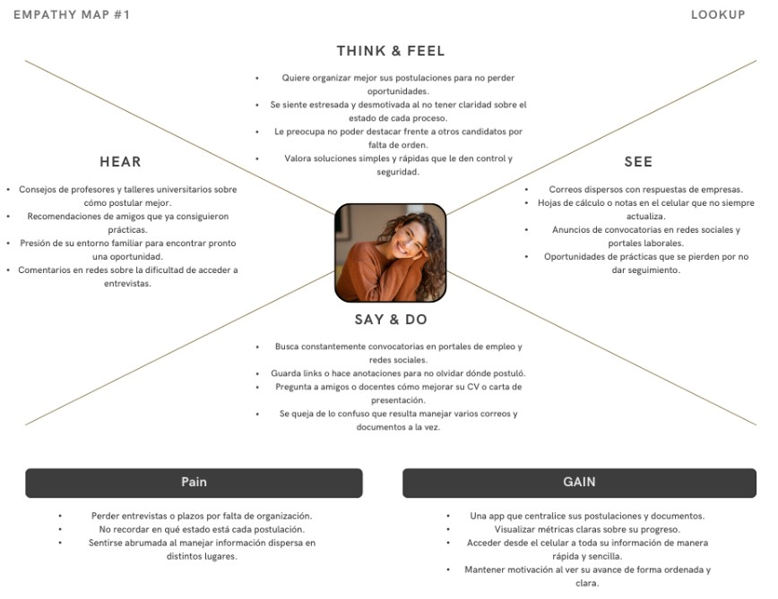

**Segmento objetivo \#2: Profesionales en transición laboral (Carlos Ramírez):**

  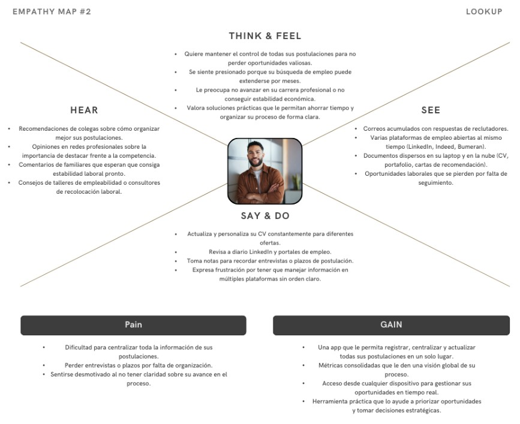

**Segmento objetivo \#3: Personas sin estudios completos que buscan empleo (José Ramírez):**

  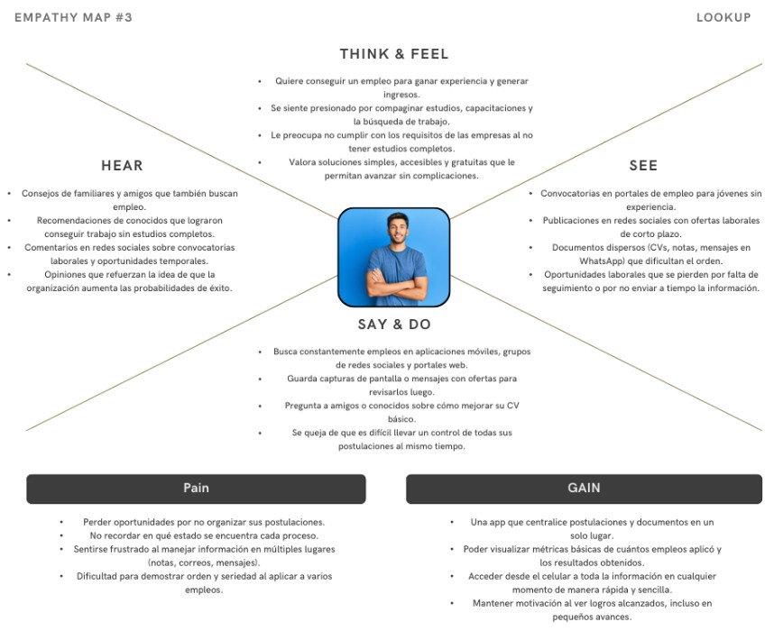

### **2.3.5. As-Is Scenario Mapping** {#2.3.5.-as-is-scenario-mapping}

**Segmento \#1: Estudiantes y recién egresados en búsqueda de prácticas:**

| Phases | Doing | Thinking | Feeling |
| :---: | ----- | ----- | ----- |
| **Exploración de oportunidades laborales** | Revisa constantemente portales de empleo, redes sociales o grupos de WhatsApp. Guarda enlaces en notas o capturas de pantalla. | “Hay demasiada información y es difícil no perder oportunidades.” | Ansioso, siente que puede pasar por alto una oferta importante. |
| **Registro manual de postulaciones** | Anota en hojas de cálculo, cuadernos o notas sueltas dónde aplicó, qué documentos envió y la fecha. | “Esto se me puede desordenar, quizá olvido algún detalle.” | Cansado y frustrado, porque siente que invertir tiempo en ordenar le quita foco a nuevas aplicaciones. |
| **Seguimiento de estados** | Revisa correos constantemente para ver si recibió respuesta. Marca estados manualmente en sus notas (ej. pendiente, rechazo). | “No sé si me responderán… quizá olvidé actualizar este registro.” | Inseguro, con poca motivación por la falta de claridad en sus avances. |
| **Gestión de documentos** | Busca su CV y carta en carpetas del celular o la laptop cada vez que postula. Edita versiones distintas según la empresa. | “¿Cuál era la última versión de mi CV? Ojalá no haya mandado la equivocada.” | Agobiado, teme cometer errores y dar una mala impresión. |
| **Evaluación de resultados** | Intenta contar manualmente cuántas postulaciones lleva y en qué etapa está cada una. | “No tengo claro si estoy mejorando o si estoy perdiendo tiempo.” | Desanimado, siente que su esfuerzo no se traduce en resultados visibles. |

**Segmento \#2: Profesionales en transición laboral:**

| Phases | Doing | Thinking | Feeling |
| :---: | ----- | ----- | ----- |
| **Búsqueda de nuevas oportunidades** | Consulta portales de empleo, LinkedIn y contactos personales. Guarda vacantes en favoritos o en correos. | “Necesito algo estable y mejor que lo actual, pero no sé si estas ofertas son confiables.” | Esperanzado, pero también preocupado por la estabilidad laboral. |
| **Registro y organización de postulaciones** | Usa Excel, correos y recordatorios en el celular para llevar control de dónde aplicó y las fechas. | “Esto ya se me está haciendo muy difícil de organizar, tengo procesos abiertos en varias empresas.” | Abrumado, siente que puede perder el control de su proceso. |
| **Seguimiento de procesos en paralelo** | Revisa varios correos, notificaciones y llamadas para confirmar avances. | “¿En qué etapa iba con esta empresa? Me puedo confundir y perder la oportunidad.” | Inseguro, teme dar una mala imagen frente a reclutadores por falta de orden. |
| **Gestión de documentos** | Adapta su CV y carta de presentación para distintos puestos, guardando múltiples versiones en su computadora. | “Ya tengo demasiadas versiones, no sé si estoy enviando la más actualizada.” | Frustrado, porque percibe que invierte tiempo en tareas repetitivas. |
| **Evaluación estratégica de resultados** | Intenta analizar si sus esfuerzos le han acercado más a entrevistas u ofertas, contando manualmente. | “No tengo datos claros de mi desempeño, ¿realmente estoy mejorando o repitiendo errores?” | Desmotivado, siente que no aprende lo suficiente de sus experiencias pasadas. |

**Segmento objetivo \#3: Personas sin estudios completos que buscan empleo:**

| Phases | Doing | Thinking | Feeling |
| ----- | ----- | ----- | ----- |
| **Exploración de oportunidades laborales** | Revisa portales de empleo básicos, redes sociales y grupos de Facebook/WhatsApp. Guarda capturas de pantalla o mensajes para no olvidar las ofertas. | “Ojalá estas ofertas sean reales y pueda aplicar aunque no tenga título.” | Esperanzado, pero con dudas sobre si será considerado por su perfil. |
| **Registro manual de postulaciones** | Anota en cuadernos, hojas sueltas o notas del celular las vacantes a las que aplica. A veces olvida registrar los detalles. | “Me puedo olvidar dónde ya postulé o repetir la misma vacante.” | Frustrado, siente que pierde control sobre el proceso. |
| **Seguimiento de estados** | Revisa a diario su correo o mensajes de WhatsApp esperando respuesta. Marca mentalmente o en notas si fue aceptado o rechazado. | “No sé si la empresa ya vio mi postulación o si la perdieron.” | Ansioso, con baja confianza en el proceso. |
| **Gestión de documentos** | Busca su CV en el celular o lo edita a último minuto en un ciber o aplicación gratuita. Tiene solo una versión básica. | “Ojalá mi CV sea suficiente para que me llamen, no tengo experiencia que mostrar.” | Inseguro, teme que su perfil no sea competitivo. |
| **Evaluación de resultados** | Intenta contar de memoria o revisar sus notas para saber a cuántos empleos aplicó y cuántas respuestas tuvo. | “No sé si estoy avanzando o perdiendo mi tiempo.” | Desmotivado, siente que no logra medir realmente su progreso. |

### 

### **2.3.6. Ubiquitous Language** {#2.3.6.-ubiquitous-language}

| Término | Definición |
| :---: | :---: |
| **Applicant (Postulante)** | Persona que busca empleo o prácticas y utiliza la aplicación para organizar y dar seguimiento a sus procesos de postulación. |
| **Student & Recent Graduate** | Jóvenes que están iniciando su trayectoria laboral y requieren una herramienta sencilla para registrar y monitorear sus prácticas y primeros empleos. |
| **Professional in Transition** | Personas con experiencia laboral que buscan un nuevo empleo o reinserción al mercado y necesitan una visión estructurada de sus postulaciones. |
| **Incomplete Studies Job Seeker** | Usuarios que aún estudian o no culminaron estudios superiores, pero buscan empleo de medio tiempo o entrada al mercado laboral. |
| **Application Record (Registro de Postulación)** | Entrada en la aplicación donde el usuario almacena la información de un proceso de postulación: empresa, puesto, fecha, portal, etc. |
| **Application Status** | Estado actual de una postulación (pendiente, en revisión, contactado, oferta, rechazo). |
| **Document Management** | Funcionalidad que permite subir, asociar, listar y eliminar documentos como CV, cartas de presentación o certificados. |
| **Feedback** | Retroalimentación recibida de empresas o reclutadores sobre una postulación, incluyendo comentarios, razones de rechazo o aceptación. |
| **Metrics** | Indicadores sobre el desempeño del usuario: número de postulaciones, entrevistas, ofertas y rechazos acumulados. |
| **History** | Registro completo de todas las postulaciones realizadas y sus resultados. |
| **Notifications** | Alertas automáticas que informan al usuario sobre cambios de estado, recordatorios de entrevistas o nuevos empleos relevantes. |
| **Achievements (Logros)** | Reconocimientos gamificados que motivan al usuario al alcanzar hitos como número de postulaciones, entrevistas u ofertas. |
| **Contact Information** | Datos de reclutadores y empresas asociados a cada postulación, centralizados dentro de la aplicación. |
| **Mobile Access** | Principio de diseño que asegura que LookUp sea usable en cualquier momento y lugar desde smartphones. |
| **User Interface (UI)** | Interfaz clara, moderna e intuitiva que organiza postulaciones, documentos y métricas de manera visual y accesible. |
| **Centralization** | Valor principal de LookUp: reunir en un único espacio postulaciones, documentos, métricas y feedback, evitando dispersión. |

## 2.4. Requirements specification {#2.4.-requirements-specification}

### **2.4.1 To-Be Scenario Mapping** {#2.4.1-to-be-scenario-mapping}

**Segmento \#1: Estudiantes y recién egresados en búsqueda de prácticas:**

| Phases | Doing | Thinking | Feeling |
| :---: | ----- | ----- | ----- |
| **Exploración y registro de oportunidades** | Busca prácticas en portales o ferias laborales y las registra directamente en LookUp con un solo paso. Adjunta desde su perfil los documentos ya guardados (CV, carta de presentación, certificados). | “Ahora sí tengo todo en un solo lugar, no necesito anotar en hojas sueltas o correos.” | Aliviado, siente que su proceso empieza a estar bajo control. |
| **Seguimiento de postulaciones** | Consulta en LookUp el estado actualizado de cada proceso (pendiente, en revisión, contactado, oferta, rechazo). Recibe recordatorios de plazos y entrevistas en el móvil. | “Es más fácil ver qué oportunidades siguen activas y cuáles ya no avanzan.” | Tranquilo, con la seguridad de que no se le escapa ninguna oportunidad. |
| **Gestión de documentos personales** | Mantiene su CV y otros documentos en su perfil y los reutiliza en cada postulación sin volver a cargarlos. | “Ya no pierdo tiempo buscando la última versión de mis documentos.” | Eficiente, siente que puede dedicar más energía a preparar entrevistas. |
| **Análisis de resultados y aprendizaje** | Revisa métricas en LookUp: número de postulaciones, entrevistas, ofertas y rechazos. Usa el historial para reflexionar sobre su progreso. | “Ahora puedo ver cómo voy mejorando y qué empresas me responden más.” | Motivado, con mayor confianza en su camino hacia la primera experiencia laboral. |

**Segmento \#2: Profesionales en transición laboral:**

| Phases | Doing | Thinking | Feeling |
| :---: | ----- | ----- | ----- |
| **Exploración y registro de oportunidades** | Identifica vacantes en portales especializados y las registra en LookUp. Asocia sus documentos ya cargados en el perfil (CV, portafolio, certificados). | “Ahora centralizo todas mis aplicaciones, no tengo que revisar varias fuentes por separado.” | Organizado, con la tranquilidad de no perder oportunidades. |
| **Seguimiento estructurado de procesos** | Consulta el estado actualizado de cada postulación en LookUp. Usa filtros para priorizar procesos por estado o por fecha de entrevistas. | “Sé exactamente en qué etapa está cada aplicación y cuáles requieren más atención.” | En control, con mayor claridad para gestionar su búsqueda laboral. |
| **Gestión de información personal y documentos** | Mantiene documentos actualizados en su perfil y los reutiliza en cada proceso sin recargarlos. | “Me aseguro de que los reclutadores siempre vean mi información más reciente.” | Profesional, seguro de presentar siempre su mejor versión. |
| **Evaluación de resultados y toma de decisiones** | Revisa métricas de entrevistas, ofertas y rechazos en LookUp. Analiza su historial para ajustar estrategias y priorizar oportunidades. | “Puedo identificar patrones y decidir en qué tipo de empresas tengo más posibilidades.” | Confiado, siente que puede planificar mejor su siguiente movimiento laboral. |

**Segmento objetivo \#3: Personas sin estudios completos que buscan empleo:**

| Phases | Doing | Thinking | Feeling |
| ----- | ----- | ----- | ----- |
| **Exploración y registro de oportunidades** | Encuentra empleos en portales o redes sociales y los registra directamente en LookUp en pocos pasos. Usa documentos básicos ya cargados en su perfil (CV simple, carta breve). | “Ahora no tengo que guardar capturas o anotar en papeles, todo queda aquí en la app.” | Aliviado, siente que puede postular sin miedo a olvidar oportunidades. |
| **Seguimiento de postulaciones** | Consulta en LookUp el estado actualizado de sus postulaciones (pendiente, en revisión, contacto, rechazo). Recibe notificaciones en el móvil cuando hay cambios. | “Por fin sé en qué estado está cada postulación, no necesito revisar correos todo el tiempo.” | Tranquilo, con mayor seguridad de que no pierde el control de su proceso. |
| **Gestión de documentos personales** | Guarda su CV y documentos básicos en el perfil de LookUp y los reutiliza en cada postulación sin tener que buscarlos de nuevo. | “Aunque mi CV sea sencillo, al menos siempre envío la versión correcta.” | Seguro, siente que presenta mejor su perfil sin confusiones. |
| **Evaluación de resultados y motivación** | Consulta métricas en LookUp: cuántas postulaciones ha enviado, cuántas respuestas o rechazos ha recibido. Ve sus avances de manera clara. | “Ahora sí puedo medir mi esfuerzo y ver si estoy avanzando en mis objetivos.” | Motivado, con más confianza para seguir buscando empleo pese a las dificultades. |

### 

### **2.4.2. User Stories** {#2.4.2.-user-stories}

| Story ID | User | Priority | Epic |
| ----- | ----- | :---: | :---: |
| US01 | Visitante | 1 | EP01 |
| **Title** | Visualización del mensaje principal en la página de inicio |  |  |
| **Description** |  |  |  |
| Como visitante de la landing page, quiere percibir un mensaje central claro y motivador en la pantalla inicial para comprender de inmediato el propósito de LookUp. |  |  |  |
| **Acceptance Criteria** |  |  |  |
| \- Escenario 1: Mensaje principal visible   Dado que un visitante accede a la landing page,   Cuando se carga la sección inicial,   Entonces se muestra un enunciado principal y un subtítulo que comunican el propósito de LookUp. |  |  |  |

 

| Story ID | User | Priority | Epic |
| ----- | ----- | :---: | :---: |
| US02 | Visitante | 1 | EP01 |
| **Title** | Acceso al menú de navegación en distintos tamaños de pantalla |  |  |
| **Description** |  |  |  |
| Como visitante, quiere acceder al menú de navegación desde cualquier dispositivo para desplazarse por el sitio sin depender del tamaño de pantalla. |  |  |  |
| **Acceptance Criteria** |  |  |  |
| \- Escenario 1: Acceso en entorno de escritorio   Dado que un visitante utiliza un computador de escritorio,   Cuando visualiza la navegación del sitio,   Entonces puede acceder a las opciones principales del menú. \- Escenario 2: Acceso en dispositivo móvil o tablet   Dado que un visitante utiliza un dispositivo móvil o una tablet,   Cuando activa el control de apertura del menú,   Entonces se presentan las opciones de navegación de forma adecuada al espacio disponible. |  |  |  |

 

| Story ID | User | Priority | Epic |
| ----- | ----- | :---: | :---: |
| US03 | Visitante | 1 | EP01 |
| **Title** | Exhibición de beneficios clave en la landing page |  |  |
| **Description** |  |  |  |
| Como visitante, quiere identificar rápidamente los beneficios más relevantes de LookUp para conocer sus principales ventajas. |  |  |  |
| **Acceptance Criteria** |  |  |  |
| \- Escenario 1: Beneficios destacados   Dado que un visitante recorre la landing page,   Cuando llega a la sección de beneficios,   Entonces se muestran como mínimo cuatro beneficios, cada uno con un identificador y una breve descripción. |  |  |  |

 

| Story ID | User | Priority | Epic |
| ----- | ----- | :---: | :---: |
| US04 | Visitante | 1 | EP01 |
| **Title** | Navegación rápida a secciones principales |  |  |
| **Description** |  |  |  |
| Como visitante, quiere acceder de manera ágil a las secciones clave desde la navegación para encontrar la información requerida sin demoras. |  |  |  |
| **Acceptance Criteria** |  |  |  |
| \- Escenario 1: Ir a Servicios   Dado que un visitante abre el menú de navegación,   Cuando selecciona la opción «Servicios»,   Entonces queda posicionado en la sección «Servicios» del sitio. \- Escenario 2: Ir a Contacto   Dado que un visitante abre el menú de navegación,   Cuando selecciona la opción «Contacto»,   Entonces se muestra la página «Contacto». \- Escenario 3: Ir a Nosotros   Dado que un visitante abre el menú de navegación,   Cuando selecciona la opción «Nosotros»,   Entonces se muestra la página «Nosotros». |  |  |  |

 

| Story ID | User | Priority | Epic |
| ----- | ----- | :---: | :---: |
| US05 | Visitante | 1 | EP01 |
| **Title** | Acceso a la sección «Sobre Nosotros» |  |  |
| **Description** |  |  |  |
| Como visitante, quiere ingresar a la sección «Sobre Nosotros» para conocer la historia, misión y propósito de LookUp. |  |  |  |
| **Acceptance Criteria** |  |  |  |
| \- Escenario 1: Contenido de «Sobre Nosotros» visible   Dado que un visitante selecciona la opción «Nosotros»,   Cuando se abre la ruta correspondiente,   Entonces se despliega contenido verificable sobre la organización y LookUp, acompañado de recursos informativos. |  |  |  |

 

| Story ID | User | Priority | Epic |
| ----- | ----- | :---: | :---: |
| US06 | Visitante | 1 | EP01 |
| **Title** | Acceso a políticas de privacidad y términos de servicio |  |  |
| **Description** |  |  |  |
| Como visitante, desea consultar las políticas de privacidad y los términos de servicio para comprender las condiciones legales de uso del sitio. |  |  |  |
| **Acceptance Criteria** |  |  |  |
| \- Escenario 1: Enlaces legales operativos   Dado que un visitante se encuentra en el área de información legal del sitio,   Cuando solicita políticas de privacidad o términos de servicio,   Entonces se muestra el contenido vigente de cada documento. |  |  |  |

 

| Story ID | User | Priority | Epic |
| ----- | ----- | :---: | :---: |
| US07 | Visitante | 1 | EP01 |
| **Title** | Acceso a redes sociales desde el pie de página |  |  |
| **Description** |  |  |  |
| Como visitante, quiere acceder a las redes sociales oficiales de LookUp desde el pie de página para mantenerse informado sobre novedades. |  |  |  |
| **Acceptance Criteria** |  |  |  |
| \- Escenario 1: Vínculos a redes sociales disponibles   Dado que un visitante revisa el área de redes sociales en el pie de página,   Cuando explora las opciones disponibles,   Entonces encuentra enlaces operativos hacia YouTube, Instagram y X (Twitter). |  |  |  |

 

| Story ID | User | Priority | Epic |
| ----- | ----- | :---: | :---: |
| US08 | Visitante | 1 | EP01 |
| **Title** | Galería de contenidos informativos en la landing page |  |  |
| **Description** |  |  |  |
| Como visitante, desea visualizar una galería interactiva de contenidos informativos para conocer de forma atractiva las funciones principales de LookUp. |  |  |  |
| **Acceptance Criteria** |  |  |  |
| \- Escenario 1: Galería visible   Dado que un visitante llega a la zona informativa de servicios,   Cuando se carga el contenido de dicha zona,   Entonces se presenta una galería con elementos informativos que combinan imágenes y descripciones. \- Escenario 2: Navegación dentro de la galería   Dado que un visitante interactúa con los controles de la galería,   Cuando utiliza las acciones de avance o retroceso,   Entonces puede desplazarse entre los diferentes elementos de la galería. |  |  |  |

| Story ID | User | Priority | Epic |
| ----- | ----- | :---: | :---: |
| US09 | Postulante | — | EP02 |
| **Title** | Registro con correo y contraseña |  |  |
| **Description** |  |  |  |
| Como postulante, quiero registrarme con mi correo y una contraseña para empezar a organizar mis postulaciones desde mi cuenta. |  |  |  |
| **Acceptance Criteria** |  |  |  |
| \- Escenario 1: Registro exitoso   Dado que el postulante ingresa un correo no registrado y una contraseña válida,   Cuando solicita crear la cuenta,   Entonces el sistema crea la cuenta y lo autentica. \- Escenario 2: Correo ya registrado   Dado que el postulante ingresa un correo existente,   Cuando solicita crear la cuenta,   Entonces el sistema rechaza el registro e informa que el correo ya está registrado. \- Escenario 3: Contraseña inválida   Dado que el postulante ingresa una contraseña que no cumple las políticas definidas,   Cuando solicita crear la cuenta,   Entonces el sistema rechaza el registro e informa que debe cumplir los requisitos de seguridad. |  |  |  |

 

| Story ID | User | Priority | Epic |
| ----- | ----- | :---: | :---: |
| US10 | Postulante | — | EP02 |
| **Title** | Inicio de sesión seguro |  |  |
| **Description** |  |  |  |
| Como postulante, quiero iniciar sesión de forma segura para acceder a mis postulaciones y datos personales. |  |  |  |
| **Acceptance Criteria** |  |  |  |
| \- Escenario 1: Acceso válido   Dado que el postulante posee credenciales válidas,   Cuando solicita iniciar sesión,   Entonces el sistema permite el acceso a su cuenta. \- Escenario 2: Credenciales inválidas   Dado que el postulante ingresa credenciales incorrectas,   Cuando solicita iniciar sesión,   Entonces el sistema deniega el acceso e informa que las credenciales no son válidas. \- Escenario 3: Sesión activa   Dado que el postulante mantiene la sesión abierta,   Cuando accede nuevamente a recursos protegidos durante el periodo de validez,   Entonces el sistema reconoce la sesión activa sin requerir nuevas credenciales. |  |  |  |

 

| Story ID | User | Priority | Epic |
| ----- | ----- | :---: | :---: |
| US11 | Postulante | — | EP02 |
| **Title** | Recuperación de contraseña |  |  |
| **Description** |  |  |  |
| Como postulante, quiero recuperar mi contraseña para restablecer el acceso a mi cuenta en caso de olvido. |  |  |  |
| **Acceptance Criteria** |  |  |  |
| \- Escenario 1: Solicitud válida   Dado que el postulante ingresa un correo registrado,   Cuando solicita la recuperación de contraseña,   Entonces el sistema envía instrucciones de restablecimiento. \- Escenario 2: Correo no registrado   Dado que el postulante ingresa un correo no asociado a una cuenta,   Cuando solicita la recuperación de contraseña,   Entonces el sistema rechaza la solicitud sin revelar datos de usuarios. \- Escenario 3: Restablecimiento exitoso   Dado que el postulante sigue las instrucciones de restablecimiento,   Cuando define una nueva contraseña válida,   Entonces el sistema actualiza la credencial y permite iniciar sesión. |  |  |  |

 

| Story ID | User | Priority | Epic |
| ----- | ----- | :---: | :---: |
| US12 | Postulante | — | EP02 |
| **Title** | Completar perfil básico del postulante |  |  |
| **Description** |  |  |  |
| Como postulante, quiero registrar mis datos básicos y una descripción personal para presentar mi perfil cuando gestione mis postulaciones. |  |  |  |
| **Acceptance Criteria** |  |  |  |
| \- Escenario 1: Guardado de datos obligatorios   Dado que el postulante completa los campos obligatorios (por ejemplo, nombre y datos de contacto),   Cuando solicita guardar el perfil,   Entonces el sistema guarda la información correctamente. \- Escenario 2: Descripción personalizada   Dado que el postulante redacta una descripción personal,   Cuando solicita guardar el perfil,   Entonces el sistema almacena la descripción junto con los datos del perfil. \- Escenario 3: Validación de obligatorios   Dado que el postulante deja campos obligatorios vacíos,   Cuando solicita guardar el perfil,   Entonces el sistema rechaza el guardado e informa que faltan datos requeridos. |  |  |  |

 

| Story ID | User | Priority | Epic |
| ----- | ----- | :---: | :---: |
| US13 | Postulante | — | EP02 |
| **Title** | Cierre de sesión desde el móvil |  |  |
| **Description** |  |  |  |
| Como postulante, quiero cerrar sesión desde mi dispositivo móvil para proteger el acceso a mi cuenta. |  |  |  |
| **Acceptance Criteria** |  |  |  |
| \- Escenario 1: Cierre exitoso   Dado que el postulante cuenta con una sesión activa,   Cuando solicita cerrar sesión,   Entonces el sistema invalida la sesión actual. \- Escenario 2: Acceso a recursos protegidos   Dado que la sesión ha sido cerrada,   Cuando el postulante intenta acceder a recursos protegidos,   Entonces el sistema solicita autenticación nuevamente. |  |  |  |

 

| Story ID | User | Priority | Epic |
| ----- | ----- | :---: | :---: |
| US14 | Postulante | — | EP03 |
| **Title** | Crear nueva postulación |  |  |
| **Description** |  |  |  |
| Como postulante, quiere postular a un puesto disponible para registrar el proceso en el sistema y dar seguimiento. |  |  |  |
| Acceptance **Criteria** |  |  |  |
| \- Escenario 1: Creación exitosa   Dado que el postulante selecciona un puesto disponible y cuenta con la información mínima del proceso,   Cuando confirma la postulación,   Entonces el sistema registra la postulación con estado inicial 'pendiente' y fecha automática. \- Escenario 2: Datos insuficientes   Dado que faltan datos mínimos del puesto (por ejemplo, empresa o título del cargo),   Cuando el postulante intenta registrar la postulación,   Entonces el sistema impide el registro e informa que faltan datos requeridos. \- Escenario 3: Evitar duplicados   Dado que existe una postulación registrada para el mismo puesto en el mismo día,   Cuando el postulante intenta crear otra igual,   Entonces el sistema evita la duplicidad y mantiene un único registro. |  |  |  |

 

| Story ID | User | Priority | Epic |
| ----- | ----- | :---: | :---: |
| US15 | Postulante | — | EP03 |
| **Title** | Registrar fecha de postulación de forma automática |  |  |
| **Description** |  |  |  |
| Como postulante, quiero que la fecha y la hora de la postulación se registren automáticamente para mantener un historial preciso. |  |  |  |
| **Acceptance Criteria** |  |  |  |
| \- Escenario 1: Registro automático   Dado que el postulante confirma una nueva postulación,   Cuando el sistema crea el registro,   Entonces el sistema asigna automáticamente la fecha y hora actuales a la postulación. \- Escenario 2: Consulta de fecha   Dado que la postulación posee una fecha registrada,   Cuando el postulante consulta los detalles del proceso,   Entonces el sistema muestra la fecha y hora de registro de la postulación. |  |  |  |

 

| Story ID | User | Priority | Epic |
| ----- | ----- | :---: | :---: |
| US16 | Postulante | — | EP03 |
| **Title** | Actualizar estado de postulación según revisión del reclutador |  |  |
| **Description** |  |  |  |
| Como postulante, quiero que el estado de mi postulación se actualice cuando el reclutador realice cambios para conocer el avance real del proceso. |  |  |  |
| **Acceptance Criteria** |  |  |  |
| \- Escenario 1: Estado actualizado   Dado que el reclutador modifica el estado en el proceso de selección,   Cuando el sistema sincroniza la información,   Entonces el sistema refleja el nuevo estado en la postulación del usuario. \- Escenario 2: Consulta de estado vigente   Dado que la postulación tiene un estado actualizado,   Cuando el postulante consulta su lista o detalle de postulaciones,   Entonces el sistema muestra el estado vigente. |  |  |  |

 

| Story ID | User | Priority | Epic |
| ----- | ----- | :---: | :---: |
| US17 | Postulante | — | EP03 |
| **Title** | Eliminar postulación registrada |  |  |
| **Description** |  |  |  |
| Como postulante, quiero eliminar una postulación registrada para mantener mi historial limpio y mis métricas consistentes. |  |  |  |
| **Acceptance Criteria** |  |  |  |
| \- Escenario 1: Eliminación exitosa   Dado que existe una postulación registrada,   Cuando el postulante solicita eliminarla,   Entonces el sistema elimina el registro y actualiza las métricas relacionadas. \- Escenario 2: Postulación inexistente   Dado que no existe una postulación con el identificador indicado,   Cuando el postulante intenta eliminarla,   Entonces el sistema informa que no se encontró el registro. |  |  |  |

 

| Story ID | User | Priority | Epic |
| ----- | ----- | :---: | :---: |
| US18 | Postulante | — | EP04 |
| **Title** | Subir documentos al perfil |  |  |
| **Description** |  |  |  |
| Como postulante, quiero subir mis documentos principales (por ejemplo, CV, carta de presentación, certificados) a mi perfil para reutilizarlos en mis postulaciones. |  |  |  |
| **Acceptance Criteria** |  |  |  |
| \- Escenario 1: Carga válida   Dado que el postulante selecciona un documento en un formato permitido,   Cuando solicita subir el documento al perfil,   Entonces el sistema guarda el documento asociado al perfil. \- Escenario 2: Formato no permitido   Dado que el archivo no cumple con los formatos permitidos por la política,   Cuando el postulante intenta subirlo,   Entonces el sistema rechaza la carga e informa que el formato no es válido. \- Escenario 3: Supera tamaño permitido   Dado que el archivo excede el tamaño máximo definido por la política,   Cuando el postulante intenta subirlo,   Entonces el sistema rechaza la carga e informa que supera el tamaño permitido. |  |  |  |

 

| Story ID | User | Priority | Epic |
| ----- | ----- | :---: | :---: |
| US19 | Postulante | — | EP04 |
| **Title** | Eliminar documento del perfil |  |  |
| **Description** |  |  |  |
| Como postulante, quiero eliminar un documento de mi perfil para mantener actualizada mi documentación disponible. |  |  |  |
| **Acceptance Criteria** |  |  |  |
| \- Escenario 1: Eliminación exitosa   Dado que el documento existe en el perfil del postulante,   Cuando solicita eliminarlo,   Entonces el sistema elimina el documento y este deja de estar disponible para nuevas postulaciones. \- Escenario 2: Documento inexistente   Dado que el documento no está asociado al perfil,   Cuando se solicita su eliminación,   Entonces el sistema informa que no se encontró el documento. |  |  |  |

 

| Story ID | User | Priority | Epic |
| ----- | ----- | :---: | :---: |
| US20 | Postulante | — | EP04 |
| **Title** | Visualizar documentos guardados en el perfil |  |  |
| **Description** |  |  |  |
| Como postulante, quiero visualizar los documentos guardados en mi perfil para seleccionar los que necesite en mis postulaciones. |  |  |  |
| **Acceptance Criteria** |  |  |  |
| \- Escenario 1: Listado disponible   Dado que el perfil tiene documentos cargados,   Cuando el postulante solicita visualizar los documentos,   Entonces el sistema lista los documentos asociados al perfil. \- Escenario 2: Sin documentos   Dado que el perfil no tiene documentos cargados,   Cuando el postulante solicita visualizar los documentos,   Entonces el sistema indica que no hay documentos disponibles. |  |  |  |

 

| Story ID | User | Priority | Epic |
| ----- | ----- | :---: | :---: |
| US21 | Postulante | — | EP05 |
| **Title** | Contador de postulaciones enviadas |  |  |
| **Description** |  |  |  |
| Como postulante, quiero ver el número total de postulaciones enviadas para entender el volumen de mi búsqueda. |  |  |  |
| **Acceptance Criteria** |  |  |  |
| \- Escenario 1: Incremento por creación   Dado que el postulante crea una nueva postulación,   Cuando el sistema confirma el registro,   Entonces el contador de postulaciones enviadas incrementa en uno. \- Escenario 2: Ajuste por eliminación   Dado que el postulante elimina una postulación,   Cuando el sistema confirma la eliminación,   Entonces el contador de postulaciones enviadas decrementa en uno. |  |  |  |

 

| Story ID | User | Priority | Epic |
| ----- | ----- | :---: | :---: |
| US22 | Postulante | — | EP05 |
| **Title** | Contador de entrevistas obtenidas |  |  |
| **Description** |  |  |  |
| Como postulante, quiero ver cuántas entrevistas obtengo para evaluar mi efectividad. |  |  |  |
| **Acceptance Criteria** |  |  |  |
| \- Escenario 1: Incremento al ser contactado   Dado que una postulación cambia a estado 'contactado',   Cuando el sistema actualiza el estado,   Entonces el contador de entrevistas obtenidas incrementa en uno. \- Escenario 2: Ajuste por cambio de estado   Dado que 'contactado' se corrige a otro estado no asociado a entrevista,   Cuando el sistema actualiza el estado,   Entonces el contador de entrevistas obtenidas decrementa en uno. |  |  |  |

 

| Story ID | User | Priority | Epic |
| ----- | ----- | :---: | :---: |
| US23 | Postulante | — | EP05 |
| **Title** | Contador de ofertas alcanzadas |  |  |
| **Description** |  |  |  |
| Como postulante, quiero ver cuántas ofertas alcanzo para medir resultados concretos. |  |  |  |
| **Acceptance Criteria** |  |  |  |
| \- Escenario 1: Incremento por oferta   Dado que una postulación cambia a estado 'oferta',   Cuando el sistema actualiza el estado,   Entonces el contador de ofertas alcanzadas incrementa en uno. \- Escenario 2: Ajuste por cambio posterior   Dado que una postulación previamente marcada como 'oferta' cambia a otro estado,   Cuando el sistema actualiza el estado,   Entonces el contador de ofertas alcanzadas decrementa en uno. |  |  |  |

 

| Story ID | User | Priority | Epic |
| ----- | ----- | :---: | :---: |
| US24 | Postulante | — | EP05 |
| **Title** | Contador de rechazos acumulados |  |  |
| **Description** |  |  |  |
| Como postulante, quiero ver cuántos rechazos acumulo para analizar mis resultados y ajustar mi estrategia. |  |  |  |
| **Acceptance Criteria** |  |  |  |
| \- Escenario 1: Incremento por rechazo   Dado que una postulación cambia a estado 'rechazo',   Cuando el sistema actualiza el estado,   Entonces el contador de rechazos acumulados incrementa en uno. \- Escenario 2: Ajuste por corrección   Dado que una postulación previamente marcada como 'rechazo' cambia a otro estado,   Cuando el sistema actualiza el estado,   Entonces el contador de rechazos acumulados decrementa en uno. |  |  |  |

 

| Story ID | User | Priority | Epic |
| ----- | ----- | :---: | :---: |
| US25 | Postulante | — | EP06 |
| **Title** | Ver historial completo de postulaciones |  |  |
| **Description** |  |  |  |
| Como postulante, quiero consultar el historial de todas mis postulaciones para revisar mi recorrido completo. |  |  |  |
| **Acceptance Criteria** |  |  |  |
| \- Escenario 1: Historial disponible   Dado que el postulante tiene postulaciones registradas,   Cuando solicita ver el historial,   Entonces el sistema lista todas las postulaciones registradas con sus estados y fechas asociadas. \- Escenario 2: Historial vacío   Dado que el postulante no tiene postulaciones registradas,   Cuando solicita ver el historial,   Entonces el sistema indica que no existen registros. |  |  |  |

 

| Story ID | User | Priority | Epic |
| ----- | ----- | :---: | :---: |
| US26 | Postulante | — | EP06 |
| **Title** | Buscar postulaciones por empresa o puesto |  |  |
| **Description** |  |  |  |
| Como postulante, quiero buscar postulaciones por empresa o puesto para encontrar rápidamente procesos específicos. |  |  |  |
| **Acceptance Criteria** |  |  |  |
| \- Escenario 1: Búsqueda con resultados   Dado que existen postulaciones que coinciden con el término de búsqueda,   Cuando el postulante ejecuta la búsqueda,   Entonces el sistema devuelve las postulaciones coincidentes. \- Escenario 2: Búsqueda sin resultados   Dado que no existen coincidencias para el término ingresado,   Cuando el postulante ejecuta la búsqueda,   Entonces el sistema devuelve una lista vacía. |  |  |  |

 

| Story ID | User | Priority | Epic |
| ----- | ----- | :---: | :---: |
| US27 | Postulante | — | EP06 |
| **Title** | Filtrar por estado de postulación |  |  |
| **Description** |  |  |  |
| Como postulante, quiero filtrar mis postulaciones por estado para concentrarme en procesos específicos. |  |  |  |
| **Acceptance Criteria** |  |  |  |
| \- Escenario 1: Filtrado exitoso   Dado que existen postulaciones con el estado seleccionado,   Cuando el postulante aplica el filtro por estado,   Entonces el sistema muestra únicamente las postulaciones con ese estado. \- Escenario 2: Filtrado sin resultados   Dado que no existen postulaciones con el estado seleccionado,   Cuando el postulante aplica el filtro por estado,   Entonces el sistema muestra una lista vacía. |  |  |  |

 

| Story ID | User | Priority | Epic |
| ----- | ----- | :---: | :---: |
| US28 | Postulante | — | EP06 |
| **Title** | Ordenar postulaciones por fecha o resultado |  |  |
| **Description** |  |  |  |
| Como postulante, quiero ordenar mis postulaciones por fecha o por resultado para analizar mi progreso con distintos enfoques. |  |  |  |
| **Acceptance Criteria** |  |  |  |
| \- Escenario 1: Orden por fecha   Dado que existen postulaciones con diferentes fechas,   Cuando el postulante solicita ordenar por fecha,   Entonces el sistema presenta las postulaciones en el orden indicado. \- Escenario 2: Orden por resultado   Dado que existen postulaciones con distintos estados,   Cuando el postulante solicita ordenar por resultado,   Entonces el sistema presenta las postulaciones ordenadas según el estado seleccionado. |  |  |  |

| Story ID | User | Priority | Epic |
| ----- | ----- | :---: | :---: |
| US29 | Postulante | — | EP07 |
| **Title** | Registro de datos de contacto en el perfil |  |  |
| **Description** |  |  |  |
| Como postulante, quiero registrar mi correo electrónico y/o número de celular en mi perfil para que los reclutadores puedan contactarme si soy seleccionado. |  |  |  |
| **Acceptance Criteria** |  |  |  |
| \- Escenario 1: Registro exitoso de datos de contacto Dado que que el postulante ingresa correo o número de celular válidos, Cuando los guarda en su perfil, Entonces el sistema almacena los datos correctamente y quedan asociados al perfil.. \- Escenario 2: Validación de datos inválidos Dado que que el postulante ingresa un correo o número con formato incorrecto, Cuando intenta guardar la información, Entonces el sistema rechaza los datos y solicita un formato válido. |  |  |  |

| Story ID | User | Priority | Epic |
| ----- | ----- | :---: | :---: |
| US30 | Postulante | — | EP07 |
| **Title** | Reclutador contacta al postulante seleccionado |  |  |
| **Description** |  |  |  |
| Como postulante, quiero que el reclutador pueda contactarme usando los datos de contacto registrados en mi perfil para avanzar en el proceso de contratación. |  |  |  |
| **Acceptance Criteria** |  |  |  |
| \- Escenario 1: Contacto exitoso Dado que que el postulante ha registrado datos de contacto válidos, Cuando el reclutador decide avanzar con la contratación, Entonces el reclutador utiliza los datos registrados para comunicarse con el postulante fuera de la aplicación. \- Escenario 2: Falta de datos de contacto Dado que que el postulante no registra ningún medio de contacto, Cuando el reclutador revisa el perfil, Entonces el reclutador no encuentra cómo comunicarse y el sistema indica que faltan datos. |  |  |  |

| Story ID | User | Priority | Epic |
| ----- | ----- | :---: | :---: |
| US31 | Postulante | — | EP08 |
| **Title** | Interfaz simple y comprensible para todo usuario |  |  |
| **Description** |  |  |  |
| Como postulante, quiero contar con una interfaz clara y sencilla para poder entender y utilizar la aplicación sin complicaciones. |  |  |  |
| **Acceptance Criteria** |  |  |  |
| \- Escenario 1: Uso exitoso de la interfaz Dado que que el postulante accede a la aplicación, Cuando explora las funciones principales, Entonces el sistema presenta opciones comprensibles y fáciles de identificar. \- Escenario 2: Evitar confusión Dado que que el postulante navega por diferentes secciones, Cuando utiliza la aplicación por primera vez, Entonces el sistema mantiene consistencia en nombres y acciones para reducir dudas. |  |  |  |

 

| Story ID | User | Priority | Epic |
| ----- | ----- | :---: | :---: |
| US32 | Postulante | — | EP08 |
| **Title** | Estética moderna y profesional que genere seguridad |  |  |
| **Description** |  |  |  |
| Como postulante, quiero que la aplicación tenga un diseño visual moderno y profesional para sentir confianza en la plataforma. |  |  |  |
| **Acceptance Criteria** |  |  |  |
| \- Escenario 1: Confianza visual Dado que que el postulante abre la aplicación, Cuando observa la interfaz principal, Entonces el diseño transmite profesionalismo y orden.  \- Escenario 2: Aspecto consistente Dado que que el postulante cambia de sección, Cuando visualiza nuevas pantallas, Entonces el estilo de colores y tipografías se mantiene coherente. |  |  |  |

 

| Story ID | User | Priority | Epic |
| ----- | ----- | :---: | :---: |
| US33 | Postulante | — | EP08 |
| **Title** | Organización visual clara de datos y procesos |  |  |
| **Description** |  |  |  |
| Como postulante, quiero que la información esté organizada visualmente para poder identificar fácilmente mis postulaciones y métricas. |  |  |  |
| **Acceptance Criteria** |  |  |  |
| \- Escenario 1: Visualización clara Dado que que el postulante revisa sus postulaciones, Cuando abre el historial de procesos, Entonces el sistema presenta la información de forma clara y ordenada. \- Escenario 2: Métricas organizadas Dado que que el postulante consulta sus estadísticas, Cuando visualiza el panel de métricas, Entonces el sistema muestra los datos agrupados y fáciles de interpretar. |  |  |  |

 

| Story ID | User | Priority | Epic |
| ----- | ----- | :---: | :---: |
| US34 | Postulante | — | EP08 |
| **Title** | Fluidez y consistencia en la navegación entre pantallas |  |  |
| **Description** |  |  |  |
| Como postulante, quiero que la navegación entre pantallas sea fluida y coherente para mantener una experiencia continua y sin interrupciones. |  |  |  |
| **Acceptance Criteria** |  |  |  |
| \- Escenario 1: Navegación fluida Dado que que el postulante cambia de sección, Cuando pasa de una pantalla a otra, Entonces el sistema responde de forma rápida y sin retrasos.  \- Escenario 2: Consistencia en navegación Dado que que el postulante explora diferentes apartados, Cuando utiliza los menús de navegación, Entonces el sistema mantiene el mismo estilo y ubicación de opciones en todas las pantallas. |  |  |  |

### **2.4.3. Impact Mapping** {#2.4.3.-impact-mapping}

  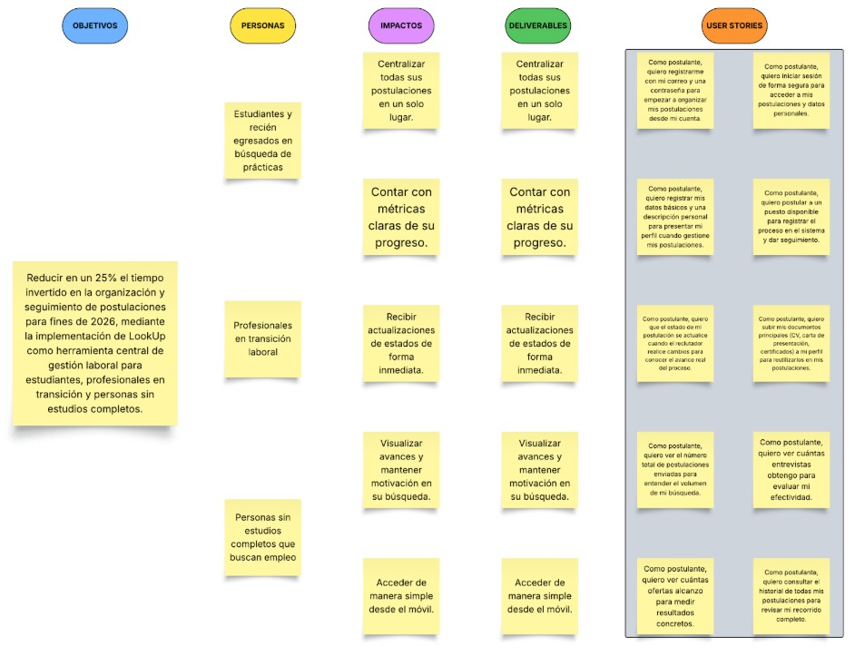

### **2.4.4. Product Backlog** {#2.4.4.-product-backlog}

Para la elaboración de nuestro Product Backlog, hemos utilizado la escala de Fibonacci (1, 2, 3, 5, 8, 13).

| \# Orden | User Story ID | Título | Descripción | Prioridad | Story Points |
| :---: | :---: | :---: | :---: | :---: | :---: |
| **1** | US16 | Actualizar estado de postulación según revisión del reclutador | Como postulante, quiero que el estado de mi postulación se actualice cuando el reclutador realice cambios para conocer el avance real del proceso. | Alta | 13 |
| **2** | US23 | Contador de ofertas alcanzadas | Como postulante, quiero ver cuántas ofertas alcanzo para medir resultados concretos. | Alta | 13 |
| **3** | US22 | Contador de entrevistas obtenidas | Como postulante, quiero ver cuántas entrevistas obtengo para evaluar mi efectividad. | Alta | 8 |
| **4** | US24 | Contador de rechazos acumulados | Como postulante, quiero ver cuántos rechazos acumulo para analizar mis resultados y ajustar mi estrategia. | Alta | 8 |
| **5** | US25 | Ver historial completo de postulaciones | Como postulante, quiero consultar el historial de todas mis postulaciones para revisar mi recorrido completo. | Alta | 8 |
| **6** | US26 | Buscar postulaciones por empresa o puesto | Como postulante, quiero buscar postulaciones por empresa o puesto para encontrar rápidamente procesos específicos. | Alta | 5 |
| **7** | US27 | Filtrar por estado de postulación | Como postulante, quiero filtrar mis postulaciones por estado para concentrarme en procesos específicos. | Alta | 5 |
| **8** | US28 | Ordenar postulaciones por fecha o resultado | Como postulante, quiero ordenar mis postulaciones por fecha o por resultado para analizar mi progreso con distintos enfoques. | Alta | 5 |
| **9** | US18 | Subir documentos al perfil | Como postulante, quiero subir mis documentos principales (CV, carta de presentación, certificados) a mi perfil para reutilizarlos en mis postulaciones. | Alta | 5 |
| **10** | US08 | Galería de contenidos informativos en la landing page | Como visitante, desea visualizar una galería interactiva de contenidos informativos para conocer de forma atractiva las funciones principales de LookUp. | Media | 5 |
| **11** | US09 | Registro con correo y contraseña | Como postulante, quiero registrarme con mi correo y una contraseña para empezar a organizar mis postulaciones desde mi cuenta. | Alta | 3 |
| **12** | US10 | Inicio de sesión seguro | Como postulante, quiero iniciar sesión de forma segura para acceder a mis postulaciones y datos personales. | Alta | 3 |
| **13** | US11 | Recuperación de contraseña | Como postulante, quiero recuperar mi contraseña para restablecer el acceso a mi cuenta en caso de olvido. | Alta | 3 |
| **14** | US12 | Completar perfil básico del postulante | Como postulante, quiero registrar mis datos básicos y una descripción personal para presentar mi perfil cuando gestione mis postulaciones. | Alta | 3 |
| **15** | US21 | Contador de postulaciones enviadas | Como postulante, quiero ver el número total de postulaciones enviadas para entender el volumen de mi búsqueda. | Alta | 3 |
| **16** | US14 | Crear nueva postulación | Como postulante, quiere postular a un puesto disponible para registrar el proceso en el sistema y dar seguimiento. | Alta | 3 |
| **17** | US02 | Acceso al menú de navegación en distintos tamaños de pantalla | Como visitante, quiere acceder al menú de navegación desde cualquier dispositivo para desplazarse por el sitio sin depender del tamaño de pantalla. | Media | 3 |
| **18** | US15 | Registrar fecha de postulación de forma automática | Como postulante, quiero que la fecha y la hora de la postulación se registren automáticamente para mantener un historial preciso. | Media | 2 |
| **19** | US19 | Eliminar documento del perfil | Como postulante, quiero eliminar un documento de mi perfil para mantener actualizada mi documentación disponible. | Media | 2 |
| **20** | US20 | Visualizar documentos guardados en el perfil | Como postulante, quiero visualizar los documentos guardados en mi perfil para seleccionar los que necesite en mis postulaciones. | Media | 2 |
| **21** | US17 | Eliminar postulación registrada | Como postulante, quiero eliminar una postulación registrada para mantener mi historial limpio y mis métricas consistentes. | Media | 2 |
| **22** | US04 | Navegación rápida a secciones principales | Como visitante, quiere acceder de manera ágil a las secciones clave desde la navegación para encontrar la información requerida sin demoras. | Media | 2 |
| **23** | US13 | Cierre de sesión desde el móvil | Como postulante, quiero cerrar sesión desde mi dispositivo móvil para proteger el acceso a mi cuenta. | Media | 1 |
| **24** | US29 | Registro de datos de contacto en el perfil | Como postulante, quiero registrar mi correo electrónico y/o número de celular en mi perfil para que los reclutadores puedan contactarme si soy seleccionado. | Alta | 1 |
| **25** | US30 | Reclutador contacta al postulante seleccionado | Como postulante, quiero que el reclutador pueda contactarme usando los datos de contacto registrados en mi perfil para avanzar en el proceso de contratación. | Alta | 1 |
| **26** | US31 | Interfaz simple y comprensible para todo usuario | Como postulante, quiero contar con una interfaz clara y sencilla para poder entender y utilizar la aplicación sin complicaciones. | Alta | 1 |
| **27** | US32 | Estética moderna y profesional que genere seguridad | Como postulante, quiero que la aplicación tenga un diseño visual moderno y profesional para sentir confianza en la plataforma. | Alta | 1 |
| **28** | US33 | Organización visual clara de datos y procesos | Como postulante, quiero que la información esté organizada visualmente para poder identificar fácilmente mis postulaciones y métricas. | Alta | 1 |
| **29** | US34 | Fluidez y consistencia en la navegación entre pantallas | Como postulante, quiero que la navegación entre pantallas sea fluida y coherente para mantener una experiencia continua y sin interrupciones. | Alta | 1 |
| **30** | US01 | Visualización del mensaje principal en la página de inicio | Como visitante de la landing page, quiere percibir un mensaje central claro y motivador en la pantalla inicial para comprender de inmediato el propósito de LookUp. | Media | 1 |
| **31** | US03 | Exhibición de beneficios clave en la landing page | Como visitante, quiere identificar rápidamente los beneficios más relevantes de LookUp para conocer sus principales ventajas. | Media | 1 |
| **32** | US05 | Acceso a la sección «Sobre Nosotros» | Como visitante, quiere ingresar a la sección «Sobre Nosotros» para conocer la historia, misión y propósito de LookUp. | Media | 1 |
| **33** | US06 | Acceso a políticas de privacidad y términos de servicio | Como visitante, desea consultar las políticas de privacidad y los términos de servicio para comprender las condiciones legales de uso del sitio. | Media | 1 |
| **34** | US07 | Acceso a redes sociales desde el pie de página | Como visitante, quiere acceder a las redes sociales oficiales de LookUp desde el pie de página para mantenerse informado sobre novedades. | Media | 1 |

## 2.5. Strategic-Level Domain-Driven Design {#2.5.-strategic-level-domain-driven-design}

En esta sección se presenta la aplicación del proceso de Domain-Driven Design (DDD) en el nivel estratégico para LookUp. Este enfoque facilita conceptualizar la solución desde la lógica del negocio, permitiendo estructurar una arquitectura modular y orientada a microservicios de manera coherente. Para ello se identificaron los Bounded Contexts, delimitando claramente los subconjuntos del sistema en función de sus responsabilidades. Como soporte metodológico se utilizaron herramientas clave: EventStorming, que permitió mapear y comprender el flujo de eventos dentro del proceso de búsqueda y gestión de postulaciones, y el Bounded Context Canvas, que posibilitó definir formalmente cada contexto y sus relaciones. De esta forma, se asegura una base sólida y alineada con las necesidades del sistema para la posterior implementación.

### **2.5.1. EventStorming** {#2.5.1.-eventstorming}

EventStorming es una técnica de modelado colaborativo utilizada en el diseño de software, especialmente dentro del enfoque de Domain-Driven Design. Se basa en identificar los eventos clave que ocurren en un dominio de negocio y cómo estos se relacionan con actores, comandos y procesos. Esta dinámica permite descubrir de manera visual y participativa los bounded contexts y los flujos de información entre ellos.

En nuestro proyecto, aplicamos EventStorming porque nos ayuda a comprender de forma clara y compartida el proceso de búsqueda de empleo, identificar las interacciones entre postulaciones, documentos, feedback, métricas y notificaciones, y garantizar que la aplicación LookUp responda de manera coherente a las necesidades reales de los usuarios. Además, nos permite definir los contextos de forma temprana y precisa, facilitando una arquitectura modular y escalable.

Durante el desarrollo de nuestro Event Storming realizamos una sesión virtual en la cual utilizamos la herramienta Lucidchart. Esto nos permitió organizar de manera colaborativa los roles de usuario, los comandos, los eventos y las reglas de negocio, asegurando que el modelado del dominio se lleve a cabo de forma estructurada y coherente con los objetivos del proyecto.

Link del Event Storming: [https://lucid.app/lucidchart/e75a2165-9088-4385-af70-dc3039d2ddbd/edit?viewport\_loc=-910%2C926%2C4159%2C1913%2C0\_0\&invitationId=inv\_fa04b1fd-9f45-4fc9-b554-61f4f15ab238](https://lucid.app/lucidchart/e75a2165-9088-4385-af70-dc3039d2ddbd/edit?viewport_loc=-910%2C926%2C4159%2C1913%2C0_0&invitationId=inv_fa04b1fd-9f45-4fc9-b554-61f4f15ab238)

#### **2.5.1.1. Candidate Context Discover** {#2.5.1.1.-candidate-context-discover}

En esta fase identificamos los bounded contexts que conforman el dominio principal de la aplicación LookUp. Cada contexto representa un área funcional específica que responde a una necesidad dentro del proceso de búsqueda de empleo y fue seleccionado porque aporta valor directo a los usuarios y a la empresa que gestiona postulaciones.

Los bounded contexts definidos son:

1. Gestión de Postulación: permite registrar nuevas postulaciones indicando empresa, puesto, fecha y estado; actualizar el estado de cada postulación (pendiente, en revisión, entrevista, oferta o rechazo) y visualizar una línea de tiempo con las fechas clave del proceso (envíos, entrevistas, feedback).  

  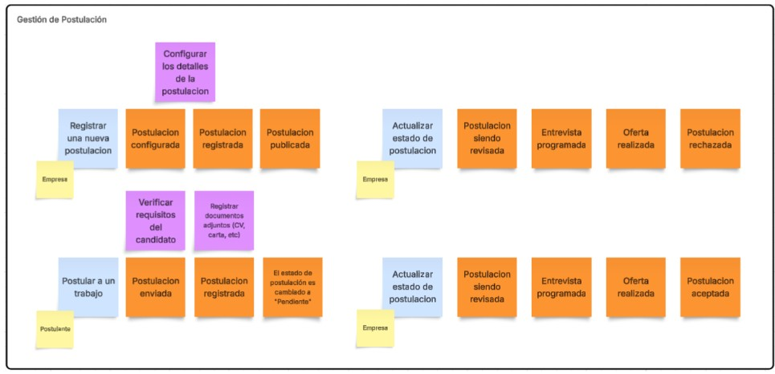

2. Gestión de Contacto de Postulación: concentra la comunicación entre la empresa y el postulante. Incluye el historial de interacciones de cada postulación y la posibilidad de que la empresa envíe feedback directamente al postulante dentro de la plataforma, ya sea mediante notificaciones o mensajes con motivos de rechazo o aceptación.

  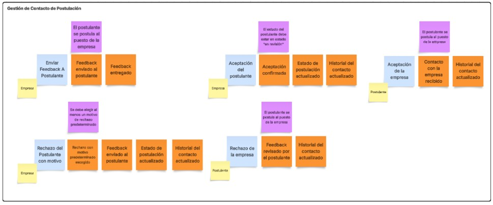

3. Gestión de Métricas: genera información estadística sobre el proceso del postulante, como el número de postulaciones realizadas, entrevistas obtenidas, rechazos recibidos y ofertas logradas. También calcula la tasa de conversión entre postulaciones y resultados, e incorpora elementos de gamificación como logros, insignias y progreso para motivar al usuario.

  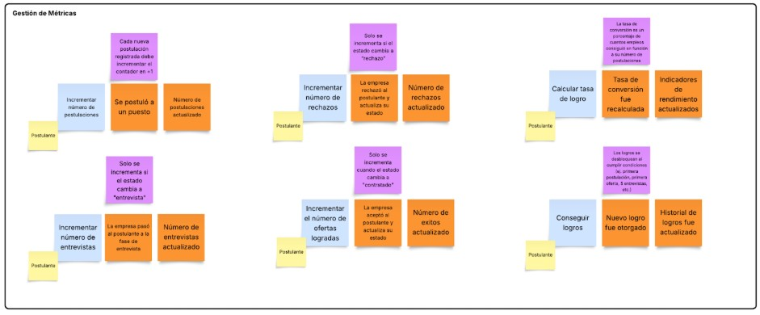

4. Gestión de Perfil: administra la información personal y profesional de los usuarios, diferenciando entre el rol de Postulante (usuario principal que busca empleo) y Empresa (que publica puestos y contacta candidatos). Además, incluye preferencias de configuración, historial general de actividad y actualización de datos.

  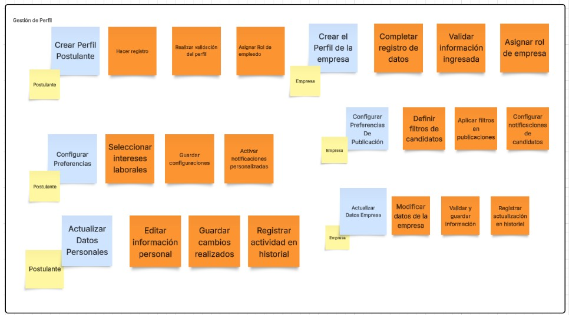

Estos bounded contexts fueron seleccionados porque permiten dividir el dominio en módulos claros y manejables, lo que facilita el modelado de eventos, la definición de responsabilidades y la posterior implementación de una arquitectura modular y escalable para LookUp.

Link del lucidchart: [https://lucid.app/lucidchart/e75a2165-9088-4385-af70-dc3039d2ddbd/edit?viewport\_loc=-219%2C482%2C2992%2C1376%2C0\_0\&invitationId=inv\_fa04b1fd-9f45-4fc9-b554-61f4f15ab238](https://lucid.app/lucidchart/e75a2165-9088-4385-af70-dc3039d2ddbd/edit?viewport_loc=-219%2C482%2C2992%2C1376%2C0_0&invitationId=inv_fa04b1fd-9f45-4fc9-b554-61f4f15ab238)

#### **2.5.1.2. Domain Message Flows Modeling** {#2.5.1.2.-domain-message-flows-modeling}

En esta sección se modelan los Domain Message Flows con el propósito de mostrar cómo los bounded contexts de LookUp colaboran para resolver los distintos casos de negocio de la aplicación. Para ello se emplea la técnica de Domain Storytelling, la cual permite narrar e ilustrar las interacciones entre actores y contextos, representando los mensajes que circulan entre ellos. Estos diagramas ayudan a comprender de forma visual y narrativa los flujos de información que se producen en escenarios clave del sistema, reflejando cómo se integran los procesos de postulación, métricas, contacto y perfil del usuario dentro del ecosistema de LookUp.

**Escenario 1: Creación de una nueva postulación:**

  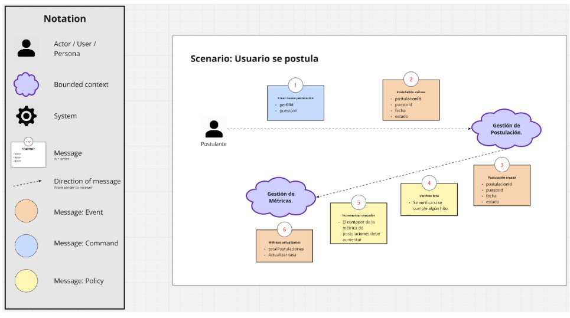

El postulante inicia el proceso enviando un comando para crear una nueva postulación, indicando el puesto al que desea aplicar. El contexto de Gestión de Postulación valida que no existan duplicados en el mismo día y registra la postulación con estado inicial “Pendiente”. Como parte del proceso, se emite un evento que refleja la creación de la postulación y otro que registra un hito en la línea de tiempo (“Postulación enviada”). Estos eventos son consumidos por el contexto de Gestión de Métricas, que aplica una política para incrementar el contador total de postulaciones y recalcula la tasa de éxito, notificando al sistema mediante un evento de métricas actualizadas.

**Escenario 2: Empresa cambia estado de una postulación:**

  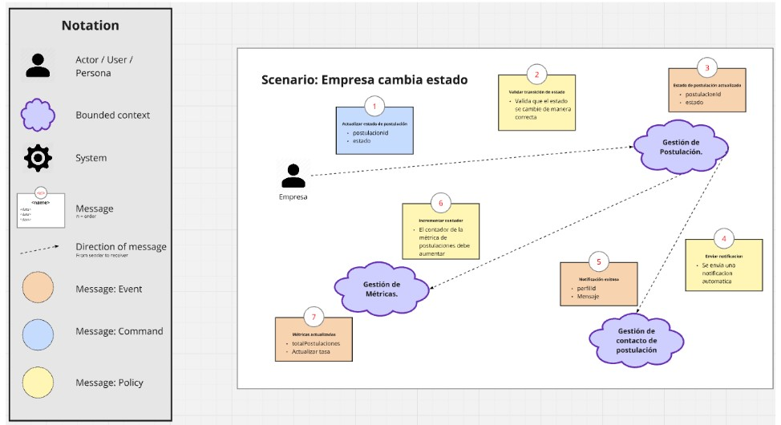

Cuando la empresa actualiza el estado de una postulación (por ejemplo, “En revisión”, “Entrevista”, “Exito” o “Rechazo”), se envía un comando al contexto de Gestión de Postulación, el cual valida que la transición de estado sea válida. Tras esta validación, se genera un evento que notifica el nuevo estado y se registra un hito en la línea de tiempo. A partir de este evento, el contexto de Gestión de Contacto ejecuta una política que genera el feedback adecuado para el postulante (motivo de rechazo, aceptación, próximos pasos). Paralelamente, el contexto de Gestión de Métricas ajusta los contadores correspondientes (entrevistas, ofertas o rechazos) y recalcula la tasa de conversión, emitiendo un evento con las métricas actualizadas.

**Escenario 3: Empresa envía feedback y postulante consulta historial:**

  

La empresa envía feedback sobre una postulación mediante un comando dirigido al contexto de Gestión de Contacto de Postulación. Este aplica políticas de validación (por ejemplo, exigir un motivo si el feedback es de tipo rechazo y normalizar el contenido del mensaje), y posteriormente emite un evento registrando el feedback junto con la actualización del historial de contacto. Más tarde, cuando el postulante solicita consultar su historial, el mismo contexto responde mostrando los mensajes y actualizaciones disponibles, lo que asegura que toda interacción con la empresa quede registrada de forma transparente y accesible para el usuario.

**Escenario 4: Postulante consulta métricas y obtiene logros:**

  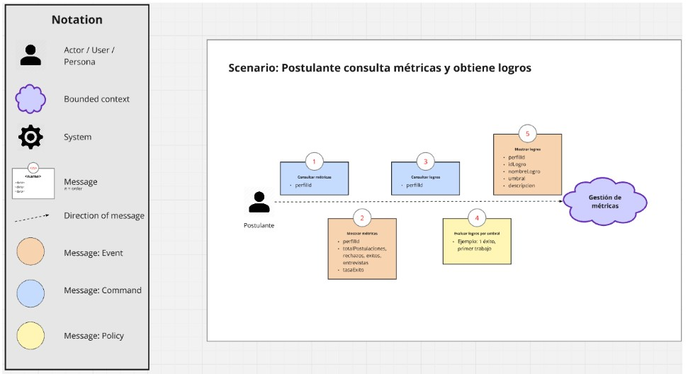

Al acceder a su panel, el postulante envía un comando al contexto de Gestión de Métricas para consultar sus indicadores. El sistema responde con un evento que contiene el resumen de sus métricas acumuladas (postulaciones, entrevistas, ofertas, rechazos y tasa de éxito). Como parte del flujo, se ejecuta una política que evalúa logros en base a umbrales definidos (por ejemplo, “Primera entrevista” o “10 postulaciones”), lo que puede derivar en la generación de un nuevo evento que otorga un logro al usuario. Finalmente, este logro puede ser comunicado al postulante a través de una notificación gestionada por el contexto de Gestión de Contacto, fortaleciendo la motivación y la gamificación de la plataforma.

#### **2.5.1.3. Bounded Context Canvases** {#2.5.1.3.-bounded-context-canvases}

Los Bounded Contexts Canvas en nuestro proyecto sirven como una herramienta para definir de manera clara los límites y responsabilidades de cada módulo del sistema. Gracias a este enfoque, podemos identificar qué función cumple cada contexto, cómo se comunica con los demás y qué decisiones de negocio gobiernan su comportamiento. En LookUp, nos permiten organizar la información en torno a los cuatro bounded contexts principales describiendo para qué sirve cada uno, qué beneficios aporta al sistema y de qué forma contribuye a lograr una experiencia más ordenada y coherente para los usuarios.

Link del miro: [https://miro.com/welcomeonboard/ZktBb21lM2h4cmppOTlodmVVS05OWlRNaFJuRmZYV2pCVjF3L0VMZ3plbjg4cmtPa0xFWElRd0tlSFFuZGIwWi9DMlRhQktEYWxnRWt2Ujgyd3RrOGxOVG8ybjRtcW9vOEs1ME5jREExSitudEdRaHc4K216YUhSY0FCaE5ZNmVhWWluRVAxeXRuUUgwWDl3Mk1qRGVRPT0hdjE=?share\_link\_id=921807483394](https://miro.com/welcomeonboard/ZktBb21lM2h4cmppOTlodmVVS05OWlRNaFJuRmZYV2pCVjF3L0VMZ3plbjg4cmtPa0xFWElRd0tlSFFuZGIwWi9DMlRhQktEYWxnRWt2Ujgyd3RrOGxOVG8ybjRtcW9vOEs1ME5jREExSitudEdRaHc4K216YUhSY0FCaE5ZNmVhWWluRVAxeXRuUUgwWDl3Mk1qRGVRPT0hdjE=?share_link_id=921807483394)

1. Gestión de Postulación

  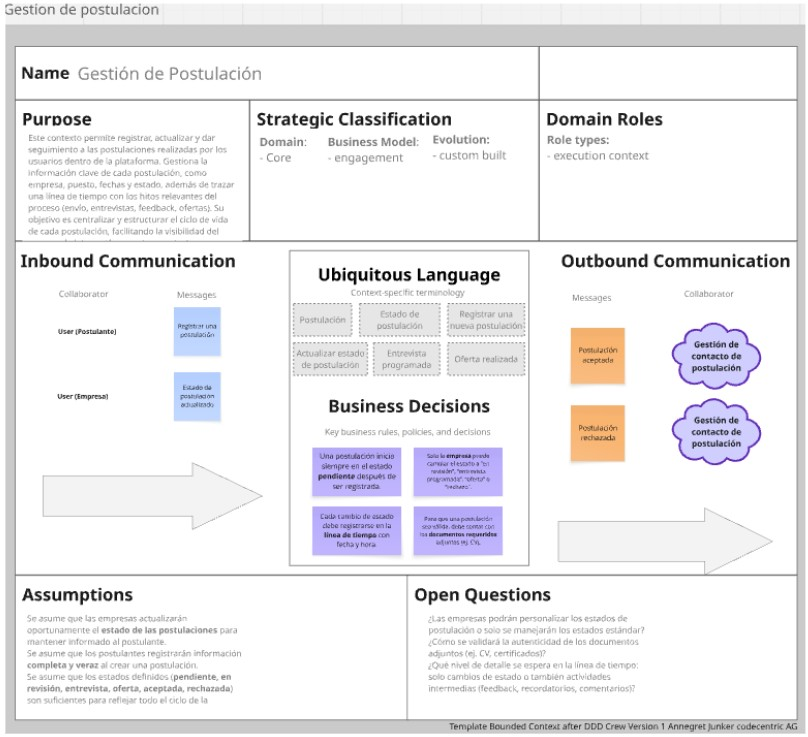

2. Gestión de Contacto de Postulación

  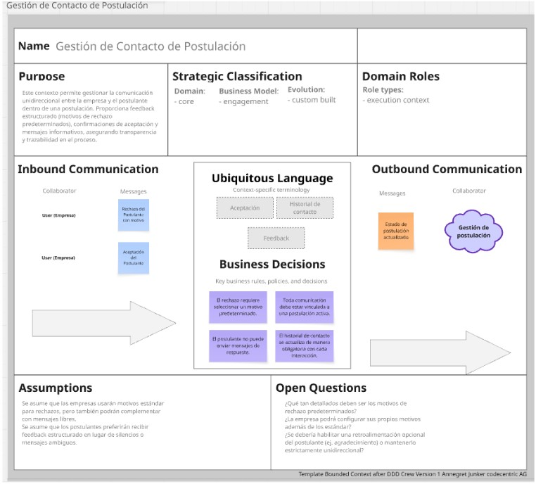

3. Gestión de Métricas

  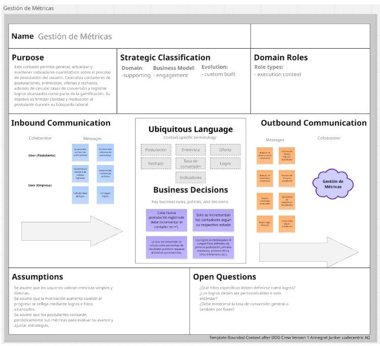

4. Gestión de Perfil

  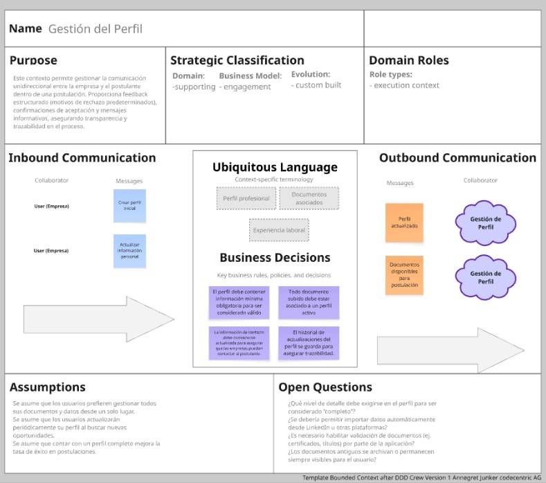

### **2.5.2. Context Mapping** {#2.5.2.-context-mapping}

**Bounded Context de Perfil → Bounded Context de Postulación:**

  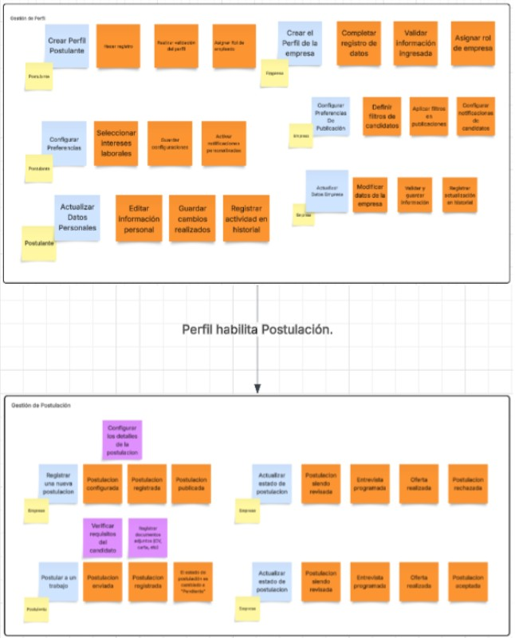

El bounded context de Perfil actúa como Upstream para el bounded context de Postulación (Downstream), ya que únicamente tras la creación y validación de un perfil (postulante o empresa) se pueden registrar postulaciones o publicar puestos. Esta integración sigue un patrón Conformist, puesto que Postulación depende de la información que provee Perfil (identidad y datos básicos) sin generar modificaciones en el sentido inverso. De esta manera, Perfil asegura que solo usuarios registrados y con información válida puedan interactuar en los procesos de postulación.

**Bounded Context de Postulación → Bounded Context de Métricas:**

  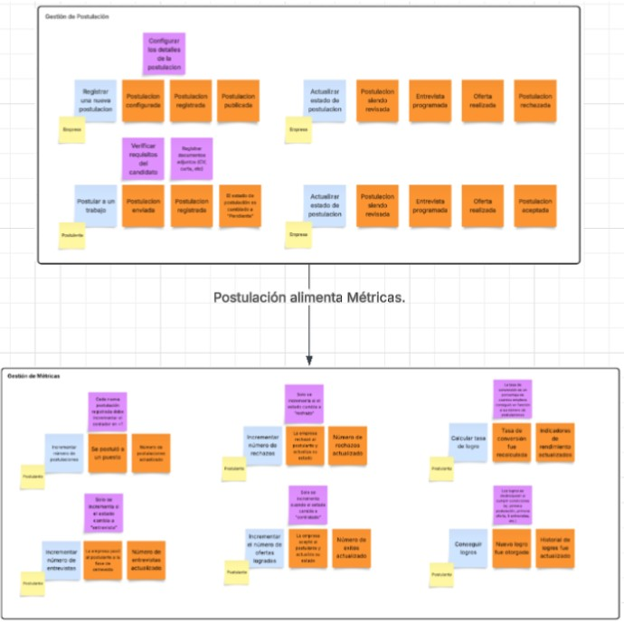

El bounded context de Postulación es Upstream respecto al bounded context de Métricas (Downstream), dado que cada evento asociado al ciclo de vida de una postulación (creación, cambio de estado o eliminación) es consumido por Métricas para actualizar indicadores y logros. La relación presenta un patrón de Cliente/Proveedor, donde Métricas (cliente) depende de la información de Postulación (proveedor) para ofrecer al usuario estadísticas confiables sobre su avance en el proceso de búsqueda de empleo.

**Bounded Context de Postulación → Bounded Context de Contacto de Postulación:**

  

El bounded context de Postulación funciona como Upstream para el bounded context de Contacto de Postulación (Downstream), ya que los cambios de estado de una postulación (pendiente, entrevista, oferta, rechazo) detonan comunicaciones entre empresa y postulante. El patrón aplicado es Conformist, debido a que Contacto se ajusta al modelo de eventos de Postulación para garantizar que los mensajes transmitidos reflejen fielmente la evolución del proceso. Esta relación asegura coherencia entre la gestión interna de las postulaciones y las notificaciones que recibe el usuario.

**Bounded Context de Perfil → Bounded Context de Contacto de Postulación:**

  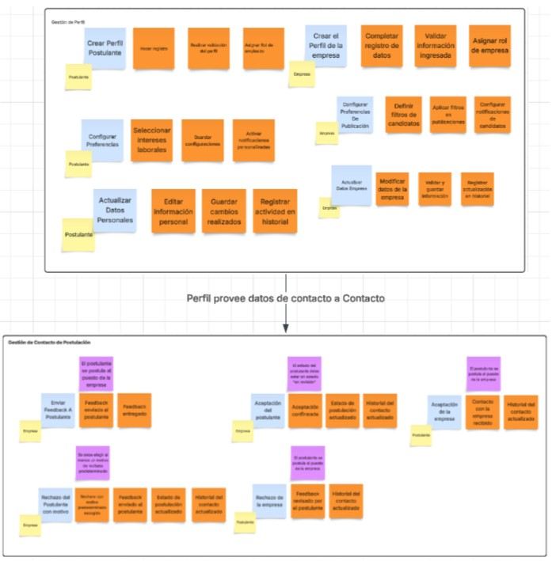

El bounded context de Perfil se conecta como Upstream al bounded context de Contacto de Postulación (Downstream), ya que los datos de contacto almacenados en el perfil (correo, teléfono, preferencias de comunicación) son imprescindibles para que el módulo de Contacto pueda enviar mensajes efectivos al postulante. Se trata de un patrón Conformist, pues Contacto consume y respeta los datos que Perfil administra, sin requerir modificaciones sobre el modelo original. Esta relación garantiza que las interacciones empresa–usuario se realicen a través de los canales correctos y actualizados.

**Bounded Context de Perfil → Bounded Context de Métricas:**

  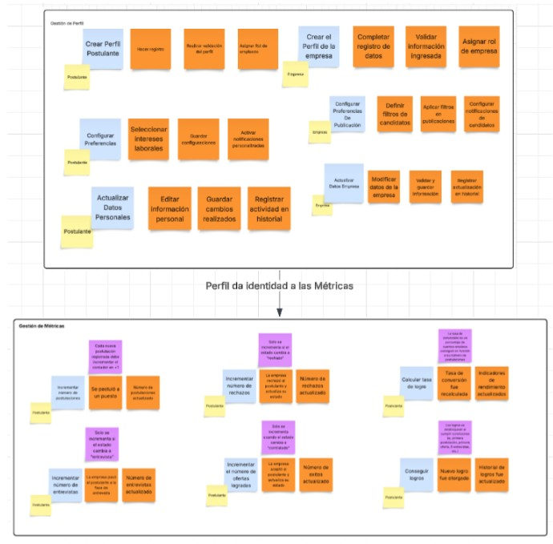

El bounded context de Perfil actúa como Upstream para el bounded context de Métricas (Downstream), ya que todo registro de métricas debe asociarse a un perfil válido de postulante. La relación se da bajo un patrón Conformist, porque Métricas consume la información de Perfil (identificadores y atributos de usuario) para vincular correctamente los indicadores, sin necesidad de imponer cambios sobre el modelo de origen. Esto garantiza que los datos estadísticos siempre estén ligados a una identidad consistente dentro del sistema.

### **2.5.3. Software Architecture** {#2.5.3.-software-architecture}

Para el diseño de la arquitectura de software de LookUp, se ha optado por el uso del Modelo C4, una técnica que permite representar el sistema en distintos niveles de abstracción: Contexto, Contenedores y Despliegue. Este enfoque progresivo facilita la comprensión integral de la solución, mostrando tanto la perspectiva macro —cómo LookUp interactúa con sus usuarios y con sistemas externos— como la visión micro, en la que se detalla la organización interna de los servicios y su despliegue en la infraestructura. La representación arquitectónica que se expone a continuación no solo describe la composición del sistema, sino que también evidencia las interacciones y responsabilidades de cada elemento, asegurando así un diseño coherente, escalable y alineado con los objetivos del proyecto.

#### **2.5.3.1. Software Architecture Context Level Diagrams** {#2.5.3.1.-software-architecture-context-level-diagrams}

El Context Diagram muestra a LookUp (el sistema central) interactuando con sus usuarios principales —el Postulante y la Empresa— quienes utilizan la aplicación para registrar postulaciones, publicar puestos, dar seguimiento al proceso y mantener la comunicación entre ambas partes. Este diagrama enfatiza las relaciones externas del sistema, sin entrar en los detalles de los bounded contexts internos, destacando cómo los actores clave (usuarios) se conectan con la plataforma principal para organizar información, recibir feedback y visualizar métricas de progreso en su búsqueda laboral.

  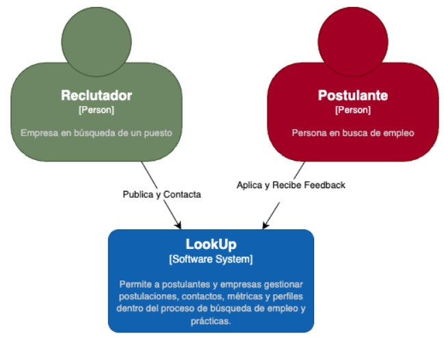

#### **2.5.3.2. Software Architecture Container Level Diagrams** {#2.5.3.2.-software-architecture-container-level-diagrams}

El Container Diagram describe la arquitectura del sistema, donde los usuarios principales —Postulante y Empresa— interactúan con la Web App y la Mobile App, las cuales se conectan a una API REST (backend) que gestiona la lógica de negocio asociada a la gestión de postulaciones, contactos, métricas y perfiles. Esta API se comunica con una base de datos PostgreSQL para almacenar y consultar información relevante. Cada componente (frontend web, frontend móvil, backend y base de datos) opera en contenedores o entornos independientes, conectados a través de APIs RESTful (HTTPS/JSON) y protocolos como JDBC (PostgreSQL).

  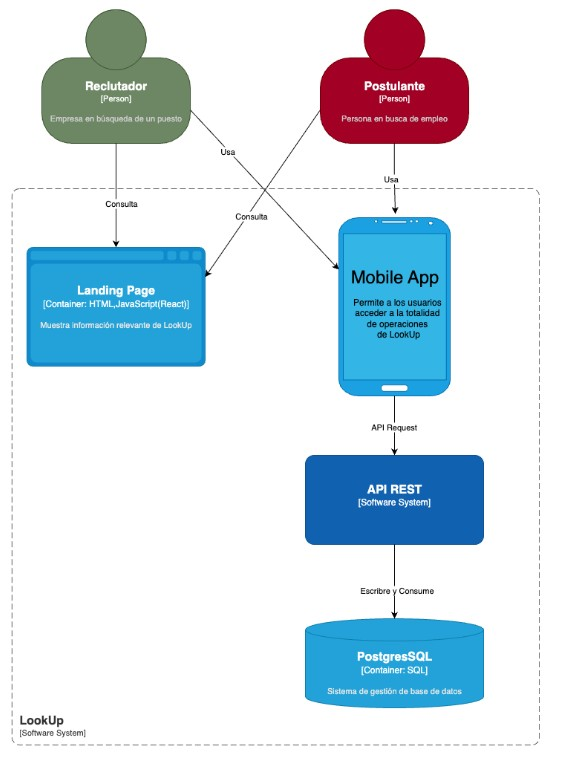

#### **2.5.3.3. Software Architecture Deployment Diagrams** {#2.5.3.3.-software-architecture-deployment-diagrams}

El diagrama de despliegue muestra como el software interactua con los servicios cloud necesarios para el servicio de backend y el servicio de base de datos. 

  

## 2.6. Tactical-Level Domain-Driven Design {#2.6.-tactical-level-domain-driven-design}

### **2.6.1. Bounded Context: Gestión de Postulación** {#2.6.1.-bounded-context:-gestión-de-postulación}

#### **2.6.1.1. Domain Layer** {#2.6.1.1.-domain-layer}

**Postulación (Entity):** Representa la solicitud de un candidato a un puesto publicado por una empresa.

- **Atributos:** postulacionId, candidatoId, puestoId, fechaPostulacion, estado, documentosAdjuntos.  
- **Métodos:** actualizarEstado(nuevoEstado), agregarDocumento(documento), registrarHito(descripcion, fecha).

**PuestoPostulacion (Entity):** Representa un puesto de trabajo creado por una empresa.

- **Atributos:** puestoId, empresaId, titulo, descripcion, requisitos, fechaInicio, fechaFin, estadoPublicacion.  
- **Métodos:** publicar(), cerrar(), actualizarRequisitos(nuevosRequisitos).

**EstadoPostulacion (ValueObject):** Representa los estados posibles de una postulación.

- **Atributos:** valor (pendiente, en revisión, entrevista, oferta, rechazo).  
- **Métodos:** esValido(nuevoEstado).

**Hito (Entity):** Representa un evento relevante dentro de la postulación.

- **Atributos:** hitoId, fecha, descripcion.  
- **Métodos:** actualizarDescripcion(nuevaDescripcion), cambiarFecha(nuevaFecha).

**LineaDeTiempo (ValueObject):** Registra los hitos relevantes de una postulación.

- **Atributos:** listaHitos (colección de Hito).  
- **Métodos:** agregarHito(fecha, descripcion).

**PostulacionAggregate (Aggregate):** Garantiza la consistencia entre la postulación, su estado y la línea de tiempo.

- **Atributos:** postulacion, estado, lineaDeTiempo.  
- **Métodos:** postularse(), cambiarEstado(nuevoEstado), registrarEvento(descripcion).

**PostulacionRepository (Repository):** Define las operaciones de persistencia de postulaciones.

- **Métodos:** guardar(postulacion), obtenerPorId(postulacionId), obtenerPorCandidato(candidatoId), obtenerPorPuesto(puestoId).

#### **2.6.1.2. Interface Layer** {#2.6.1.2.-interface-layer}

**PostulacionController(Controller):** Gestiona las operaciones de los candidatos.

- **POST /postulacion:** Crear una nueva postulación.  
- **GET /postulacion/{id}:** Consultar una postulación específica.  
- **GET /postulaciones/candidato/{candidatoId}:** Ver todas las postulaciones de un candidato.

**PuestoPostulacionController (Controller):** Gestiona las operaciones de las empresas.

- **POST /puesto:** Registrar un nuevo puesto de postulación.  
- **PUT /puesto/{id}/publicar:** Publicar un puesto.  
- **PUT /puesto/{id}/cerrar:** Cerrar un puesto.  
- **GET /puesto/{id}:** Consultar detalles de un puesto.

#### **2.6.1.3. Application Layer** {#2.6.1.3.-application-layer}

**PostularHandler (Command Handler):** Maneja el comando de un candidato que desea postular a un puesto.

- **Métodos:** handle(postularCommand).

**ActualizarEstadoPostulacionHandler (Command Handler):** Gestiona el cambio de estado de una postulación.

- **Métodos:** handle(actualizarEstadoCommand).

**RegistrarPuestoHandler (Command Handler):** Procesa la creación de un nuevo puesto de postulación.

- **Métodos:** handle(registrarPuestoCommand).

**PublicarPuestoHandler (Command Handler):** Maneja la publicación de un puesto.

- **Métodos:** handle(publicarPuestoCommand).

**PostulacionCreadaHandler (Event Handler):** Reacciona al evento de creación de una nueva postulación.

- **Métodos:** onPostulacionCreada(event).

**EstadoPostulacionActualizadoHandler (Event Handler):** Reacciona al evento de cambio de estado en la postulación.

- **Métodos:** onEstadoPostulacionActualizado(event).

#### **2.6.1.4. Infrastructure Layer** {#2.6.1.4.-infrastructure-layer}

**PostulacionRepositoryImpl (Repository Impl):** Implementa la persistencia de postulaciones.

- **Métodos:** guardar(postulacion), obtenerPorId(postulacionId), obtenerPorCandidato(candidatoId), obtenerPorPuesto(puestoId).

**PuestoPostulacionRepositoryImpl (Repository Impl):** Implementa la persistencia de los puestos de postulación.

- **Métodos:** guardar(puesto), obtenerPorId(puestoId), obtenerPorEmpresa(empresaId).

#### **2.6.1.5. Bounded Context Software Architecture Component Level Diagrams** {#2.6.1.5.-bounded-context-software-architecture-component-level-diagrams}

  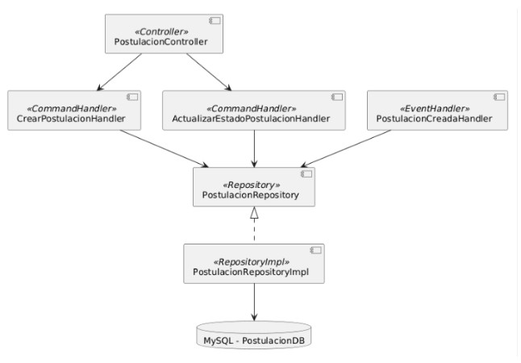

El diagrama se organiza así porque sigue los principios de arquitectura limpia: los controllers reciben las solicitudes externas, los handlers orquestan los casos de uso, los repositories definen contratos de persistencia en el dominio y sus implementaciones en infraestructura se conectan con MySQL. De esta forma, el dominio queda independiente de la tecnología, con responsabilidades claras y flexibilidad para cambiar bases de datos o interfaces sin afectar la lógica de negocio.

#### **2.6.1.6. Bounded Context Software Architecture Code Level Diagrams** {#2.6.1.6.-bounded-context-software-architecture-code-level-diagrams}

##### **2.6.1.6.1. Bounded Context Domain Layer Class Diagrams** {#2.6.1.6.1.-bounded-context-domain-layer-class-diagrams}

  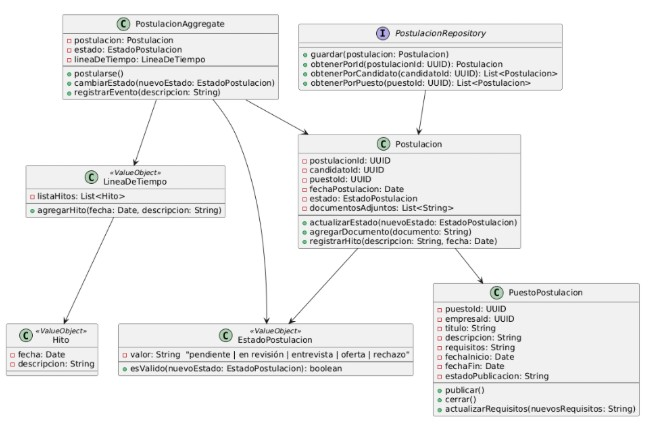

El diagrama de clases representa los principales elementos del dominio de postulación. Se definen las entidades como Postulación y PuestoPostulación, los value objects como EstadoPostulación y Línea de Tiempo, y el aggregate PostulaciónAggregate que garantiza la consistencia entre estado e hitos. Además, el repository abstrae las operaciones de persistencia. Con esta estructura se asegura un modelado centrado en el negocio, con objetos de valor que refuerzan inmutabilidad y entidades que mantienen identidad propia.

##### **2.6.1.6.2. Bounded Context Database Design Diagram** {#2.6.1.6.2.-bounded-context-database-design-diagram}

  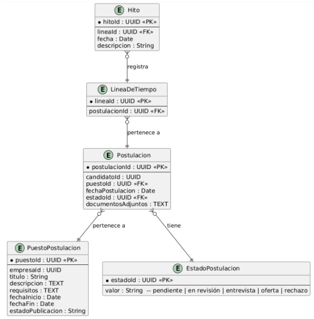

El diagrama de base de datos transforma los conceptos del dominio en tablas relacionales. La entidad Postulación guarda la información central de cada solicitud, asociada a PuestoPostulación y al candidato. Los estados de postulación se representan como un valor controlado, mientras que la línea de tiempo registra los hitos de la evolución de cada postulación. Este diseño garantiza integridad referencial y permite consultas eficientes para obtener postulaciones por candidato, puesto o estado.

### **2.6.2. Bounded Context: Gestión de Contacto de Postulación**

#### **2.6.2.1. Domain Layer**

**ContactoPostulación (Entity):** Representa la interacción entre la empresa y el postulante en una postulación específica.

- **Atributos:** contactoId, postulacionId, empresaId, perfilId, tipoMensaje, motivoRechazo, fechaHora.  
- **Métodos:** asociarFeedback(feedback), marcarComoAceptado(), marcarComoRechazado().

**Feedback(ValueObject):** Representa el contenido del feedback enviado al postulante.

- **Atributos:** tipo (aceptacion, rechazo, informativo), motivoRechazo (opcional), mensajeTexto.  
- **Métodos:** validarMotivo(), formatearMensaje().

**ContactoAggregate (Aggregate):** Es el punto de entrada para gestionar las interacciones de la empresa hacia el postulante.

- **Atributos:** contactoPostulacion, listaFeedback.  
- **Métodos:** procesarFeedback(feedback), actualizarEstadoPostulacion().

**ContactoRepository (Repository):** Define las operaciones para guardar y recuperar contactos asociados a postulaciones.

- **Métodos**: guardar(contacto), obtenerpostulacion(postulacionID)

#### **2.6.2.2. Interface Layer**

**ContactoController (Controller):** Gestiona las solicitudes HTTP relacionadas con la comunicación entre el postulante y la empresa.

- **POST /contacto/{postulaciónId}/feedback** : Envía un feedback al postulante.  
- **GET /contacto/{postulaciónId}** : Recupera los mensajes asociados a una postulación.  
- **PUT /contacto/{contactoId}/estado** : Actualiza el estado de un contacto (aceptado/rechazado).

#### **2.6.2.3. Application Layer**

**EnviarFeedbackCommandHandler:** Maneja el envío de feedback desde la empresa al postulante.

- **Métodos:**handle(enviarFeedbackCommand).

**ActualizarEstadoContactoHandler:** Permite cambiar el estado de un contacto (aceptado, rechazado).

- **Métodos:**handle(actualizarEstadoCommand).

#### **2.6.2.4. Infrastructure Layer**

- **ContactoRepositoryImpl:** Implementa la interfaz definida en el dominio para guardar y recuperar contactos. 

#### **2.6.2.5. Bounded Context Software Architecture Component Level Diagrams**

  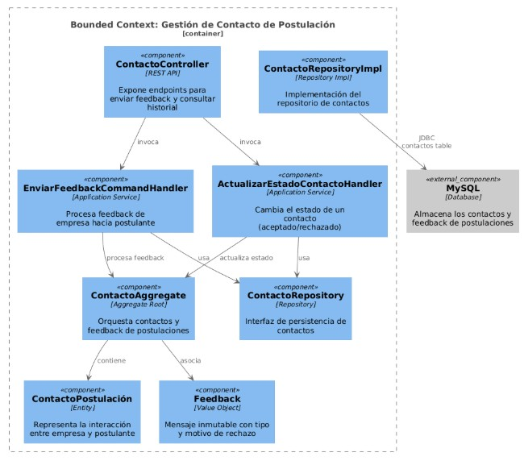

El diagrama de componentes de Gestión de Contacto de Postulación muestra cómo se organiza la arquitectura en capas siguiendo DDD: la Interface Layer expone endpoints REST mediante el ContactoController, la Application Layer orquesta la lógica con los command handlers EnviarFeedbackCommandHandler y ActualizarEstadoContactoHandler, la Domain Layer concentra las reglas de negocio a través de la entidad ContactoPostulación, el value object Feedback y el agregado ContactoAggregate, y la Infrastructure Layer implementa la persistencia con ContactoRepository conectado a MySQL. De esta manera, se asegura una separación clara de responsabilidades entre la interacción del usuario, la coordinación de procesos, la lógica del dominio y el almacenamiento de datos.

#### **2.6.2.6. Bounded Context Software Architecture Code Level Diagrams**

##### **2.6.2.6.1. Bounded Context Domain Layer Class Diagrams**

  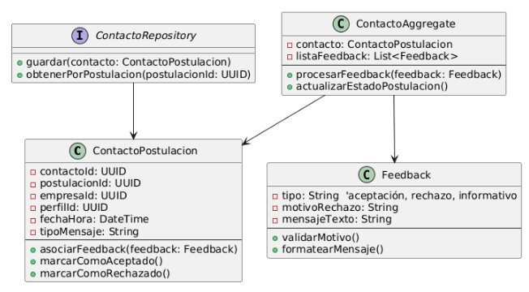

El diagrama de clases del Domain Layer de Gestión de Contacto de Postulación modela los principales elementos de negocio que intervienen en la comunicación entre empresa y postulante. La entidad ContactoPostulacion representa la interacción específica dentro de una postulación, mientras que el value object Feedback encapsula de manera inmutable el mensaje enviado por la empresa (ya sea de aceptación, rechazo o informativo). El agregado ContactoAggregate actúa como punto de entrada para garantizar la consistencia en el procesamiento de feedback y la actualización del estado de la postulación. Finalmente, la interfaz ContactoRepository define las operaciones necesarias para persistir y recuperar contactos asociados a postulaciones, desacoplando la lógica de dominio de la infraestructura de almacenamiento.

##### **2.6.2.6.2. Bounded Context Database Design Diagram**

  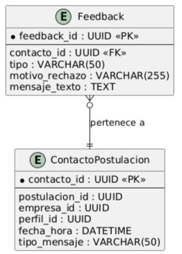

El diagrama de diseño de base de datos del Bounded Context: Gestión de Contacto de Postulación define dos tablas principales: ContactoPostulacion, que almacena los datos de cada interacción entre empresa y postulante (incluyendo identificadores, fecha y tipo de mensaje), y Feedback, que guarda los mensajes enviados con su tipo, motivo de rechazo y contenido textual. La relación entre ambas es de uno a muchos, ya que un contacto puede generar múltiples feedbacks asociados. Este diseño permite mantener un historial claro y estructurado de las comunicaciones, asegurando integridad referencial mediante la clave foránea contacto\_id.

### **2.6.3. Bounded Context: Gestión de Métricas**

#### **2.6.3.1. Domain Layer**

**MetricaRegistro (Entity):** Guarda las metricas del usuario

Atributos: perfilId, totalPostulaciones, totalEntrevistas, totalExitos, totalRechazos, tasaExito.

Metodos: aumentarPostulaciones(), aumentarEntrevistas(), aumentarOfertas(), aumentarRechazos(), tasaExito(totalPostulaciones, totalExitos) 

**Logro (Value Object)**: Representa un logro de gamificación alcanzado al cumplir un umbral (ej. 5 postulaciones, 3 entrevistas).

**Atributos**: idLogro, nombreLogro, umbral, fechaObtencion.

**Métodos**: verificarLogro(totalPostulaciones, totalEntrevistas, totalExitos).

**MetricaAggregate (Aggregate):** Agrupa la entidad MetricaRegistro y su lista de Logro. Sirve como “punto central” para actualizar los contadores, recalcular la tasa y otorgar logros sin inconsistencias.

**Atributos:** metricaRegistro, listaLogros.

**Métodos:** aplicarPostulacionCreada(), aplicarEstadoActualizado(estadoAnterior, estadoNuevo), aplicarPostulacionEliminada(), evaluarLogros(listaReglas).

**MetricaRepository (Repository):** Define cómo guardar y recuperar las métricas del postulante (la implementación real va en otra capa).

**Métodos:** guardar(metricaAggregate), obtenerPorPostulante(postulanteId).

#### **2.6.3.2. Interface Layer**

**MetricaController (Controller):** Gestiona las solicitudes HTTP relacionadas con los indicadores y logros del postulante (conteos, tasa de éxito y gamificación).

**GET /metricas/{perfilId}** : Devuelve el resumen de indicadores del postulante (totalPostulaciones, totalEntrevistas, totalOfertas, totalRechazos, tasaExito).

**GET /metricas/{perfilId}/logros** : Lista los logros obtenidos por el postulante (nombreLogro, umbral, fechaObtencion).

**POST /metricas/{perfilId}/recalcular** : Recalcula todos los indicadores y la tasa a partir del historial consolidado (útil para sincronizaciones/correcciones).

#### **2.6.3.3. Application Layer**

**RecalcularMetricasHandler (Command Handler):** Recalcula todos los contadores y la tasa de éxito a partir del historial consolidado del postulante.

**Métodos:** handle(recalcularMetricasCommand).

**ConsultarResumenMetricasHandler (Query Handler):** Devuelve el registro de métricas del postulante (contadores \+ tasa).

**Métodos:** handle(consultarResumenMetricasQuery).

**ListarLogrosHandler (Query Handler):** Retorna los logros alcanzados por el postulante.

**Métodos:** handle(listarLogrosQuery).

**OnPostulacionCreadaHandler (Event Handler):** Escucha el evento externo *PostulacionCreada* emitido por Gestión de Postulación y actualiza el agregado de métricas del postulante (+1 en totalPostulaciones, recalcular tasa, evaluar logros).

**Métodos:** onPostulacionCreada(event).

**OnEstadoPostulacionActualizadoHandler (Event Handler):** Escucha *EstadoPostulacionActualizado* y ajusta contadores según transición (→ entrevista/oferta/rechazo). Recalcula la tasa de éxito y evalúa logros.

**Métodos:** onEstadoActualizado(event).

**OnPostulacionEliminadaHandler (Event Handler):** Escucha *PostulacionEliminada* y revierte el impacto de esa postulación en las métricas (decrementos y recálculo correspondiente).

**Métodos:** onPostulacionEliminada(event).

#### **2.6.3.4. Infrastructure Layer**

**MetricaRepositoryImpl (Repository Impl):** Implementa la interfaz MetricaRepository del dominio para persistir y recuperar el agregado de métricas de un postulante.

Métodos: guardar(metricaAggregate), obtenerPorPostulante(perfilId).

#### **2.6.3.5. Bounded Context Software Architecture Component Level Diagrams**

  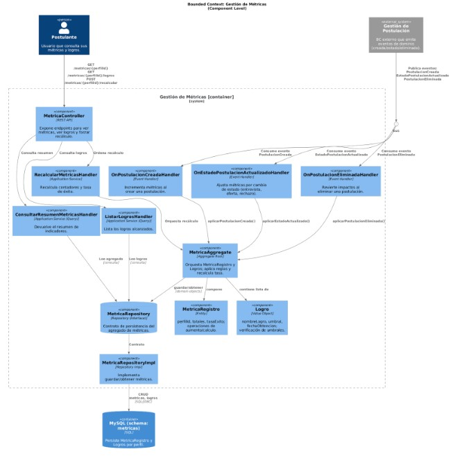

Este diagrama C4 a nivel de componentes muestra cómo funciona el Bounded Context de Gestión de Métricas dentro de la plataforma. El Postulante interactúa a través del MetricaController, que expone endpoints REST para consultar sus indicadores, logros o solicitar un recálculo. Estas solicitudes son atendidas por diferentes Application Services como RecalcularMetricasHandler, ConsultarResumenMetricasHandler y ListarLogrosHandler, que orquestan la lógica del dominio. A su vez, el contexto consume eventos externos de Gestión de Postulación mediante Event Handlers (OnPostulacionCreadaHandler, OnEstadoPostulacionActualizadoHandler y OnPostulacionEliminadaHandler) para actualizar los contadores y logros. Toda la lógica de negocio se concentra en el MetricaAggregate, que coordina la entidad MetricaRegistro y el value object Logro. Finalmente, el agregado se persiste a través de la interfaz MetricaRepository, implementada por MetricaRepositoryImpl, que se comunica con una base de datos MySQL donde se almacenan las métricas y logros de cada postulante.

#### **2.6.3.6. Bounded Context Software Architecture Code Level Diagrams**

##### **2.6.3.6.1. Bounded Context Domain Layer Class Diagrams**

  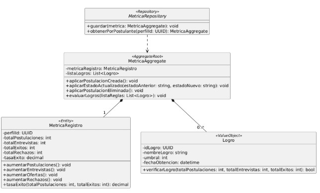

Este diagrama UML de clases representa el Domain Layer del Bounded Context de Gestión de Métricas. En el centro se encuentra el MetricaAggregate, que actúa como Aggregate Root y garantiza la consistencia del dominio, al orquestar tanto la entidad principal como los logros alcanzados. El agregado se compone de una MetricaRegistro (Entity), que almacena los contadores clave de un postulante (total de postulaciones, entrevistas, ofertas exitosas, rechazos y la tasa de éxito), e incluye métodos para incrementar cada métrica y recalcular la tasa. Además, el agregado puede contener múltiples instancias del Logro (Value Object), que encapsula hitos de gamificación alcanzados al cumplir determinados umbrales (por ejemplo, cierto número de postulaciones o entrevistas). Los logros no tienen identidad propia fuera de este agregado y solo se validan en función de los totales. Finalmente, la interfaz MetricaRepository (Repository) define las operaciones de persistencia necesarias para guardar y recuperar métricas, manteniendo al dominio desacoplado de la infraestructura. En conjunto, este diseño asegura que las métricas de cada postulante se actualicen de forma coherente, que los logros se evalúen automáticamente y que los datos puedan persistirse sin afectar la lógica central del negocio.

##### **2.6.3.6.2. Bounded Context Database Design Diagram**

  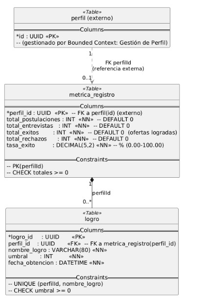

Este diagrama muestra el diseño de la base de datos para el Bounded Context de Gestión de Métricas. La tabla central es metrica\_registro, que guarda los indicadores acumulados de cada postulante: número total de postulaciones, entrevistas, éxitos logrados (ofertas), rechazos y la tasa de éxito expresada en porcentaje. Esta tabla utiliza como clave primaria el campo perfil\_id, que es además una clave foránea que referencia al identificador de usuario proveniente del Bounded Context de Gestión de Perfil, garantizando la coherencia entre el perfil y sus métricas.

La tabla logro almacena los hitos de gamificación alcanzados por cada postulante. Contiene como clave primaria el logro\_id, además de una clave foránea a metrica\_registro mediante el campo perfil\_id, lo que permite asociar múltiples logros a un mismo perfil. Sus atributos incluyen el nombre del logro, el umbral que lo define y la fecha de obtención. Se aplican restricciones de unicidad para asegurar que un mismo perfil no duplique logros con el mismo nombre, y se establece que los valores de umbral siempre sean mayores o iguales a cero.

Finalmente, la tabla perfil, gestionada externamente por el Bounded Context de Perfil, actúa como referencia externa para enlazar métricas con usuarios registrados en el sistema. Este diseño asegura la integridad referencial y permite que las métricas y logros se consulten y actualicen de manera consistente con la información del postulante.

### **2.6.4. Bounded Context: Gestión del Perfil**

#### **2.6.4.1. Domain LayerPerfil (Entity)**

Perfil (Entity): Representa el perfil de un usuario dentro de la aplicación (puede ser postulante o empresa).

**Atributos**: perfilId, tipoPerfil (Postulante/Empresa), datosPersonales, preferencias, rolAsignado, fechaCreacion, fechaActualizacion.

**Métodos**: crearPerfil(datos), actualizarDatos(datos), asignarRol(rol), configurarPreferencias(preferencias).

Preferencia (Value Object)

Representa las configuraciones personalizadas del usuario (notificaciones, intereses laborales, filtros de candidatos).

**Atributos**: idPreferencia, tipoPreferencia, valor, fechaConfiguracion.

**Métodos**: validarPreferencia(), actualizarPreferencia(nuevoValor).

**PerfilAggregate (Aggregate)**

Sirve como raíz de consistencia para todo lo relacionado al perfil (entidad Perfil, sus preferencias y reglas de validación).

**Atributos**: perfil (entidad), listaPreferencias, historialCambios.

**Métodos**: aplicarCreacionPerfil(), aplicarActualizacionDatos(), aplicarCambioFoto(), aplicarConfiguracionPreferencias(), aplicarActualizacionEmpresa().

PerfilRepository (Repository)

Define cómo se guarda y recupera la información del perfil en el sistema.

**Métodos**: guardar(perfilAggregate), obtenerPorId(perfilId), obtenerPorTipo(tipoPerfil).

#### 

#### **2.6.4.2. Interface Layer**

**PerfilPostulanteController (Controller)**

Gestiona las operaciones de los candidatos/postulantes.

**POST /perfil/postulante**: Crear un nuevo perfil de postulante.

**PUT /perfil/postulante/{id}/datos**: Actualizar datos personales del postulante.

**PUT /perfil/postulante/{id}/foto**: Actualizar foto de perfil del postulante.

**PUT /perfil/postulante/{id}/preferencias**: Configurar preferencias de notificaciones/intereses laborales.

**GET /perfil/postulante/{id}**: Consultar información del perfil del postulante.

PerfilEmpresaController (Controller)

Gestiona las operaciones de los perfiles empresariales.

**POST /perfil/empresa**: Crear un nuevo perfil de empresa.

**PUT /perfil/empresa/{id}/datos**: Actualizar datos de la empresa.

**PUT /perfil/empresa/{id}/logo**: Actualizar el logo de la empresa.

**PUT /perfil/empresa/{id}/responsable**: Asignar un responsable de la empresa.

**PUT /perfil/empresa/{id}/preferencias**: Configurar preferencias de publicación y filtros de candidatos.

**GET /perfil/empresa/{id}**: Consultar información del perfil de la empresa.

#### 2.6.4.3. Application Layer

CrearPerfilPostulanteHandler (Command Handler): Maneja la creación de un nuevo perfil de postulante.

Métodos: handle(crearPerfilPostulanteCommand).

ActualizarDatosPostulanteHandler (Command Handler): Gestiona la actualización de los datos personales de un postulante.

Métodos: handle(actualizarDatosPostulanteCommand).

ConfigurarPreferenciasPostulanteHandler (Command Handler): Procesa la configuración de preferencias del postulante (intereses, notificaciones).

Métodos: handle(configurarPreferenciasPostulanteCommand).

ActualizarFotoPostulanteHandler (Command Handler): Maneja la actualización de la foto de perfil del postulante.

Métodos: handle(actualizarFotoPostulanteCommand).

CrearPerfilEmpresaHandler (Command Handler): Procesa la creación de un nuevo perfil de empresa.

Métodos: handle(crearPerfilEmpresaCommand).

ActualizarDatosEmpresaHandler (Command Handler): Gestiona la actualización de datos de la empresa.

Métodos: handle(actualizarDatosEmpresaCommand).

ActualizarLogoEmpresaHandler (Command Handler): Maneja la actualización del logo de la empresa.

Métodos: handle(actualizarLogoEmpresaCommand).

#### 2.6.4.4. Infrastructure Layer

PerfilRepositoryImpl (Repository Impl)

Implementa la persistencia de perfiles (postulantes y empresas).

Métodos:

guardar(perfil)

obtenerPorId(perfilId)

obtenerPorTipo(tipoPerfil)

eliminar(perfilId)

PreferenciaRepositoryImpl (Repository Impl)

Implementa la persistencia de las preferencias de los perfiles.

Métodos:

guardar(preferencia)

obtenerPorPerfil(perfilId)

actualizar(preferencia)

Servicios externos

ValidacionIdentidadService: Verifica la autenticidad de los datos del postulante o empresa.

Métodos:

validarDocumento(numeroDocumento, tipoDocumento)

validarEmpresa(ruc, razonSocial)

**AlmacenamientoService:** Maneja archivos asociados al perfil (fotos de postulante, logos de empresa).

**Métodos:**

subirArchivo(ruta, archivo)

obtenerArchivo(ruta)

eliminarArchivo(ruta)

#### **2.6.4.5. Bounded Context Software Architecture Component Level Diagrams**

  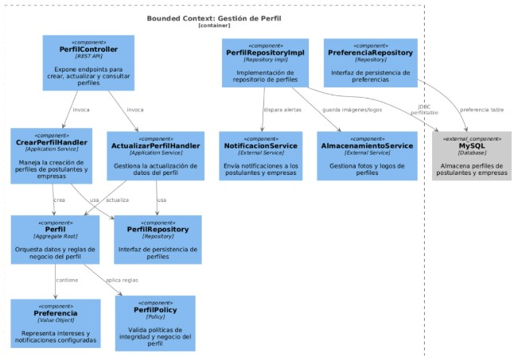

Este diagrama C4 a nivel de componentes muestra cómo funciona el Bounded Context de Gestión del Perfil dentro de la plataforma. El usuario interactúa mediante el PerfilController, que expone endpoints REST para crear, actualizar o consultar un perfil. Estas operaciones son gestionadas en la capa de aplicación por servicios como CrearPerfilHandler y ActualizarPerfilHandler, que orquestan la lógica de negocio. La capa de dominio concentra las reglas y validaciones en el agregado Perfil, que incluye el value object Preferencia y políticas como PerfilPolicy. La persistencia se realiza a través de PerfilRepository, implementado por PerfilRepositoryImpl, que comunica los datos hacia una base de datos MySQL. Además, servicios externos como NotificacionService y AlmacenamientoService permiten enviar alertas y gestionar fotos o logos de los perfiles.

#### **2.6.4.6. Bounded Context Software Architecture Code Level Diagrams**

##### **2.6.4.6.1. Bounded Context Domain Layer Class Diagrams**

  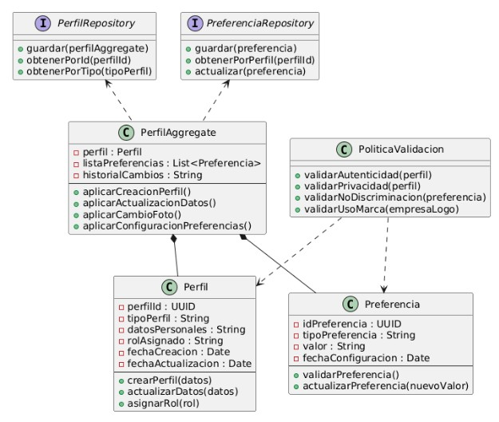

Este diagrama de clases de la capa de dominio muestra la estructura central del Bounded Context de Gestión del Perfil. El agregado raíz Perfil orquesta los datos principales del postulante o empresa, garantizando la consistencia de la información. Dentro del agregado, el value object Preferencia representa configuraciones personales como intereses o notificaciones, mientras que PerfilPolicy define las reglas de negocio y validaciones aplicables a la creación o modificación de un perfil. Además, el PerfilAggregate actúa como punto de entrada para coordinar actualizaciones de datos y aplicar políticas, asegurando que los cambios se realicen de manera controlada y sin inconsistencias.

##### **2.6.4.6.2. Bounded Context Database Design Diagram**

  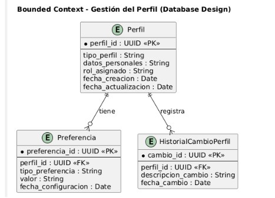

Este diagrama de diseño de base de datos refleja cómo se almacenan los datos del Bounded Context de Gestión del Perfil. La tabla principal Perfil contiene los atributos clave del postulante o empresa (como nombre, correo, datos de contacto y tipo de perfil). A ella se relaciona la tabla Preferencia, que almacena configuraciones asociadas a cada perfil, incluyendo intereses y opciones de notificación. Ambas tablas están enlazadas mediante una relación de clave foránea, lo que garantiza integridad referencial entre un perfil y sus preferencias. Este diseño facilita consultas rápidas sobre la información personal y las configuraciones del usuario, manteniendo una estructura clara y normalizada.

# **CONCLUSIONES Y RECOMENDACIONES**

**Conclusiones:**

* **Necesidad clara de una solución digital:**  
  Los estudiantes, egresados y profesionales en transición muestran dificultades para organizar sus postulaciones laborales debido al uso de métodos dispersos (Excel, correos, notas). Esto confirma la pertinencia de LookUp como una aplicación centralizada para gestionar el proceso.  
* **Centralización y seguimiento en tiempo real:**  
  Existe un fuerte interés en contar con una herramienta que permita visualizar el estado de cada postulación, con notificaciones y métricas claras (número de entrevistas, rechazos y ofertas), lo cual incrementa la confianza y reduce la incertidumbre.  
* **Valor del feedback y las métricas:**  
  Los usuarios consideran crucial recibir retroalimentación de los procesos de selección y estadísticas de avance. Esto no solo mejora la organización, sino que también actúa como motivador y ayuda en la toma de decisiones estratégicas.  
* **Factores de adopción clave:**  
  La interfaz intuitiva, el acceso móvil y la simplicidad en el registro son condiciones indispensables para la aceptación de la app. Además, la integración de métricas y logros puede aumentar la motivación y el uso constante.

**Recomendaciones:**

* **Enfocar la propuesta de valor en la centralización y simplicidad:**  
  Resaltar en la comunicación y en la interfaz que LookUp permite tener todo en un solo lugar: postulaciones, documentos, estados y métricas. Esto refuerza la diferenciación frente a competidores y responde directamente al dolor principal de los usuarios.  
* **Optimizar la experiencia móvil:**  
  Asegurar que la aplicación sea ligera, responsiva y con un diseño intuitivo. Incluir tutoriales interactivos (onboarding) para que los nuevos usuarios entiendan rápidamente cómo registrar postulaciones, adjuntar documentos y revisar métricas.  
* **Ampliar la personalización:**  
  Incluir filtros avanzados y sugerencias según perfil académico, experiencia y sector laboral. Esto aumentará la relevancia de la información y reducirá la frustración de revisar ofertas poco alineadas.

# **BIBLIOGRAFÍA**

* Alvarez, A. (2020, 5 de agosto). 5W2H: Qué significa, para qué sirve, cómo aplicarla y algunos ejemplos. *LeanConstructionMexico.* [https://www.leanconstructionmexico.com.mx/post/5w2h-qu%C3%A9-significapara-qu%C3%A9-sirve-c%C3%B3mo-aplicarla-y-algunos-ejemplos](https://www.leanconstructionmexico.com.mx/post/5w2h-qu%C3%A9-significapara-qu%C3%A9-sirve-c%C3%B3mo-aplicarla-y-algunos-ejemplos)  
* Brothwell, P. (2023, 12 de enero). 2023 job application statistics. *HiringThing.* [https://blog.hiringthing.com/job-application-statistics](https://blog.hiringthing.com/job-application-statistics)  
* ComexPerú. (2025, 21 de febrero). Más peruanos desisten de buscar empleo. *ComexPerú.* [https://www.comexperu.org.pe/articulo/mas-peruanos-desisten-de-buscar-empleo](https://www.comexperu.org.pe/articulo/mas-peruanos-desisten-de-buscar-empleo)  
* Eckhardt, F. (2024, 12 de marzo). Mobile vs. desktop: Trends in job search. *Appcast.* [https://www.appcast.io/mobile-versus-desktop-trends-in-job-search/](https://www.appcast.io/mobile-versus-desktop-trends-in-job-search/)  
* Lean UX y Lean Startup: potencia experiencia y diseño de producto. (2023, 28 de septiembre). *Pragma.* [https://www.pragma.co/es/blog/lean-ux-y-lean-startuppotencia-experiencia-y-diseno-de-producto](https://www.pragma.co/es/blog/lean-ux-y-lean-startuppotencia-experiencia-y-diseno-de-producto)  
* New report says over half of candidates are abandoning job applications mid-way. (2025, 3 de septiembre). *BambooHR News.* [https://newsroom.bamboohr.com/livecareer-survey-job-seekers-abandon-applications/](https://newsroom.bamboohr.com/livecareer-survey-job-seekers-abandon-applications/)  
* Ongresso. (2023, 27 de septiembre). Labor market in Peru 2023–2024. *Ongresso.* [https://blog.ongresso.com/labor-market-in-peru-2023-2024](https://blog.ongresso.com/labor-market-in-peru-2023-2024)  
* Redacción Gestión. (2024, 16 de abril). Ocho de cada 10 peruanos confían en las plataformas digitales para conseguir empleo. *Gestión.* [https://gestion.pe/economia/management-empleo/ocho-de-cada-10-peruanos-confian-en-las-plataformas-digitales-para-conseguir-empleo-procesos-de-seleccion-bumeran-noticia/](https://gestion.pe/economia/management-empleo/ocho-de-cada-10-peruanos-confian-en-las-plataformas-digitales-para-conseguir-empleo-procesos-de-seleccion-bumeran-noticia/)  
* Why candidate abandonment is your job board’s biggest challenge in 2025\. (2024, 18 de diciembre). *UBIO.* [https://ub.io/blog-posts/why-candidate-abandonment-is-your-job-boards-biggest-challenge-in-2025](https://ub.io/blog-posts/why-candidate-abandonment-is-your-job-boards-biggest-challenge-in-2025)

# 2.4.2. User Stories {#2.4.2.-user-stories}

> Nota: Para evitar que las tablas “se rompan”, cada historia usa:
> 1) una tabla breve (metadatos) y  
> 2) secciones con **Title**, **Description** y **Acceptance Criteria** en listas.

---

## US01 — Visualización del mensaje principal en la página de inicio

| Story ID | User      | Priority | Epic |
|----------|-----------|:--------:|:----:|
| US01     | Visitante |    1     | EP01 |

**Title**  
- Visualización del mensaje principal en la página de inicio

**Description**  
- Como visitante de la landing page, quiere percibir un mensaje central claro y motivador en la pantalla inicial para comprender de inmediato el propósito de LookUp.

**Acceptance Criteria**  
- **Escenario 1: Mensaje principal visible**  
  Dado que un visitante accede a la landing page, cuando se carga la sección inicial, entonces se muestra un enunciado principal y un subtítulo que comunican el propósito de LookUp.

---

## US02 — Acceso al menú de navegación en distintos tamaños de pantalla

| Story ID | User      | Priority | Epic |
|----------|-----------|:--------:|:----:|
| US02     | Visitante |    1     | EP01 |

**Title**  
- Acceso al menú de navegación en distintos tamaños de pantalla

**Description**  
- Como visitante, quiere acceder al menú de navegación desde cualquier dispositivo para desplazarse por el sitio sin depender del tamaño de pantalla.

**Acceptance Criteria**  
- **Escenario 1: Acceso en entorno de escritorio**  
  Dado que un visitante utiliza un computador de escritorio, cuando visualiza la navegación del sitio, entonces puede acceder a las opciones principales del menú.  
- **Escenario 2: Acceso en dispositivo móvil o tablet**  
  Dado que un visitante utiliza un dispositivo móvil o una tablet, cuando activa el control de apertura del menú, entonces se presentan las opciones de navegación de forma adecuada al espacio disponible.

---

## US03 — Exhibición de beneficios clave en la landing page

| Story ID | User      | Priority | Epic |
|----------|-----------|:--------:|:----:|
| US03     | Visitante |    1     | EP01 |

**Title**  
- Exhibición de beneficios clave en la landing page

**Description**  
- Como visitante, quiere identificar rápidamente los beneficios más relevantes de LookUp para conocer sus principales ventajas.

**Acceptance Criteria**  
- **Escenario 1: Beneficios destacados**  
  Dado que un visitante recorre la landing page, cuando llega a la sección de beneficios, entonces se muestran como mínimo cuatro beneficios, cada uno con un identificador y una breve descripción.

---

## US04 — Navegación rápida a secciones principales

| Story ID | User      | Priority | Epic |
|----------|-----------|:--------:|:----:|
| US04     | Visitante |    1     | EP01 |

**Title**  
- Navegación rápida a secciones principales

**Description**  
- Como visitante, quiere acceder de manera ágil a las secciones clave desde la navegación para encontrar la información requerida sin demoras.

**Acceptance Criteria**  
- **Escenario 1: Ir a Servicios**  
  Dado que un visitante abre el menú de navegación, cuando selecciona la opción «Servicios», entonces queda posicionado en la sección «Servicios».  
- **Escenario 2: Ir a Contacto**  
  Dado que un visitante abre el menú de navegación, cuando selecciona la opción «Contacto», entonces se muestra la página «Contacto».  
- **Escenario 3: Ir a Nosotros**  
  Dado que un visitante abre el menú de navegación, cuando selecciona la opción «Nosotros», entonces se muestra la página «Nosotros».

---

## US05 — Acceso a la sección «Sobre Nosotros»

| Story ID | User      | Priority | Epic |
|----------|-----------|:--------:|:----:|
| US05     | Visitante |    1     | EP01 |

**Title**  
- Acceso a la sección «Sobre Nosotros»

**Description**  
- Como visitante, quiere ingresar a la sección «Sobre Nosotros» para conocer la historia, misión y propósito de LookUp.

**Acceptance Criteria**  
- **Escenario 1: Contenido de «Sobre Nosotros» visible**  
  Dado que un visitante selecciona la opción «Nosotros», cuando se abre la ruta correspondiente, entonces se despliega contenido verificable sobre la organización y LookUp, acompañado de recursos informativos.

---

## US06 — Acceso a políticas de privacidad y términos de servicio

| Story ID | User      | Priority | Epic |
|----------|-----------|:--------:|:----:|
| US06     | Visitante |    1     | EP01 |

**Title**  
- Acceso a políticas de privacidad y términos de servicio

**Description**  
- Como visitante, desea consultar las políticas de privacidad y los términos de servicio para comprender las condiciones legales de uso del sitio.

**Acceptance Criteria**  
- **Escenario 1: Enlaces legales operativos**  
  Dado que un visitante se encuentra en el área de información legal del sitio, cuando solicita políticas de privacidad o términos de servicio, entonces se muestra el contenido vigente de cada documento.

---

## US07 — Acceso a redes sociales desde el pie de página

| Story ID | User      | Priority | Epic |
|----------|-----------|:--------:|:----:|
| US07     | Visitante |    1     | EP01 |

**Title**  
- Acceso a redes sociales desde el pie de página

**Description**  
- Como visitante, quiere acceder a las redes sociales oficiales de LookUp desde el pie de página para mantenerse informado sobre novedades.

**Acceptance Criteria**  
- **Escenario 1: Vínculos a redes sociales disponibles**  
  Dado que un visitante revisa el área de redes sociales en el pie de página, cuando explora las opciones disponibles, entonces encuentra enlaces operativos hacia YouTube, Instagram y X (Twitter).

---

## US08 — Galería de contenidos informativos en la landing page

| Story ID | User      | Priority | Epic |
|----------|-----------|:--------:|:----:|

